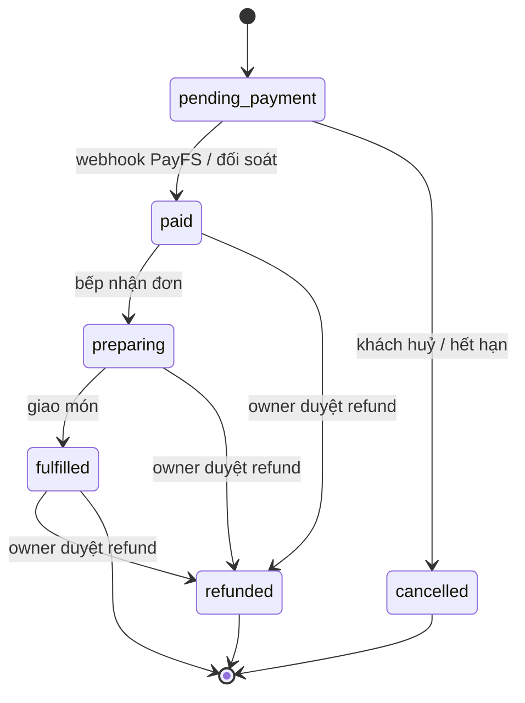

# Decision Record — Chốt sau phân tích Xia (nexus-handson)

Ngày: 2026-09-19
Đầu vào: [`docs/PRD.md`](../PRD.md) · [`plans/reports/260919-xia-nexus-handson-reference.md`](../../plans/reports/260919-xia-nexus-handson-reference.md) · [`docs/reference/nexus/`](../reference/nexus/00-index.md)
Trạng thái file: **bản chốt kỹ thuật**. Mọi kế hoạch (`/ak:plan`) và code (`/ak:cook`) sau ngày này phải tuân thủ. Muốn đổi → sửa file này trước, không sửa ngầm trong code.

Ký hiệu trạng thái:
- **LOCKED** — đã chốt. Thực thi luôn.
- **OPEN** — chưa đủ dữ liệu, phải giải quyết trước mốc được ghi.

D1, D2, D3 — ba mục có đánh đổi thật — đều đã được chủ dự án chốt ngày 2026-09-19. Không còn mục nào treo chờ xác nhận.

---

## A. Sự thật đã xác minh (không phải quyết định — là ràng buộc)

Những điều này đã kiểm bằng cách đọc trực tiếp repo mẫu, không suy đoán:

| # | Sự thật | Bằng chứng |
| --- | --- | --- |
| F1 | Repo mẫu **không dùng Next.js**. Là Vite 8 + React 19 SPA, phục vụ bằng Worker `assets` binding với SPA fallback | `wrangler.jsonc:4,8-16`; `package.json:14,25,69` |
| F2 | Repo mẫu **không dùng Drizzle/Prisma/Kysely trực tiếp**. Truy cập D1 bằng `prepare().bind()` + `db.batch()`; migration là SQL viết tay 0001→0016 | `package.json:46-72`; `packages/catalog/src/catalog-read.ts`; `migrations/` |
| F3 | better-auth nhận **thẳng binding D1**: `betterAuth({ database: env.DB })` — không cần ORM cho auth | `apps/worker/src/auth.ts:99-100` |
| F4 | D1 **không có transaction tương tác**. Atomicity chỉ đạt được bằng `db.batch()` + câu lệnh assertion tự huỷ cuối batch | `packages/catalog/src/files/product-image.ts:189-208`; `plans/260915-1046-.../phase-02-identityadmission.md:53` |
| F5 | Repo mẫu **không có real-time**. Bếp/khách cập nhật bằng `setInterval(..., 5_000)` | `apps/storefront/src/storefront-app.tsx:306-309` |
| F6 | Webhook PayFS **chỉ xác thực bằng API key tĩnh**, không HMAC, không timestamp, không IP allowlist, so sánh không constant-time | `apps/worker/src/payfs-webhook-routes.ts:106-108` |
| F7 | Repo mẫu **không có cơ chế đối soát** khi webhook rơi | `plans/260915-1512-payfs-bank-transfer-payment/plan.md:31` |
| F8 | Repo mẫu **không có quy trình `cloudflared`/`ngrok`** nào. Grep toàn repo: 0 kết quả | grep `cloudflared\|ngrok` |
| F9 | Tiền lưu dạng **INTEGER minor units**, chuyển đổi bằng BigInt, sai định dạng thì **từ chối chứ không làm tròn**. VND có `fractionDigits = 0` | `packages/catalog/src/money.ts:41-75` |
| F10 | Console **cùng origin** với API (cookie không cross-origin); Storefront **khác origin**, CORS không credentials | `README.md:9`; `apps/worker/src/index.ts:68-140` |
| F11 | PayFS **có ký HMAC-SHA256**. Chuỗi được ký là `timestamp + "." + JSON.stringify(<payload đã sort khóa đệ quy>)` — **không phải raw body**. Header `X-PayFS-Signature` (hex 64 ký tự, không tiền tố), `X-PayFS-Timestamp`, hạn 5 phút | `docs.payfs.vn/vi/developers/webhook-signature`; test vector của PayFS đã chạy lại và khớp, kể cả qua WebCrypto |
| F12 | PayFS **có API tra cứu giao dịch**: `GET https://api.payfs.vn/v1.1/transactions`, `Authorization: Bearer <API Token>`. API Token và Webhook API Key là **hai khóa độc lập** | `docs.payfs.vn/vi/developers/api-token` |
| F13 | Payload `transaction.credit` **không có trường nào trỏ về đơn hàng**: chỉ `transaction_id`, `amount`, `content`, `bank`, `bank_account_number`, `transaction_date`, `transfer_type`. Khớp đơn bắt buộc phải dò mã tham chiếu trong `content`. PayFS retry tối đa 10 lần, chờ đầu 10s, hệ số 2 (≈2.8 giờ) | `docs.payfs.vn/vi/developers/webhooks` |

---

## B. Quyết định kiến trúc

### D1 — Framework UI: **Vite + React SPA**, bỏ Next.js · LOCKED (bạn đã chốt 2026-09-19)

Theo đúng repo mẫu. Một Worker duy nhất vừa là API vừa phục vụ static asset của Console (F1).

| Thành phần | Cách làm |
| --- | --- |
| UI | React 19 + Vite, hai SPA riêng: `apps/console`, `apps/storefront` |
| Phục vụ Console | Cùng Worker với API: `assets` binding, `not_found_handling: single-page-application`, `run_worker_first: ["/api", "/api/*"]` |
| Phục vụ Storefront | Worker riêng, origin riêng, `wrangler.jsonc` riêng |
| Deploy | `wrangler deploy --config apps/console/dist/<name>/wrangler.json` — file do `@cloudflare/vite-plugin` sinh, đảm bảo config và bundle luôn cặp đúng |

- Lý do: toàn bộ pipeline build/deploy tham chiếu gắn chặt `@cloudflare/vite-plugin` (`package.json:32`). Chọn Next.js là tự nguyện vứt phần giá trị nhất của repo mẫu và thêm một lớp adapter (OpenNext) chưa ai trong dự án này kiểm chứng.
- Hệ quả: `docs/PRD.md` mục 3 đã được sửa — không còn "Next.js / Cloudflare Pages".
- Console cùng origin với API là điều kiện để cookie session không cross-origin (F10, D15). Không được tách Console sang domain khác mà không xem lại D15.
- Cấm: thêm Next.js, thêm Cloudflare Pages project, thêm Wrangler thứ hai cho Console/API.

### D2 — Tầng dữ liệu: **100% SQL viết tay, không ORM** · LOCKED (bạn đã chốt 2026-09-19)

Theo đúng repo mẫu. Không thêm Drizzle, Prisma hay Kysely vào dự án.

| Việc | Cách làm |
| --- | --- |
| Khai báo schema | File SQL đánh số trong `migrations/`, append-only, không sửa file đã apply |
| Đọc dữ liệu | Hàm thuần `(db: D1Database, ...)` + `prepare().bind()` + `.first<T>()` / `.all<T>()` |
| Ghi dữ liệu | `db.batch([...])` kèm câu assertion tự huỷ cuối lô (F4) |
| Bảng của better-auth | Viết tay, lấy `migrations/0008-better-auth.sql` của repo mẫu làm mẫu |
| Kết nối better-auth | `betterAuth({ database: env.DB })` — nhận thẳng binding, không adapter (F3) |

Lợi ích của lựa chọn này: mọi pattern trong `docs/reference/nexus/02-d1-data-layer-and-r2.md` và `04-payfs-webhook-and-business-contracts.md` dùng lại được nguyên văn, không phải dịch. Một phong cách duy nhất trong codebase. Không có lớp thư viện nào chen giữa code và D1.

Chi phí đã chấp nhận, và cách bù:

| Mất gì | Bù bằng gì |
| --- | --- |
| Gõ sai tên cột không ai báo lúc build | Test integration chạy trên D1 thật với migration thật (D14). Repo mẫu có 35 file loại này — đó chính là lưới an toàn thay cho compiler |
| Đổi tên cột không biết chỗ nào hỏng | Mỗi bảng có đúng **một** module sở hữu mọi câu SQL của nó; không rải SQL khắp nơi |
| Row trả về là `unknown` | Mọi truy vấn khai báo generic `.first<ProductRow>()` và map qua một hàm mapper tường minh, không `as any` |
| Điều kiện lặp lại (ví dụ mệnh đề `store_id`) bị copy-paste | Tách thành hằng chuỗi dùng chung. Repo mẫu copy-paste mệnh đề membership 9 lần trong `catalog-read.ts` — đừng lặp lại lỗi đó |

- Cấm: thêm bất kỳ ORM/query builder nào về sau mà không sửa file này trước.
- Cấm: nối chuỗi để dựng SQL. Mọi giá trị đi qua `.bind()`.
- Cấm: mutation nhiều bước bằng nhiều round-trip (`SELECT` rồi `UPDATE`). Phải gộp vào một `db.batch()`.

### D3 — Bố cục: **3 package như repo mẫu** · LOCKED (bạn đã chốt 2026-09-19)

```
apps/console   apps/storefront   apps/worker
packages/identity   packages/catalog   packages/orders
```

| Package | Sở hữu | Được phép phụ thuộc |
| --- | --- | --- |
| `@qr/identity` | user, session, membership, `evaluatePermission`, invitation | — (đáy) |
| `@qr/catalog` | categories, products, ảnh R2, `money`, `tables` + QR token, nguồn giá cho snapshot | `identity` |
| `@qr/orders` | orders, order_items, payments, refund_requests, state machine, idempotency ledger, email outbox | `catalog`, `identity` |

Chiều phụ thuộc một chiều: `orders → catalog → identity`. `catalog` **không bao giờ** import `orders`. Package **không bao giờ** import app.

Vì sao `tables` nằm trong `catalog`: bàn là dữ liệu thiết lập của quán, Owner quản lý cùng chỗ với menu, và storefront phải giải `table_token` **trước khi** có đơn hàng nào tồn tại. Đặt trong `orders` sẽ tạo phụ thuộc ngược.

Biên giới được cưỡng chế bằng máy, hai lớp:
1. Trường `dependencies` của từng workspace. `apps/storefront/package.json` khai báo **rỗng** → mọi `import` từ package đều fail lúc build. Đây là lớp chính.
2. Gate `assert-production-import-graph` soi module thật trong bundle production — **phủ cả Console lẫn Storefront**. Repo mẫu chỉ phủ Console (`scripts/assert-production-import-graph.ts`), tức bỏ trống đúng chỗ nguy hiểm nhất. Đừng copy thiếu sót đó.

- Cấm: import trực tiếp giữa `apps/console` và `apps/storefront`.
- Cấm: tạo package thứ tư kiểu `shared` / `common` / `utils`. Code không thuộc về 1 trong 3 hộp trên thì nó thuộc về app đang dùng nó.
- Cấm: barrel file `index.ts` re-export cả package. Repo mẫu dùng `exports: { "./*": "./src/*.ts" }` để mỗi import trỏ đúng một module, giữ bundle gọn — làm y vậy.

### D4 — Giữ `store_id` ngay từ migration đầu · LOCKED

Mọi bảng nghiệp vụ có `store_id`, giá trị hằng cho MVP một quán.

- Lý do: thêm cột tenant sau = migrate lại toàn bộ khoá chính, khoá ngoại, index và mọi câu query. Chi phí thêm ngay bây giờ gần bằng 0.
- Không copy: ma trận membership nhiều tầng của repo mẫu (`migrations/0009`). Chỉ giữ cột.

### D5 — Xác thực webhook PayFS · LOCKED (**sửa 2026-09-19** sau khi đọc tài liệu PayFS thật)

O1 đã đóng. Chữ ký **có tồn tại**, nhưng bản chốt trước ghi "HMAC-SHA256 trên **raw body**" là **sai**: PayFS ký trên JSON đã chuẩn hóa. Ký raw body sẽ không bao giờ khớp (đã kiểm: cùng payload, khác thứ tự khóa → digest khác hoàn toàn).

Hợp đồng xác minh, đúng thứ tự này:

| # | Bước | Thất bại → |
| --- | --- | --- |
| 1 | Chặn body > 16 KB trước khi đọc (giữ nguyên `payfs-webhook-routes.ts:7`) | 413 |
| 2 | `X-Client-API-Key` so sánh **constant-time** với `PAYFS_WEBHOOK_API_KEY` | 401 |
| 3 | `X-PayFS-Timestamp` lệch giờ hiện tại quá 300 giây | 401 |
| 4 | Parse JSON; body hỏng | 400 |
| 5 | `data = timestamp + "." + JSON.stringify(sortKeysRecursive(payload))`; `HMAC_SHA256(data, PAYFS_WEBHOOK_SECRET)` hex, so sánh **constant-time** với `X-PayFS-Signature` | 401 |
| 6 | `transfer_type !== "credit"` → ghi `provider_events` rồi 200, không đụng đơn | 200 |

- Dùng **WebCrypto** (`crypto.subtle.importKey/sign`), không `node:crypto` — đã xác minh cho ra đúng digest của test vector PayFS.
- Chữ ký **không có tiền tố** `sha256=`. Đừng cắt tiền tố.
- Test bắt buộc: test vector công bố của PayFS (`secret whsec_example_secret_do_not_use_in_production`, `timestamp 1758173916`) phải cho ra `86f02cefae56d51f72a00e04bf9d5a96b40cfe6902d54e495234c447ec706c5e`. Đây là bài test rẻ nhất chặn được toàn bộ lỗi canonicalization.
- Rủi ro tồn dư đã biết: chuẩn hóa là "JSON theo kiểu JS" (escape Unicode, định dạng số). `content` từ ngân hàng có thể chứa ký tự lạ. Khi chữ ký lệch, **ghi raw body vào `provider_events` rồi trả 401** — không im lặng bỏ qua, vì đây là lỗi lập trình chứ không phải tấn công.
- API key tĩnh giữ làm lớp phụ (bước 2), không phải lớp duy nhất (F6).
- Endpoint phải trả lời trong 30 giây, nếu không PayFS tính là thất bại và gửi lại.

### D6 — Phải có đối soát (reconciliation) · LOCKED (**mở rộng** sau khi đóng O1)

Công cụ đã có thật: `GET https://api.payfs.vn/v1.1/transactions` với `Authorization: Bearer $PAYFS_API_TOKEN` (F12). Biến này **khác** `PAYFS_WEBHOOK_API_KEY` và `PAYFS_WEBHOOK_SECRET` — ba secret, ba tên, không tái dùng (D16).

Cron `*/1` (tách khỏi cron `*/5` của email outbox):

| Tuổi đơn `pending_payment` | Hành động |
| --- | --- |
| > 2 phút | Gọi `/v1.1/transactions`, dò `content` chứa `payment_reference` **và** `amount` khớp tuyệt đối → `paid` qua đúng batch/idempotency như webhook |
| > 15 phút | Gắn cờ `needs_attention` cho Owner, đơn vẫn sống |
| > 30 phút | `cancelled`, giải phóng bàn |

Tiền về sau khi đơn đã `cancelled`: **không tự hồi sinh đơn**. Ghi `provider_events` với cờ `unmatched_payment` để Owner xử lý tay. Lý do: D10 cấm retarget một khoản tiền sang đơn khác, và tự động chuyển trạng thái ngược từ `cancelled` là đường ngắn nhất tới ghi nhận tiền hai lần.

Lý do vẫn cần đối soát dù PayFS tự retry: retry của PayFS kéo dài tới ~2.8 giờ (F13) — khách ngồi ở bàn không chờ được, và retry không cứu được trường hợp Worker trả 200 rồi chết giữa chừng.

### D7 — Real-time bếp: **polling 3 giây cho MVP** · LOCKED

- Lý do: F5. SSE/Durable Object là hạng mục phase sau, không nằm trong 1–2 tuần.
- Hệ quả: PRD `docs/PRD.md:20` phải viết lại "gần thời gian thực (polling 3s)", không hứa "real-time".
- Điều kiện nâng cấp: khi số bàn hoạt động đồng thời vượt ~30 hoặc chi phí read D1 thành vấn đề.

### D8 — Token khách: lưu digest, không lưu token thô · LOCKED

Áp cho cả `table_token` (QR tại bàn) và `order_token` (secret link tra cứu đơn):
- Sinh ≥32 byte CSPRNG.
- DB chỉ lưu SHA-256 digest; so khớp bằng JOIN trên digest.
- Mọi thất bại (không tồn tại / sai / hết hạn) trả **404 giống hệt nhau**, không phân biệt.
- Token không bao giờ đi vào query string bị log; dùng header hoặc URL fragment.

Nguồn: `packages/orders/src/private-access.ts:5-27`.

### D9 — State machine đơn hàng · LOCKED



Kỹ thuật cưỡng chế (bê nguyên từ repo mẫu):
- Guard thuần, tách khỏi SQL — kiểu `packages/orders/src/transitions/order-transitions.ts:45-59`.
- `UPDATE ... WHERE status = <from_status>` — chuyển trạng thái sai thì 0 row bị ảnh hưởng.
- Câu assertion cuối `db.batch()` để mọi race biến thành rollback toàn batch.
- Xung đột trả **409**, không trả 200 im lặng.

Cấm: chuyển trạng thái bằng `SELECT` rồi `UPDATE` ở hai round-trip.

### D10 — Idempotency 3 tầng · LOCKED

| Tầng | Khoá | Hành vi khi trùng |
| --- | --- | --- |
| Khách đặt đơn | `UNIQUE(store_id, request_key)` + `capability_digest` | Trùng khoá + trùng capability → **replay đơn cũ**; lệch capability → **409** |
| Webhook provider | `UNIQUE(provider, provider_event_id)` + `facts_fingerprint` (SHA-256) | Trùng ID cùng facts → `already_processed`; trùng ID khác facts → **400**, tuyệt đối không retarget sang đơn khác |
| Lệnh Console (nhận đơn, giao món, duyệt refund) | `UNIQUE(store_id, request_key)` + `payload_hash` | Khớp hash → replay kết quả; lệch → **409** |

Thêm ràng buộc `UNIQUE(store_id, order_id)` trên bảng payment thành công để một đơn không bao giờ được ghi nhận trả tiền hai lần (`migrations/0015-provider-events-and-payments.sql:53`).

### D11 — Pricing & snapshot · LOCKED

1. Client **chỉ được gửi** `productId`, `quantity`, `notes`. Payload chứa `price` hay `total` → trả lỗi `unknown_field`, không phải bỏ qua im lặng.
2. Server đọc giá từ D1, nhân số lượng, tự tính tổng.
3. Ghi `unit_price_snapshot` + `line_total` vào `order_items` tại thời điểm đặt.
4. Guard tổng tiền nằm ngay trong SQL batch, không chỉ ở tầng ứng dụng.
5. Món `is_available = false` hoặc bị xoá giữa chừng → từ chối cả đơn, trả danh sách món có vấn đề.
6. Tiền theo F9: INTEGER VND, không float, không `toFixed`.

### D12 — Email: Resend + outbox + cron · LOCKED

Enqueue job trong **cùng batch** với chuyển trạng thái; cron `*/5` claim bằng conditional UPDATE (`attempts+1`, đẩy `available_at`), backoff mũ, retire sau N lần, gửi Resend kèm `Idempotency-Key: job.id`.

Sửa so với repo mẫu: secret HMAC của link email **phải là biến riêng**, không tái dùng `RESEND_API_KEY` (repo mẫu làm vậy ở `storefront-order-routes.ts:182,233` → xoay key Resend là chết mọi link cũ).

### D13 — Ảnh món trên R2 · LOCKED

- Object key **opaque**: `product-images/<uuid>`, không nhúng tên món / id / phần mở rộng.
- Xác định MIME bằng **magic bytes**, không tin `Content-Type` client gửi.
- Nhiều lớp chặn kích thước: route → `Content-Length` → đếm byte khi stream (giới hạn 5 MB).
- Ghi D1 trước, R2 sau; R2 lỗi thì compensation xoá object, chấp nhận object mồ côi hơn là D1 sai.
- **Khác repo mẫu**: `Cache-Control: public, max-age=31536000, immutable` + xử lý `If-None-Match`. Repo mẫu dùng `no-store` (`storefront-product-image-routes.ts:27`) — sai với key UUID bất biến và làm menu tải chậm trên 3G.

### D14 — Cổng chất lượng · LOCKED

CI chặn merge: `typecheck` → `test:workerd` → `build:console` → `build:storefront` → **1 e2e luồng tiền** (quét QR → đặt món → thanh toán giả lập → bếp thấy đơn).

Repo mẫu **không** chạy e2e trong CI (`.github/workflows/deploy-console.yml:26-29`). Ở đây luồng tiền phải chặn merge.

Năm test bắt buộc tồn tại trước khi gọi MVP là xong:
1. Tính tổng tiền — server-authoritative, client gửi giá thì bị từ chối.
2. Snapshot giá — đổi giá menu không làm thay đổi đơn cũ.
3. Idempotency — retry cùng body không nhân bản đơn; rebind khoá → 409; webhook replay là no-op.
4. Chuyển trạng thái trái phép → 409 và **không có side effect nào được ghi**.
5. Phân quyền — Staff không sửa được menu, không duyệt được refund.

### D15 — Xác thực Console · LOCKED

- `betterAuth({ database: env.DB })` — nhận thẳng binding D1 theo F3, không adapter, không ORM (D2). Google OAuth, Console cùng origin với API (F10).
- Google **chỉ xác thực con người**; nguồn sự thật phân quyền là bảng membership (`role: owner|staff`, `status: active|revoked`) — giải lại từ DB mỗi request, không tin cookie.
- `accountLinking.enabled: false` và chặn đăng ký tự do: user Google lạ phải bị từ chối ở `validateUserInfo` (kiểm `sub` đã bind tới membership active, email khớp) — `apps/worker/src/auth.ts:107-131`.
- Cookie refresh phải forward trên **mọi** response kể cả lỗi; 403 giữ cookie, 401 hết hạn mới xoá.
- Storefront **không đi qua better-auth**. Ranh giới: `/api/console/*` yêu cầu session; `/api/storefront/*` công khai + token theo D8.

### D16 — Vệ sinh bí mật · LOCKED

- Mọi secret qua `wrangler secret put`, không vào `wrangler.jsonc`, không vào repo.
- **Không copy** `payment-intergration-prd.md` từ repo mẫu — file đó chứa webhook key, webhook secret và số tài khoản dạng plaintext (`:16-20`).
- Đặt tên biến môi trường **một lần, dùng chung**. Repo mẫu có lỗi `PAYFS_FEFAULT_ACCOUNT` (webhook, `payfs-webhook-routes.ts:10,22`) khác `PAYFS_MERCHANT_ACCOUNT` (storefront, `storefront-order-routes.ts:44`) → QR và đối soát có thể trỏ hai tài khoản khác nhau mà hệ thống vẫn "chạy".
- Payment reference: chốt **một** độ dài duy nhất, và regex đối soát phải có test khớp với giá trị DB thực sự sinh ra. Repo mẫu lệch: matcher cần 18 hex (`order-commands.ts:375`), code sinh 18 hex (`order-write.ts:30`), nhưng `DEFAULT` của cột sinh 32 hex (`migrations/0006-order-brief-contract.sql:35`) → row dùng DEFAULT không bao giờ khớp webhook.

### D17 — Token bàn phải xoay được, có cửa sổ ân hạn · LOCKED

Xung đột đã phát hiện: `docs/PRD.md:27` hứa Owner "xuất mã QR" bất cứ lúc nào, nhưng D8 chỉ lưu digest → **không thể in lại** mã cũ. Một trong hai phải nhượng bộ; nhượng bộ D8 là tự bỏ lợi ích bảo mật chính.

Chốt: bảng riêng `table_secrets(id, store_id, table_id, token_digest, created_at, revoked_at)`.
- "Xuất QR" = **sinh token mới** + hiện QR **đúng một lần** ngay lúc đó. Không có đường đọc lại.
- Token cũ giữ hiệu lực thêm **15 phút** (`revoked_at` tương lai) để khách đang ngồi không bị 404 giữa bữa.
- Một bàn có thể có nhiều digest sống cùng lúc; truy vấn JOIN trên `token_digest` kèm `revoked_at IS NULL OR revoked_at > now`.
- Token đi trong **URL fragment** (`https://<storefront>/t#<token>`), SPA đọc rồi gửi qua header — fragment không tới server, không vào log (D8). Hệ quả: request storefront là cross-origin có custom header → có preflight; đặt `Access-Control-Max-Age` để không mất 1 RTT mỗi lần gọi.

### D18 — Mã tham chiếu thanh toán: một định dạng, sinh ở một chỗ · LOCKED

F13: webhook không có trường nào trỏ về đơn. Khớp đơn **chỉ** dựa vào `content` + `amount`.

- Định dạng: `QM` + 8 ký tự `[0-9A-Z]`. Sinh bằng CSPRNG **trong code ứng dụng**, một hàm duy nhất.
- **Cấm** đặt `DEFAULT` sinh mã ở tầng cột SQL. Đây đúng là lỗi R4 của repo mẫu: DEFAULT sinh 32 hex trong khi matcher cần 18 hex → row nào dùng DEFAULT là không bao giờ khớp webhook.
- `UNIQUE(store_id, payment_reference)`.
- Khớp = tìm chuỗi con trên `content` đã `upper()`, **không** so khớp cả chuỗi: ngân hàng chèn thêm rác vào nội dung (`"NGUYEN VAN A chuyen tien  Ma giao dich  Trace773231"`).
- Bắt buộc `amount` khớp tuyệt đối với `total_amount`. Lệch → không `paid`, ghi `provider_events` + cờ cho Owner. Trả thiếu tiền không phải là đã trả.
- Test bắt buộc: regex matcher chạy trên **giá trị thật do code sinh ra**, không phải trên hằng viết tay trong test.

### D19 — Biến thể món (O5): **không làm ở MVP**, và không chặn migration đầu · LOCKED

Bản chốt trước nói O5 chặn migration 0001. Kiểm lại thì không đúng: khác với `store_id` (D4 — thêm sau = migrate lại khoá và index), thêm biến thể về sau là **migration thuần cộng thêm**: một bảng `product_variants` mới + một cột `order_items.variant_id` nullable. Đơn cũ không cần chạm vì đã có `unit_price_snapshot`.

MVP làm thế này:
- `products.price` phẳng. Cỡ ly có giá khác nhau → khai báo thành **món riêng** cùng category ("Cà phê sữa (M)", "Cà phê sữa (L)").
- Tuỳ chọn không ảnh hưởng giá (ít đá, ít đường) → dùng `order_items.notes` đã có sẵn trong schema.
- Điều kiện duy nhất để giữ đường lùi rẻ: **toàn bộ việc giải giá nằm trong một hàm** của `catalog` (`resolveLineItemPrice`). Không rải logic giá ra route hay UI.

Ngưỡng xét lại: quá ~15 món phải nhân bản theo cỡ, hoặc xuất hiện topping có tính tiền.

**Xác nhận bởi chủ dự án 2026-09-19**: đồng ý MVP không có biến thể.

### D20 — Bootstrap Owner đầu tiên + mời nhân viên: **port hệ thống invitation của repo mẫu** · LOCKED (chủ dự án chốt 2026-09-19)

Lỗ hổng của bản chốt trước: D15 nói nguồn sự thật phân quyền là bảng membership, nhưng không nói Owner **đầu tiên** vào bảng đó bằng cách nào. Chicken-and-egg: không có Owner nào để mời Owner đầu tiên.

Bootstrap (bê nguyên, không có lựa chọn thay thế hợp lý):
- `INITIAL_OWNER_EMAIL` là **Worker secret**. Chỉ Google identity đã verify khớp email đó mới bootstrap được, và chỉ khi chưa có claim nào thành công (`03-better-auth-google-oauth.md:660-662`).
- Bảng `store_bootstrap_claims` với `store_id` là **PRIMARY KEY** → mỗi store bootstrap đúng một lần, kể cả khi hai callback OAuth chạy song song (`:299-318`).
- Hai lớp chống race: điều kiện `NOT EXISTS (... store_bootstrap_claims ...)` trong guarded insert **và** vi phạm khoá chính làm abort cả batch → `reconcileAdmission` đọc lại và từ chối (`:708`).

Mời nhân viên — **chọn bản đầy đủ**, không dùng bản rút gọn "Owner nhập thẳng email":
- Bảng `owner_invitations` theo mẫu `migrations/0012`, **nới `role CHECK` cho `staff`**.
- Token invitation: digest + HMAC context, TTL 7 ngày, one-time.
- Email mời gửi qua Resend outbox (D12).
- Giữ ràng buộc `NOT EXISTS (SELECT 1 FROM "user" WHERE email = ?)` khi tạo mời — identity đã bind, staff, hoặc đã revoke thì không mời lại được (`:857`).
- Giữ `disableSignUp: true` và `accountLinking.enabled: false`. Bỏ là mở cửa cho mọi tài khoản Google.
- Thông báo lỗi **giống hệt nhau** cho mọi nguyên nhân từ chối, không để lộ sự tồn tại của lời mời.

Bỏ, không port: `scripts/provision-s4-identities.ts` — tài liệu của chính repo mẫu nói nó không cần cho bootstrap lẫn mời Owner (`:1082`). Hằng `NEXUS_STORE_ID` hard-code 10+ chỗ: truyền `storeId` qua tham số ngay từ đầu.

Chi phí đã chấp nhận: thêm 2 bảng, một luồng UI accept, và test. Đổi lại thu hồi/luân chuyển nhân viên không phải sửa DB tay.

### D21 — Origin: **workers.dev cho MVP** · LOCKED (chủ dự án chốt 2026-09-19)

- Console + API: một Worker, một origin. Storefront: Worker riêng, origin riêng (D1, F10).
- MVP dùng subdomain `workers.dev`. Domain thật để sau.
- **Rủi ro đã biết, phải xử lý khi cutover**: đổi origin về sau bắt buộc sửa đồng bộ Google OAuth `redirect_uri`, CORS allowlist của storefront, và cookie domain. Repo mẫu ghi nhận nguyên văn: cutover thiếu một chỗ là hỏng OAuth hoặc CORS, dấu hiệu là `redirect_uri_mismatch` (`03-better-auth-google-oauth.md:955-957`).
- Hệ quả thi công: **không hard-code hostname**. Mọi origin đọc từ biến môi trường, một tên biến cho một origin. Có một test khẳng định không còn hostname legacy nào trong source/build input.

### D22 — PayFS: chưa có tài khoản, dev không phụ thuộc PayFS · LOCKED (chủ dự án chốt 2026-09-19)

- M0–M2 chạy **hoàn toàn** bằng script tự ký payload theo F11. Deterministic, chạy được trong CI, không cần mạng.
- Đăng ký PayFS + nối ngân hàng (MB / ACB / OCB) là việc **trước M4**, không chặn M0–M3.
- Smoke test chuyển khoản thật qua `cloudflared` lùi về M4.
- Hệ quả bắt buộc: toàn bộ chỗ chạm PayFS phải nằm sau một **cổng hẹp** — một module `payfs` trong `apps/worker` với đúng hai mặt tiếp xúc (verify webhook, query transactions). Nếu về sau đổi sang SePay/payOS (payload của họ **có** order reference riêng, không phải dò `content`), chỉ D18 và module đó phải đổi, không lan ra `packages/orders`.

### D23 — Email outbox: code từ M2, bật gửi thật ở M4 · LOCKED (chủ dự án chốt 2026-09-19)

D12 giữ nguyên, tách làm hai phần theo phụ thuộc thật:

| Phần | Phụ thuộc | Mốc |
| --- | --- | --- |
| Bảng `order_email_jobs`, enqueue **trong cùng batch** với chuyển trạng thái, cron `*/5`, claim bằng conditional UPDATE, backoff mũ, retire sau N lần | Chỉ D1 | **M2** — nhét vào sau là phải sửa lại mọi SQL batch đã viết |
| Gửi thật qua Resend | Domain đã verify (SPF/DKIM) | **M4** — chỉ là đổi biến môi trường |

Trong lúc chưa verify domain: dùng địa chỉ test của Resend, chỉ gửi được tới email chủ tài khoản. Job vẫn chạy đủ vòng enqueue → claim → gửi → retire nên logic được kiểm thật.

Giữ nguyên sửa đổi so với repo mẫu: secret HMAC của link trong email là **biến riêng**, không tái dùng `RESEND_API_KEY` (D12, R5).

---

## C. Hạng mục loại khỏi phạm vi

| Hạng mục | Lý do |
| --- | --- |
| CSV import, variant matrix, delivery file | Ngoài scope MVP (`docs/PRD.md:78-81`) |
| Drizzle / Prisma / Kysely | D2 — không ORM |
| Package thứ tư kiểu `shared` / `common` / `utils` | D3 |
| WebSocket / Durable Object | D7 |
| Ghép bàn, tích điểm, voucher, cổng thẻ quốc tế | PRD đã loại |
| Bộ `scripts/verification/` + evidence ledger của repo mẫu | Hạ tầng cho quy trình làm việc của repo đó, không phải nhu cầu sản phẩm |

---

## D. Còn mở

| # | Vấn đề | Cần trước mốc | Ghi chú |
| --- | --- | --- | --- |
| O1 | ~~PayFS có ký HMAC webhook không~~ | — | **ĐÓNG 2026-09-19**: có. Xem F11, F12, F13 và D5, D6, D18 |
| O2 | ~~Quy trình nhận webhook khi dev local~~ | — | **ĐÓNG**: PayFS không có sandbox gửi thử. Chốt hai lớp: (1) mặc định dev bằng **script tự ký payload** theo F11 bắn thẳng vào worker local — deterministic, chạy được trong CI; (2) `cloudflared tunnel --url http://127.0.0.1:<port>` + đăng ký URL trong Client Portal **chỉ cho một lần smoke test chuyển khoản thật** trước khi lên production. Không phụ thuộc tunnel trong vòng lặp dev hằng ngày |
| O3 | ~~Ngưỡng N phút cho job đối soát~~ | — | **ĐÓNG**: 2 / 15 / 30 phút, xem bảng trong D6 |
| O4 | ~~Refund hoàn tiền qua API PayFS hay thủ công~~ | — | **ĐÓNG**: thủ công. PayFS là dịch vụ **ghi nhận biến động số dư**, tài liệu phát triển không có endpoint chi tiền nào. `refunded` là trạng thái **ghi nhận**, không có side effect chuyển tiền; Owner chuyển khoản tay rồi bấm duyệt |
| O5 | ~~Menu có biến thể không~~ | — | **ĐÓNG**: xem D19 — không làm ở MVP, và không còn chặn migration đầu |
| O6 | Gói dịch vụ PayFS: OpenBanking miễn phí 30 giao dịch/tháng | Trước khi chạy quán thật | Không ảnh hưởng kiến trúc, ảnh hưởng chi phí vận hành. Cần chốt gói trước ngày mở bán |
| O7 | Đăng ký PayFS + nối ngân hàng (MB / ACB / OCB) | Trước M4 | D22 — không chặn M0–M3. Cần trước khi smoke test tiền thật |
| O8 | Domain gửi email verify trên Resend (SPF/DKIM) + email nhận báo cáo + giờ chốt ngày | Trước M4 | D23 — không chặn outbox ở M2 |
| O9 | Cutover từ `workers.dev` sang domain thật | Trước ngày mở bán | D21 — phải sửa đồng bộ OAuth redirect_uri, CORS allowlist, cookie domain |

---

## E. Bước tiếp

1. ~~Chốt D1, D2, D3~~ — xong 2026-09-19: Vite + React SPA · SQL viết tay 100% · 3 package.
2. ~~Cập nhật `docs/PRD.md` cho khớp D1, D2, D3, D7~~ — xong: mục 1, 2.2, 3, 5 đã sửa.
3. ~~Trả lời O5~~ — xong, xem D19.
4. ~~Trả lời O1~~ — xong, xem F11–F13, D5, D6, D18.
5. ~~Cập nhật `docs/PRD.md` cho khớp D17, D18, D19~~ — xong: mục 2.3.3, 3, 5, 7 đã sửa.
6. Chạy `/ak:plan` với đầu vào: `docs/PRD.md` + file này + `plans/reports/260919-xia-nexus-handson-reference.md` + `plans/reports/260919-brainstorm-build-approach.md` + `plans/reports/260919-brainstorm-decisions-locked.md`.

Bản tra cứu nhanh những gì phiên brainstorm đã chốt (kèm bằng chứng và file bị ảnh hưởng): [`plans/reports/260919-brainstorm-decisions-locked.md`](../../plans/reports/260919-brainstorm-decisions-locked.md).
