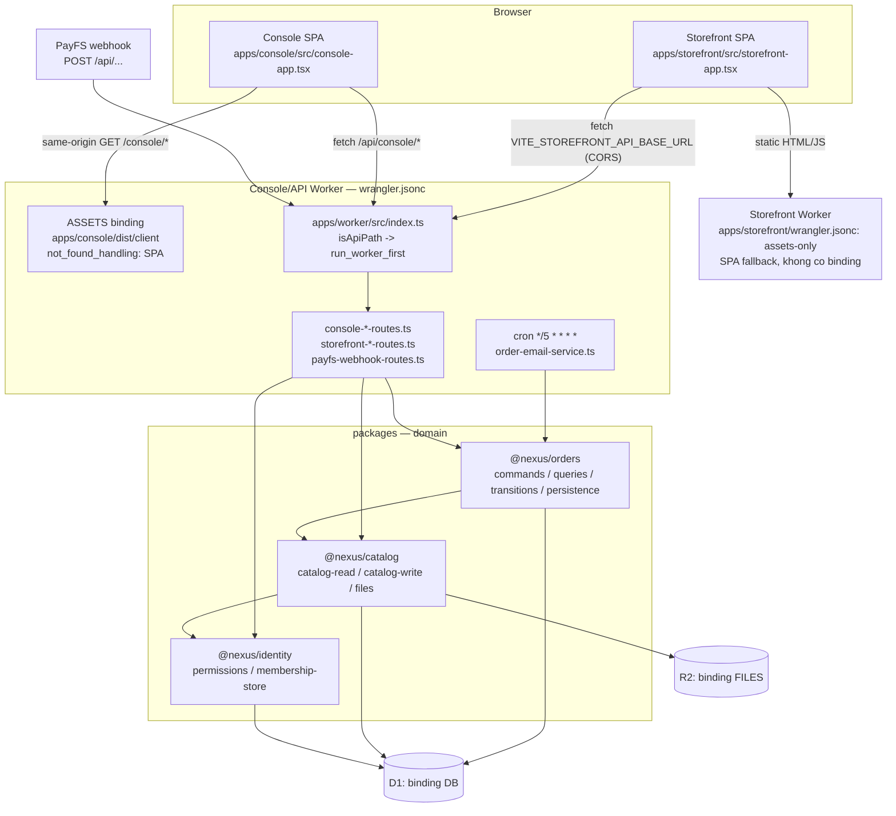

# 01 — Monorepo, biên giới module và pipeline build/deploy (tham chiếu từ `nexus-handson`)

Mọi đường dẫn dạng `path:line` trong tài liệu này là đường dẫn tương đối tính từ gốc repo SOURCE `nexus-handson`. Tài liệu chỉ mô tả **cấu trúc + biên giới import + build/deploy**; auth, payment, schema D1, R2 nằm ở các tài liệu khác trong cùng thư mục.

Bối cảnh nền quan trọng: SOURCE **không dùng Next.js** (stack là Vite 8 + React 19 SPA, `package.json:69-70`, `package.json:50-51`), **không dùng Drizzle/Prisma**, và **không có `packages/core` gộp** — nó tách thành 3 package `@nexus/catalog`, `@nexus/orders`, `@nexus/identity` (`package.json:56-58`).

---

## 1. Cây thư mục thật của SOURCE

Xác minh bằng listing thư mục gốc, `apps/*`, `packages/*/src/*`, `apps/*/src/*`.

```
nexus-handson/
├── package.json                  # workspace root: workspaces + toàn bộ script dev/build/deploy (package.json:6-9, :13-45)
├── package-lock.json             # lockfile authoritative, cài bằng `npm ci` (README.md:62)
├── tsconfig.json                 # MỘT tsconfig duy nhất cho cả repo, noEmit (tsconfig.json:21, :26-36)
├── wrangler.jsonc                # Worker Console/API + binding D1 `DB` + R2 `FILES` (wrangler.jsonc:3-4, :24-36)
├── worker-configuration.d.ts     # 569 KB type bindings do Wrangler sinh; nằm trong tsconfig include (tsconfig.json:31)
├── vitest.config.ts              # pool workerd + miniflare D1/R2; include tests/unit + tests/integration (vitest.config.ts:6-11, :15)
├── vitest.browser.config.ts      # React component contracts (tests/AGENTS.md:5; package.json:20)
├── vitest.node.config.ts         # test chạy node thuần (package.json:40)
├── playwright.config.ts          # e2e 2 origin 5173/5174 (playwright.config.ts:15, :19)
├── AGENTS.md                     # file luật canonical, gồm rule biên giới import (AGENTS.md:16-17)
├── README.md                     # runbook dev/checks/deploy (README.md:71-108)
├── migrations/                   # 0001..0016 *.sql append-only + AGENTS.md (migrations/AGENTS.md:5)
├── scripts/
│   ├── assert-production-import-graph.ts   # gate chặn bundle production chạm module design/prototype/fixture
│   ├── provision-s4-identities.ts
│   └── verification/                       # harness e2e isolation, evidence ledger, fixtures
├── apps/
│   ├── worker/                   # HTTP adapter layer, không có UI
│   │   └── src/                  # index.ts + *-routes.ts (console-*, storefront-*, payfs-webhook-*) + auth.ts, environment.ts, http-response.ts
│   ├── console/                  # SPA nội bộ (Operations Console)
│   │   └── src/                  # main.tsx, console-app.tsx, production-console-app.tsx, api-client.ts, auth-client.ts
│   │       ├── layout/  products/  orders/  imports/  provider-events/  styles/
│   └── storefront/               # SPA khách hàng, deploy riêng
│       ├── wrangler.jsonc        # Worker/assets riêng cho storefront (apps/storefront/wrangler.jsonc:4-10)
│       └── src/                  # main.tsx, storefront-app.tsx, api-client.ts, storefront-view-types.ts, format-money.ts, styles.css
├── packages/
│   ├── catalog/                  # @nexus/catalog: sản phẩm, money, slug, CSV import, file/ảnh
│   │   └── src/                  # catalog-read.ts, catalog-write.ts, catalog-types.ts, money.ts, slug.ts, schema-change.ts, private-order-snapshot.ts
│   │       ├── shared/  import/  files/
│   ├── orders/                   # @nexus/orders: đơn hàng + state machine
│   │   └── src/                  # order-types.ts, order-validation.ts, order-access.ts, private-access.ts
│   │       ├── commands/  queries/  transitions/  persistence/
│   └── identity/                 # @nexus/identity: membership, permissions, invitations, google-identity
│       └── src/                  # permissions.ts, membership-store.ts, invitations.ts, admission.ts, identity-types.ts, google-identity.ts
├── tests/                        # unit / integration / browser / e2e / node + fixtures, support (tests/AGENTS.md:5)
├── docs/, design/, plans/        # tài liệu; KHÔNG được bundle vào production (xem §2.3)
└── .github/workflows/deploy-console.yml   # CI duy nhất
```

Điểm đáng chú ý về layering bên trong từng app:

- `apps/worker/src` **phẳng, chia theo mặt tiếp xúc HTTP**: `console-*-routes.ts` (Console API), `storefront-*-routes.ts` (public API), `payfs-webhook-routes.ts` (inbound webhook), cộng hạ tầng `auth.ts` / `environment.ts` / `http-response.ts` / `console-route-match.ts`. Entry là `apps/worker/src/index.ts`, chỉ import các route module cục bộ rồi dispatch (`apps/worker/src/index.ts:1-19`, `:22-28`).
- `apps/console/src` **chia theo destination UI**: `products/`, `orders/`, `imports/`, `provider-events/`, `layout/`, `styles/` — trùng với danh sách destination được quy định ở `AGENTS.md:14`.
- `apps/storefront/src` **phẳng và rất mỏng**: 6 file, trong đó `api-client.ts` là toàn bộ cầu nối ra API.
- `packages/orders/src` chia theo vai trò kiến trúc (`commands/`, `queries/`, `transitions/`, `persistence/`) — đúng như `packages/orders/AGENTS.md:5-9` liệt kê.

---

## 2. Biên giới phụ thuộc

### 2.1. Luật thành văn

Toàn bộ luật nằm ở một dòng duy nhất trong file canonical (`AGENTS.md:16`):

> Worker composes `@nexus/catalog/*` and `@nexus/orders/*`. Console consumes catalog only; keep Order UI types in the Console app. Storefront stays HTTP-only. Orders may depend on catalog. Catalog and packages never depend on apps. Catalog never depends on orders.

Và luật phân tầng trách nhiệm (`AGENTS.md:17`):

> Worker stays HTTP adapters and platform composition. Domain writes, SQL batches, and transition rules stay in packages.

Luật cục bộ bổ sung:
- `packages/catalog/AGENTS.md:5`: "Owns product catalog plus `import/`, `files/`, and `shared/`. Do not depend on `@nexus/orders` or any app."
- `packages/orders/AGENTS.md:11`: "May import `@nexus/catalog/*`. Never import apps. Commands may import persistence and transitions; persistence and transitions must not import each other. SQL construction stays in the command that owns the transaction."
- `migrations/AGENTS.md:5-7`: append-only, không được sửa file `.sql` đã apply, không được tạo thư mục migrations thứ hai hay binding D1 thứ hai.
- `tests/AGENTS.md:5-7`: 4 lớp risk cố định, `fixtures/` và `support/` chỉ là helper, **không được move test vào apps/packages**.
- `AGENTS.md:26` (Don't): "Compatibility barrels, old `src/` shims, or a generic shared package" — đây chính là lý do SOURCE không có `packages/core`.

### 2.2. Bảng biên giới (đã đối chiếu với code thật)

| Từ | Được import | Bị cấm | Bằng chứng trong code |
|---|---|---|---|
| `apps/worker` | `@nexus/catalog/*`, `@nexus/orders/*`, `@nexus/identity/*` | domain logic viết tại chỗ, SQL ngoài package | `apps/worker/package.json:6-11`; `apps/worker/src/console-product-routes.ts:1-27` import catalog + identity; `apps/worker/src/storefront-order-routes.ts:1-12` import orders |
| `apps/console` | `@nexus/catalog/*` (+ react) | `@nexus/orders`, `@nexus/identity` | `apps/console/package.json:6-10` chỉ khai báo `@nexus/catalog`; các import thực tế: `apps/console/src/api-client.ts:10,18`, `apps/console/src/production-console-app.tsx:8-10`, `apps/console/src/imports/csv-import-screen.tsx:2-5`, `apps/console/src/products/product-editor-screen.tsx:3` |
| `apps/storefront` | chỉ `react`/`react-dom` — giao tiếp qua HTTP | mọi `@nexus/*` | `apps/storefront/package.json:6-9`; grep `@nexus/` trong `apps/storefront/src` → **0 match** |
| `packages/orders` | `@nexus/catalog`, `@nexus/identity` | apps | `packages/orders/package.json:9-12` |
| `packages/catalog` | `@nexus/identity`, `papaparse` | `@nexus/orders`, apps | `packages/catalog/package.json:9-12` (không có orders) |
| `packages/identity` | không phụ thuộc gì (leaf) | tất cả | `packages/identity/package.json:1-8` không có field `dependencies` |

Nghĩa là graph phụ thuộc là một DAG 3 tầng: `apps/*` → `orders` → `catalog` → `identity`. Điều quan trọng: **biên giới được khoá bằng `dependencies` của từng workspace package**, không bằng ESLint rule. Console không thể `import '@nexus/orders/...'` một cách hợp lệ vì `@nexus/orders` không nằm trong dependency của `@nexus/console`; Console tự giữ Order UI types trong app (`AGENTS.md:16`).

Rủi ro tồn dư: vì đây là npm workspaces hoisting, `node_modules` ở root có **cả 3 package** (`package.json:56-58` khai báo chúng như devDependencies của root), nên một import sai từ Console vẫn resolve được lúc runtime. Luật `AGENTS.md` + code review là lớp bảo vệ, không phải bundler.

### 2.3. `scripts/assert-production-import-graph.ts` — gate thực sự được thi hành

Gate này **không** kiểm tra biên giới `apps ↔ packages`. Nó kiểm tra một thứ khác và mạnh hơn: **bundle production tuyệt đối không được chạm vào module design/prototype/fixture**. Cơ chế gồm 2 nửa.

Nửa thu thập nằm trong Vite plugin `nexus-production-import-graph` (`apps/console/vite.config.ts:27-63`): plugin chỉ chạy khi `apply: 'build'`, hook `generateBundle` duyệt mọi chunk, lấy `Object.keys(output.modules)` — tức là **tập module thực sự vào bundle**, không phải khai báo import tĩnh — chuẩn hoá id (bỏ tiền tố `\0` của virtual module, cắt query `?`), quy về path tương đối so với project root, bỏ mọi thứ nằm ngoài repo và trong `node_modules/`, rồi `closeBundle` ghi ra `.nexus-build/production-import-graph.json`.

```ts
// apps/console/vite.config.ts:42-61
    generateBundle(_options, bundle) {
      for (const output of Object.values(bundle)) {
        if (output.type !== 'chunk') continue;
        for (const moduleId of Object.keys(output.modules)) {
          const cleanId = moduleId.replace(/^\0/, '').split('?')[0];
          const projectPath = relative(projectRoot, cleanId).split(sep).join('/');
          if (
            projectPath !== '..' &&
            !projectPath.startsWith('../') &&
            !projectPath.startsWith('node_modules/')
          ) {
            modules.add(projectPath);
          }
        }
      }
    },
    async closeBundle() {
      await mkdir(metadataDirectory, { recursive: true });
      await writeFile(metadataPath, `${JSON.stringify({ modules: [...modules].sort() }, null, 2)}\n`, 'utf8');
    },
```

Nửa assert là script chạy ngay sau `vite build` trong cùng npm script (`package.json:23`, `package.json:27`). Thuật toán, theo đúng thứ tự trong `scripts/assert-production-import-graph.ts`:

1. Đọc `.nexus-build/production-import-graph.json` (`:10`, `:16`) và dựng `Set` module reachable (`:17`).
2. **Sanity path**: loại bỏ khả năng metadata bị nhiễm — fail nếu có module id absolute, `..`, prefix `../`, hoặc chứa `\` (`:18-23`). Đây là chống bypass: nếu path không sạch thì regex forbidden bên dưới có thể bị lách.
3. **Forbidden pattern**: fail nếu bất kỳ module reachable nào khớp regex (`:12-13`, `:25-28`):
   ```ts
   const FORBIDDEN_PROJECT_MODULE =
     /(^|\/)design\/|prototype-scenarios|(^|\/)[^/]*prototype[^/]*\.(?:[cm]?[jt]sx?)$|(^|\/)[^/]*scenario[^/]*\.(?:[cm]?[jt]sx?)$|(^|\/)fixtures?\//i;
   ```
   tức là chặn: thư mục `design/`, file `prototype-scenarios*`, mọi file tên chứa `prototype` hoặc `scenario`, và mọi thư mục `fixture`/`fixtures`. Cụ thể nó chặn `design/prototype-scenarios.ts` (file 18.7 KB dữ liệu demo tồn tại trong repo) khỏi rò vào production.
4. **Liveness check**: fail nếu graph *không* chứa `apps/console/src/main.tsx` (`:30-32`). Đây là chống false-negative: nếu plugin không chạy hoặc metadata rỗng, gate sẽ không im lặng pass.
5. Log số module đã kiểm tra (`:34`).
6. `finally`: xoá `.nexus-build/` và `apps/console/dist/client/production-import-graph.json` (`:35-39`) — **luôn xoá, cả khi đã throw**. Lý do: `apps/console/dist/client` chính là `assets.directory` của Worker (`wrangler.jsonc:10`), nên nếu file metadata còn sót lại thì nó sẽ được publish thành asset public, làm lộ toàn bộ cây đường dẫn nội bộ.

Storefront có plugin thu thập tương đương (`apps/storefront/vite.config.ts:12-43`) nhưng ghi vào `node_modules/.vite-storefront/production-import-graph.json` (`:9-10`) và **không** có script assert nào gọi tới — tức là gate hiện chỉ thực thi trên Console.

---

## 3. Khai báo và resolve package nội bộ

### 3.1. npm workspaces

```json
// package.json:5-12
  "type": "module",
  "workspaces": [
    "apps/*",
    "packages/*"
  ],
  "engines": {
    "node": ">=22"
  },
```

Mọi thư mục con của `apps/` và `packages/` là một workspace. Symlink trong `node_modules/@nexus/*` do npm tạo; không cần `tsconfig` path alias, không cần Vite alias — kiểm chứng: `apps/console/vite.config.ts:65-87` và `apps/storefront/vite.config.ts:45-58` **không có `resolve.alias` nào**.

### 3.2. Trường `exports` kiểu wildcard subpath

Cả 3 package dùng đúng một pattern:

```json
// packages/catalog/package.json:1-12
{
  "name": "@nexus/catalog",
  "version": "0.0.0",
  "private": true,
  "type": "module",
  "exports": {
    "./*": "./src/*.ts"
  },
  "dependencies": {
    "@nexus/identity": "file:../identity",
    "papaparse": "5.7.0"
  }
}
```

Hệ quả thiết kế:

- `@nexus/catalog/money` → `packages/catalog/src/money.ts`; `@nexus/orders/commands/order-write` → `packages/orders/src/commands/order-write.ts` (xem import thật tại `apps/worker/src/storefront-order-routes.ts:4`).
- **Không có barrel `index.ts`** và không có `main`/`types`. Đây là cưỡng chế bằng công cụ cho luật `AGENTS.md:26` ("Compatibility barrels … prohibited") và `packages/orders/AGENTS.md:11` ("Do not add a … package barrel"). Mỗi consumer phải nêu tên đúng module nó cần → import graph đọc được và tree-shake tự nhiên.
- Trỏ trực tiếp vào `.ts`, **không có bước build cho package**: không `tsc -b`, không `dist/`, không `exports.types`. Vite/Vitest/Wrangler compile TS của package như source của app. Đó là lý do chỉ cần một `tsconfig.json` duy nhất với `include: ["apps","packages","scripts","tests", …]` (`tsconfig.json:26-36`) và `npm run typecheck` = `tsc --noEmit` cho toàn repo (`package.json:17`).
- Version specifier không nhất quán nhưng vô hại vì workspaces: `packages/catalog/package.json:10` dùng `"@nexus/identity": "file:../identity"` còn `packages/orders/package.json:10-11` và `apps/worker/package.json:7-9` dùng `"0.0.0"`. Cả hai đều link về workspace cục bộ.

---

## 4. Pipeline build & deploy

### 4.1. Script (nguyên văn phần liên quan)

```json
// package.json:14-34
    "dev": "vite --config apps/storefront/vite.config.ts",
    "dev:console": "vite --config apps/console/vite.config.ts",
    "dev:storefront": "vite --config apps/storefront/vite.config.ts",
    "typecheck": "tsc --noEmit",
    "test": "npm run test:workerd && npm run test:browser",
    "test:workerd": "vitest run",
    "test:browser": "vitest run --config vitest.browser.config.ts",
    "test:unit": "vitest run tests/unit",
    "test:integration": "vitest run tests/integration",
    "build": "npm run typecheck && vite build --config apps/console/vite.config.ts && npm run assert:production-import-graph",
    "build:console": "npm run build",
    "build:storefront": "vite build --config apps/storefront/vite.config.ts",
    "build:storefront:production": "VITE_STOREFRONT_API_BASE_URL=https://nexus-handson-console.cppai.workers.dev npm run build:storefront",
    "assert:production-import-graph": "tsx scripts/assert-production-import-graph.ts",
    "preview": "vite preview --config apps/console/vite.config.ts",
    "preview:console": "vite preview --config apps/console/vite.config.ts",
    "preview:storefront": "vite preview --config apps/storefront/vite.config.ts",
    "migrate:production": "wrangler d1 migrations apply nexus-handson-akbuild-db --remote --env production",
    "deploy:console": "CLOUDFLARE_ENV=production npm run build:console && wrangler deploy --config apps/console/dist/nexus_s1_468cba/wrangler.json",
    "deploy:storefront": "npm run build:storefront:production && wrangler deploy --config apps/storefront/wrangler.jsonc --name nexus-handson-akbuild",
```

Quan sát: **không có script nào định nghĩa trong `apps/*/package.json` hay `packages/*/package.json`** — chúng chỉ khai báo `name`/`type`/`dependencies`. Toàn bộ command ownership nằm ở root (`README.md:104`: "all command ownership remains in `package.json`"), và `AGENTS.md:7` yêu cầu "Run npm, Wrangler, Vite, and tests from the repository root".

### 4.2. Dev local: hai origin, hai port

`README.md:79-87` mô tả quy trình 2 terminal:

```sh
# Terminal 1: API and Console
npm run dev:console -- --host 127.0.0.1 --port 5173

# Terminal 2: Storefront
VITE_STOREFRONT_API_BASE_URL=http://127.0.0.1:5173 npm run dev:storefront -- --host 127.0.0.1 --port 5174
```

- Port **không** hardcode trong vite config; cả hai config chỉ đặt `strictPort: true` (`apps/console/vite.config.ts:68-71`, `apps/storefront/vite.config.ts:53-58`) để fail sớm thay vì lặng lẽ nhảy port. Port đến từ CLI flag, và giá trị 5173/5174 được đóng đinh ở hai nơi khác: `wrangler.jsonc:17-20` (`CONSOLE_ORIGIN`, `STOREFRONT_ORIGIN` dùng cho CORS/cookie) và default của Playwright (`playwright.config.ts:15`, `:19`).
- Storefront biết API ở đâu **chỉ qua biến build-time** `VITE_STOREFRONT_API_BASE_URL`, không qua import. Đây là cách giữ "Storefront stays HTTP-only" (`AGENTS.md:16`).
- `npm run dev:console` chạy Vite với `@cloudflare/vite-plugin` trỏ vào root wrangler (`apps/console/vite.config.ts:73-84`), nên một process Vite duy nhất phục vụ cả SPA Console **và** Worker API + D1/R2 local; state local ghi vào `.wrangler/state` (`apps/console/vite.config.ts:17`).
- Playwright tự khởi động cả hai app, chèn thêm bước check port trống và apply migration local trước khi dev server lên (`playwright.config.ts:86`, `:100`, `:49-51`).

### 4.3. Build Console (Worker + assets SPA)

`npm run build` = `typecheck` → `vite build (console config)` → `assert:production-import-graph` (`package.json:23`). Ba bước nối bằng `&&` nên typecheck fail hoặc gate fail thì build fail.

Output có 2 phần vì `@cloudflare/vite-plugin` build cả client bundle và Worker:

```jsonc
// wrangler.jsonc:1-16
{
	"$schema": "node_modules/wrangler/config-schema.json",
	"name": "nexus-s1-468cba",
	"main": "apps/worker/src/index.ts",
	"compatibility_date": "2026-08-22",
	"workers_dev": true,
	"preview_urls": false,
	"assets": {
		"binding": "ASSETS",
		"directory": "./apps/console/dist/client",
		"not_found_handling": "single-page-application",
		"run_worker_first": [
			"/api",
			"/api/*"
		]
	},
```

Ba thuộc tính quyết định hành vi runtime:
- `directory: ./apps/console/dist/client` — chính là outDir của Vite client build, nên assets và Worker luôn build cùng một lần.
- `not_found_handling: "single-page-application"` — 404 trả `index.html`, cho client-side routing của SPA (`/console/products`, `/console/orders`, `README.md:89`).
- `run_worker_first: ["/api", "/api/*"]` — mọi request API đi vào Worker trước, không bị asset serving bắt trước. Khớp với `isApiPath` trong Worker (`apps/worker/src/index.ts:22-24`).

Cron trigger `*/5 * * * *` (`wrangler.jsonc:21-23`) chạy trong cùng Worker đó (worker có `dispatchDueOrderEmails`, `apps/worker/src/index.ts:16`).

### 4.4. Build Storefront

`build:storefront` chỉ là `vite build` thuần React SPA ra `apps/storefront/dist` (`package.json:25`; `apps/storefront/vite.config.ts:49-52`). Bản production bọc thêm biến API base (`package.json:26`). Wrangler config của nó không có `main`, không có binding — chỉ là static asset Worker:

```jsonc
// apps/storefront/wrangler.jsonc:1-11
{
  "$schema": "../../node_modules/wrangler/config-schema.json",
  // Deployment supplies the confirmed Worker name through Wrangler's --name option.
  "compatibility_date": "2026-08-27",
  "workers_dev": true,
  "preview_urls": false,
  "assets": {
    "directory": "./dist",
    "not_found_handling": "single-page-application"
  }
}
```

Tên Worker cố tình **không** ghi trong file, mà truyền bằng `--name nexus-handson-akbuild` lúc deploy (`package.json:33`, comment tại `apps/storefront/wrangler.jsonc:3`). `README.md:104`: "The two production builds are independent."

### 4.5. Vì sao `deploy:console` trỏ vào file wrangler trong `dist`

```
deploy:console = CLOUDFLARE_ENV=production npm run build:console
              && wrangler deploy --config apps/console/dist/nexus_s1_468cba/wrangler.json
```
(`package.json:32`)

Giải thích:
- `apps/console/dist/nexus_s1_468cba/wrangler.json` là **artifact do `@cloudflare/vite-plugin` sinh ra** trong lúc build, không phải file người viết — thư mục `dist/` bị gitignore (`.gitignore:4`), và `README.md:106` gọi nó là "the generated `apps/console/dist/nexus_s1_468cba/wrangler.json` artifact". Tên thư mục `nexus_s1_468cba` là Worker name `nexus-s1-468cba` (`wrangler.jsonc:3`) đã normalize.
- `CLOUDFLARE_ENV=production` được set **cho bước build**, không cho bước deploy. Plugin đọc root `wrangler.jsonc` qua `configPath` (`apps/console/vite.config.ts:74`), chọn nhánh `env.production` (`wrangler.jsonc:37-57`: name `nexus-handson-console`, bucket R2 `nexus-handson-akbuild-private`, D1 `nexus-handson-akbuild-db`) và **phẳng hoá** thành một wrangler.json đã resolve, kèm `main` trỏ tới Worker bundle đã build và `assets.directory` trỏ tới client bundle đã build trong cùng `dist/`. Deploy từ file đó ⇒ config và bundle luôn là một cặp đúng.
- Nếu deploy bằng `wrangler deploy` ở root thì Wrangler sẽ tự bundle lại `apps/worker/src/index.ts` theo source config — bỏ qua output của Vite, và theo `README.md:106` còn có rủi ro cụ thể: "Do not deploy the relocated Console using a bare root `wrangler deploy`: an old root `.wrangler/deploy` redirect can select a stale bundle. Use `npm run deploy:console` so the production build and selected artifact stay paired."
- Root wrangler vẫn là **source of truth** cho config và cho migration (`README.md:106`; `migrations/AGENTS.md:7`; `AGENTS.md:7` cấm thêm Wrangler Console/API thứ hai).

### 4.6. CI

Chỉ có một workflow, `.github/workflows/deploy-console.yml`, hai job:

- `verify` (mọi PR + push main + manual, `:3-7`): `npm ci` → `npm run test:workerd` → `npm run build:console` → `npm run build:storefront:production` (`:26-29`). Vì `build:console` đã bao gồm typecheck và import-graph gate (`package.json:23`), CI không cần step riêng cho hai thứ đó. Lưu ý CI **không** chạy `test:browser` và `test:e2e`.
- `deploy` (chỉ `workflow_dispatch` hoặc push vào `main`, `:32`), `needs: verify`: `npm run migrate:production` → `deploy:console` → `deploy:storefront` (`:45-47`). **Migration chạy trước deploy code.**
- `concurrency: group nexus-handson-production, cancel-in-progress: false` (`:12-14`) — nối đuôi chứ không huỷ, vì job này apply migration remote; huỷ giữa đường sẽ để DB ở trạng thái không xác định.
- Node 22 + `cache: npm` ở cả hai job (`:22-25`, `:40-43`), khớp `engines` (`package.json:10-12`) và `README.md:61-62`.

---

## 5. Luồng request



Hai điểm bất đối xứng cần nhớ: Console là **same-origin** với API (cùng một Worker, `wrangler.jsonc:8-16`) nên dùng cookie session và check `Origin` + `Sec-Fetch-Site` (`apps/worker/src/index.ts:57-62`); Storefront là **cross-origin** nên cần preflight riêng (`routeStorefrontPreflight`, `apps/worker/src/index.ts:13`) và `STOREFRONT_ORIGIN` trong vars (`wrangler.jsonc:19`, `:42`).

---

## Áp dụng cho QR Menu

### Cây thư mục đề xuất cho TARGET

```
qr-menu-app/
├── package.json              # workspaces ["apps/*","packages/*"]; TẤT CẢ script ở root
├── tsconfig.json             # một file, noEmit, include apps/packages/scripts/tests
├── wrangler.jsonc            # Worker Console/API: main = apps/worker/src/index.ts,
│                             #   assets = apps/console/dist/client (SPA fallback),
│                             #   run_worker_first ["/api","/api/*"], D1 DB, R2 FILES,
│                             #   cron cho email/outbox đơn hàng
├── migrations/               # 0001_*.sql … append-only + AGENTS.md
├── apps/
│   ├── worker/src/           # console-order-routes.ts, console-menu-routes.ts,
│   │                         #   storefront-menu-routes.ts, storefront-order-routes.ts,
│   │                         #   payfs-webhook-routes.ts, auth.ts, environment.ts, http-response.ts
│   ├── console/src/          # orders/ (màn hình Bếp), menu/ (categories+products),
│   │                         #   tables/ (QR), refunds/, layout/, styles/
│   └── storefront/           # wrangler.jsonc riêng (assets-only) + src/ phẳng:
│                             #   menu-view, cart, checkout, order-status, api-client.ts
├── packages/core/            # theo PRD; exports { "./*": "./src/*.ts" }
└── tests/                    # unit / integration / browser / e2e
```

Bê nguyên được từ SOURCE:

1. **npm workspaces + `exports: { "./*": "./src/*.ts" }`, không barrel, không build step cho package** (`packages/catalog/package.json:6-8`). Đây là phần rẻ nhất và lợi nhất: một `tsconfig.json`, `tsc --noEmit` cho cả repo, không cần path alias, không cần watch-build package.
2. **Một root wrangler sở hữu Console/API + D1 + R2, storefront có wrangler assets-only riêng** (`wrangler.jsonc:8-36` vs `apps/storefront/wrangler.jsonc:4-10`). Phù hợp trực tiếp với QR Menu: storefront (khách quét QR) là public cross-origin, console (bếp/owner) là same-origin với API để dùng cookie session.
3. **`run_worker_first` + `not_found_handling: single-page-application`** (`wrangler.jsonc:10-15`) — đúng bài cho console SPA có route `/console/orders`, `/console/menu`.
4. **Deploy trỏ vào wrangler.json sinh trong `dist`** (`package.json:32`) — giữ nguyên, cùng với khoá `CLOUDFLARE_ENV` cho bước build.
5. **CI: verify (test → build console → build storefront) rồi deploy (migrate remote → deploy console → deploy storefront), `cancel-in-progress: false`** (`.github/workflows/deploy-console.yml:26-29`, `:45-47`, `:12-14`). Thứ tự migrate-trước-deploy và no-cancel là bắt buộc khi có migration remote.
6. **Biên giới bằng `dependencies` của workspace package**, không bằng lint rule (`apps/console/package.json:6-10`).

Phải đổi so với SOURCE:

1. **Không dùng Next.js dù PRD viết "Next.js / Cloudflare Pages" (`docs/PRD.md:35-36`)** nếu muốn copy pipeline này. Mô hình `run_worker_first` + `assets` + `not_found_handling: single-page-application` là mô hình Vite SPA; Next.js trên Cloudflare có adapter và routing khác hẳn, sẽ làm mất toàn bộ §4.3–4.5. Đây là quyết định phải chốt trước khi viết dòng code đầu tiên: **Vite SPA (copy được SOURCE) hoặc Next.js (viết lại pipeline)**.
2. **PRD viết `packages/core` chứa "Drizzle ORM" (`docs/PRD.md:37`) nhưng SOURCE dùng raw SQL qua `env.DB.prepare().bind()` + `env.DB.batch()`** — hai lựa chọn này không tương thích ở mức pattern. Nếu chọn Drizzle thì các tài liệu về persistence/atomicity của SOURCE không dùng lại được; nếu chọn raw SQL thì sửa PRD.
3. **`apps/worker` là app thứ tư, PRD không liệt kê.** SOURCE tách rõ `apps/worker` (HTTP adapter) khỏi `apps/console` (UI) dù cả hai deploy thành một Worker duy nhất (`wrangler.jsonc:4` + `:10`). TARGET nên làm y vậy: `apps/worker/src` là nơi duy nhất viết route handler, để `packages/core` không bao giờ biết về `Request`/`Response`.

### `packages/core` gộp vs tách 3 package: đánh đổi

| | `packages/core` gộp (PRD `docs/PRD.md:37`) | Tách như SOURCE (`catalog`/`orders`/`identity`) |
|---|---|---|
| Chi phí setup | 1 package.json | 3 package.json + quản lý dependency giữa chúng |
| Cưỡng chế biên giới | **Không có.** Console import `core/order-state-machine` cũng hợp lệ như `core/menu` — cả hai đều là subpath của cùng một package | Có: Console chỉ khai báo `@nexus/menu` ⇒ import `@nexus/orders` là sai dependency graph, nhìn thấy ngay trong `package.json` |
| Rủi ro thực tế cho QR Menu | Logic refund/payment (Console-only, có payment evidence) dễ bị lôi vào bundle Storefront; SOURCE chống việc này bằng cách để Storefront HTTP-only **và** không có dependency package nào | Snapshot/private field bị chặn ở tầng dependency (`packages/catalog/AGENTS.md:5`, `packages/orders/AGENTS.md:13`) |
| Khi nào đủ | Team 1–2 người, domain nhỏ (menu + order + table), chưa có logic identity phức tạp | Khi state machine đơn hàng + refund approval + membership/permission bắt đầu đan chéo nhau |

**Khuyến nghị**: giữ `packages/core` như PRD yêu cầu, nhưng **bắt buộc giữ 3 điều kiện** để có thể tách sau này mà không phải refactor lớn:

1. `exports: { "./*": "./src/*.ts" }`, **không tạo `src/index.ts`**. Consumer luôn import theo subpath (`@qrmenu/core/menu-read`, `@qrmenu/core/order-transitions`). Nếu có barrel, tách package về sau = sửa mọi callsite.
2. Chia `packages/core/src` thành thư mục theo capability ngay từ đầu — `menu/`, `orders/`, `identity/` — mỗi thư mục là một package tương lai, và viết luật "`menu/` không import `orders/`" vào `AGENTS.md`, đúng như `AGENTS.md:16` của SOURCE.
3. Giữ **Storefront hoàn toàn HTTP-only** (`apps/storefront/package.json:6-9` không có dependency nội bộ nào). Đây là biên giới quan trọng nhất của QR Menu: storefront chạy trên thiết bị của khách lạ, mọi thứ vào bundle của nó là public.

Thêm một gate nên port sang TARGET: `scripts/assert-production-import-graph.ts` với regex forbidden đổi mục tiêu — thay vì chặn `design/`/`prototype`/`fixtures`, chặn **mọi module chứa logic Console/owner (refund approval, payment evidence, permission) lọt vào bundle Storefront**. Lưu ý phải chạy assert cho **cả hai** build, vì SOURCE hiện chỉ assert Console: storefront có plugin thu thập (`apps/storefront/vite.config.ts:12-43`) nhưng không có script nào đọc metadata đó.
