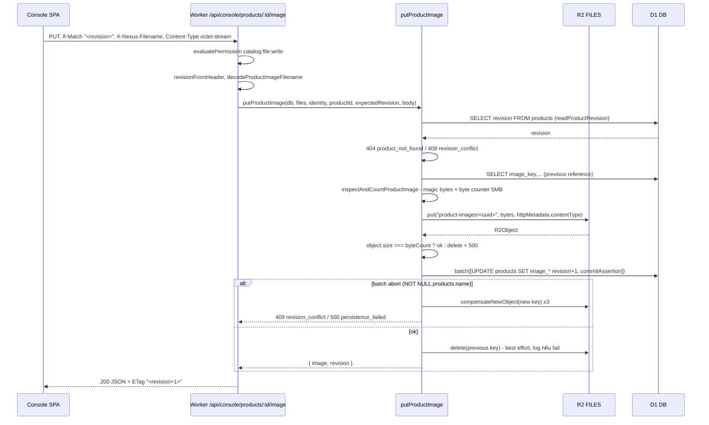
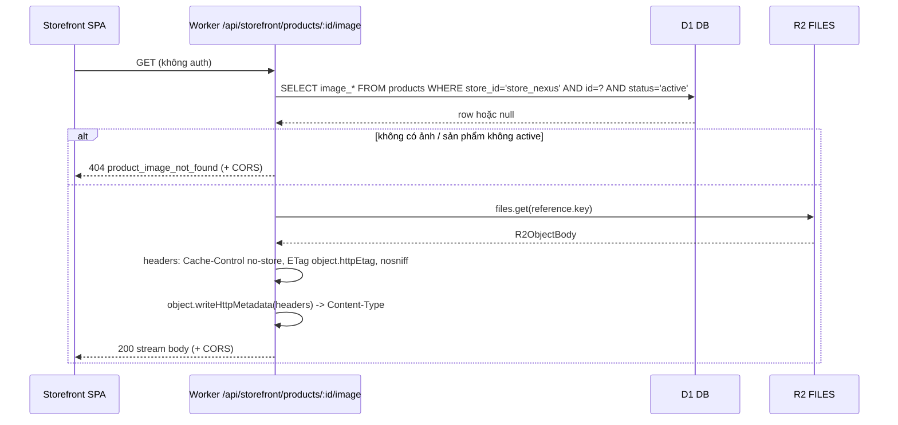

# 02 — Tầng dữ liệu D1, lưu ảnh R2 và bindings (tham chiếu từ nexus-handson)

Tài liệu tham chiếu kỹ thuật. Mọi khẳng định đều kèm `đường-dẫn:dòng` trỏ vào repo SOURCE
`~/Desktop/nexus-handson`. Snippet là trích nguyên văn (có thể cắt bớt bằng `// ...`).

Phạm vi: migrations D1, pattern truy cập dữ liệu raw SQL, quy tắc tiền tệ, vòng đời ảnh trên R2,
bindings/env. Không bàn về auth flow và PayFS webhook.

---

## 1. Quy ước migration

### 1.1. Đánh số và bất biến

Thư mục `migrations/` ở gốc repo, một file `.sql` cho mỗi bước, tiền tố 4 chữ số tăng dần, kèm mô tả
kebab-case. Danh sách thực tế tại thời điểm đọc: `0001-store-products.sql` → `0016-product-images.sql`
(16 file, xác minh bằng liệt kê thư mục `migrations/`).

Lịch sử là append-only:

```md
Append-only history. Never rewrite an applied `.sql` file, including 0001–0007.

Apply through root [`wrangler.jsonc`](../wrangler.jsonc): `npx wrangler d1 migrations apply nexus-s1-468cba-db --local`. Do not add a second migrations directory or Wrangler D1 binding.
```
— `migrations/AGENTS.md:5-7`

Quy tắc này được lặp lại ở gốc: `AGENTS.md:24` liệt kê "Rewrite applied files under `migrations/`" trong
nhóm hành vi bị cấm, và `AGENTS.md:7` khẳng định root `wrangler.jsonc` sở hữu cấu hình Console/API cùng
trạng thái D1/R2 local, không được thêm Wrangler thứ hai cho Console/API.

Hệ quả thực tế: khi cần đổi shape bảng, SOURCE **không** sửa file cũ mà viết migration mới theo kiểu
copy-drop-recreate. Ví dụ `migrations/0006-order-brief-contract.sql:1-7` sao lưu 7 bảng sang bảng tạm
`_s6_*`, `migrations/0006-order-brief-contract.sql:9-19` drop trigger và bảng cũ, rồi tạo lại và
`INSERT ... SELECT` từ bảng tạm (`migrations/0006-order-brief-contract.sql:47-62`). `0010-refund-decisions.sql:1-11`
dùng đúng khuôn mẫu đó với tiền tố `_s4_*`.

### 1.2. Lệnh apply

| Môi trường | Lệnh | Nguồn |
| --- | --- | --- |
| Local (miniflare/`.wrangler`) | `npx wrangler d1 migrations apply nexus-s1-468cba-db --local` | `AGENTS.md:15`, `migrations/AGENTS.md:7` |
| Production (remote) | `npm run migrate:production` = `wrangler d1 migrations apply nexus-handson-akbuild-db --remote --env production` | `package.json` script `migrate:production` |

Tên DB local và production **khác nhau** và được chọn qua `--env` (xem `wrangler.jsonc:30-36` cho default,
`wrangler.jsonc:50-56` cho `production`). `.wrangler*/` bị gitignore (`.gitignore:6`), nên state D1 local là
ephemeral, rebuild bằng cách apply lại toàn bộ migrations.

### 1.3. Quy ước đặt cột, khoá, index, constraint

Rút từ `migrations/0001-store-products.sql` và `0002-product-variants.sql`:

- `PRAGMA foreign_keys = ON;` ở đầu file (`migrations/0001-store-products.sql:1`, `0002-product-variants.sql:1`).
- Khoá chính: `id TEXT PRIMARY KEY NOT NULL` (`0001-store-products.sql:4`, `:11`). ID sinh ở tầng app, không autoincrement.
- Timestamp: `TEXT NOT NULL DEFAULT (strftime('%Y-%m-%dT%H:%M:%fZ', 'now'))` — ISO-8601 UTC dạng chuỗi
  (`0001-store-products.sql:7`, `:31-32`).
- Tiền: `INTEGER` minor units kèm CHECK chặn âm và tràn safe-integer:
  `base_price_minor INTEGER NOT NULL DEFAULT 0 CHECK (base_price_minor >= 0 AND base_price_minor <= 9007199254740991)`
  (`0001-store-products.sql:20`).
- Boolean: `INTEGER ... CHECK (x IN (0, 1))` (`0002-product-variants.sql:10-11`).
- Enum: `TEXT ... CHECK (col IN (...))` (`0001-store-products.sql:17-18`).
- Constraint được **đặt tên** theo `<table>_<ý nghĩa>_<loại>`: `products_store_fk`, `products_file_all_or_none`,
  `products_store_slug_unique` (`0001-store-products.sql:33-40`).
- Composite UNIQUE `(id, store_id)` tồn tại chỉ để làm target cho FK đa cột từ bảng con
  (`0001-store-products.sql:39` ↔ `0002-product-variants.sql:12`, `:63`). Đây là kỹ thuật ép tenant-scoping
  ở tầng schema: bảng con không thể trỏ sang record của store khác.
- Index nhiều cột khớp đúng `ORDER BY` của truy vấn list:
  `products_store_updated_idx ON products (store_id, updated_at DESC, id ASC)` (`0001-store-products.sql:43-44`)
  phục vụ trực tiếp `ORDER BY p.updated_at DESC, p.id ASC` trong `packages/catalog/src/catalog-read.ts:281`.
- Partial unique index cho ràng buộc chỉ áp dụng lên bản ghi active:
  `CREATE UNIQUE INDEX ... ON product_option_groups (product_id, position) WHERE active = 1` (`0002-product-variants.sql:16-17`).
- Invariant phức tạp (đếm, cross-table) dùng TRIGGER + `RAISE(ABORT, '<mã lỗi>')`
  (`0002-product-variants.sql:99-104`, `:106-114`). Mã lỗi là chuỗi ổn định để app phân loại.

### 1.4. Migration mẫu: `0016-product-images.sql`

```sql
ALTER TABLE products ADD COLUMN image_key TEXT;
ALTER TABLE products ADD COLUMN image_filename TEXT;
ALTER TABLE products ADD COLUMN image_content_type TEXT;
ALTER TABLE products ADD COLUMN image_size INTEGER;

CREATE TRIGGER products_image_shape_insert
BEFORE INSERT ON products
WHEN NOT (
  (NEW.image_key IS NULL AND NEW.image_filename IS NULL AND NEW.image_content_type IS NULL AND NEW.image_size IS NULL)
  OR (
    NEW.image_key IS NOT NULL
    AND NEW.image_filename IS NOT NULL
    AND NEW.image_content_type IS NOT NULL
    AND NEW.image_content_type IN ('image/jpeg', 'image/png', 'image/webp')
    AND NEW.image_size IS NOT NULL
    AND NEW.image_size BETWEEN 1 AND 5000000
  )
)
BEGIN
  SELECT RAISE(ABORT, 'product_image_shape_invalid');
END;
-- ... trigger products_image_shape_update lặp lại đúng điều kiện cho BEFORE UPDATE OF
```
— `migrations/0016-product-images.sql:1-21` (trigger UPDATE: `:23-38`)

Ba điểm đáng học:

1. SQLite `ALTER TABLE ADD COLUMN` không thêm được CHECK ràng buộc nhiều cột, nên "all-or-none" được ép
   bằng cặp TRIGGER `BEFORE INSERT` + `BEFORE UPDATE OF` (`0016-product-images.sql:6-7`, `:23-24`). So sánh:
   khi tạo bảng mới thì dùng CHECK trực tiếp — `products_file_all_or_none` (`0001-store-products.sql:34-38`).
2. Whitelist MIME và giới hạn 5 000 000 byte được lặp lại **ở cả DB** (`0016-product-images.sql:14`, `:16`)
   **và app** (`packages/catalog/src/shared/catalog-limits.ts:20` — `PRODUCT_IMAGE_BYTES_MAX = 5_000_000`).
   DB là phòng tuyến cuối.
3. Không có `IF NOT EXISTS` cho TRIGGER ở file này (`:6`), khác với `0002-product-variants.sql:99`
   (`CREATE TRIGGER IF NOT EXISTS`) — tức migration chỉ chạy đúng một lần theo sổ migration của Wrangler.

---

## 2. SỰ THẬT QUAN TRỌNG: SOURCE không dùng Drizzle (hay bất kỳ ORM nào)

Không tồn tại schema TypeScript, query builder hay client sinh mã. Toàn bộ truy cập D1 là raw SQL qua
API `D1Database` của workerd.

### 2.1. Hình dạng hàm

Hàm truy cập dữ liệu là **hàm thuần nhận `db: D1Database` làm tham số đầu tiên**, không có class repository,
không DI container, không singleton connection:

```ts
async function productRowBy(
  db: D1Database,
  identity: ConsoleIdentityContext,
  column: 'id' | 'slug',
  target: string,
): Promise<ProductRow | null> {
  return db.prepare(
    `SELECT id, slug, name, status, product_type, currency, base_price_minor,
            public_description, delivery_access_title, delivery_access_instructions,
            delivery_file_filename, delivery_file_size, delivery_file_kind,
            image_filename, image_content_type, image_size, updated_at, revision

       FROM products
      WHERE store_id = ? AND ${column} = ?
        AND EXISTS (SELECT 1 FROM store_memberships
          WHERE id=? AND store_id=? AND user_id=? AND status='active')`,
  ).bind(identity.storeId, target, identity.membershipId, identity.storeId, identity.userId).first<ProductRow>();
}
```
— `packages/catalog/src/catalog-read.ts:92-109`

Chú ý: phần duy nhất được nội suy vào chuỗi SQL là `${column}`, và nó bị thu hẹp kiểu thành union
`'id' | 'slug'` (`catalog-read.ts:95`). Mọi giá trị do người dùng cung cấp đều đi qua `.bind()`.

### 2.2. Bảng API thực dùng

| API | Dùng khi | Ví dụ |
| --- | --- | --- |
| `.first<T>()` | 0..1 dòng, trả `T \| null` | `catalog-read.ts:109` |
| `.first<T>('col')` | lấy đúng một cột (ở đây là kết quả `EXISTS ... AS active`) | `catalog-read.ts:26` |
| `.all<T>()` | nhiều dòng, đọc `.results` | `catalog-read.ts:149`, `:284`, `:305` |
| `.batch([...])` | nhiều statement, atomic | `catalog-write.ts:421`, `product-image.ts:233` |
| `Promise.all([...])` | nhiều truy vấn đọc độc lập, chạy song song | `catalog-read.ts:142-173` |

`.run()` không xuất hiện trong các module đọc/ghi catalog đã khảo sát; mọi mutation đều đi qua `batch()`
(xem 2.4). Đây là lựa chọn có chủ đích chứ không phải thiếu sót — xem phần "commit assertion".

### 2.3. Mapping row → domain type thủ công

Interface row là snake_case, khớp đúng tên cột, khai báo cạnh hàm đọc:

```ts
interface ProductRow {
  id: string;
  slug: string;
  name: string;
  status: ProductStatus;
  product_type: ProductType;
  currency: string;
  base_price_minor: number;
  // ...
  image_filename: string | null;
  image_content_type: 'image/jpeg' | 'image/png' | 'image/webp' | null;
  image_size: number | null;

  updated_at: string;
  revision: number;
}
```
— `packages/catalog/src/catalog-read.ts:30-50`

Chuyển sang domain type camelCase làm bằng tay trong object literal:
`basePriceMinor: product.base_price_minor` (`catalog-read.ts:192`), `type: product.product_type`
(`catalog-read.ts:190`), và nhóm 3 cột ảnh được gập thành union `{ present: boolean }`
(`catalog-read.ts:194-196`). Kiểu đích `ProductImageSummary` khai báo tại
`packages/catalog/src/catalog-types.ts:12-14`.

Biến thể thứ hai: đặt alias ngay trong SQL để tránh mapping thủ công khi row đã là DTO —
`p.product_type AS type`, `p.updated_at AS updatedAt` (`catalog-read.ts:266`, `:273`), rồi
`.all<ProductListResponse['products'][number]>()` và trả thẳng `result.results`
(`catalog-read.ts:284-286`). Cách này chỉ dùng được vì kiểu trả về đã được khai báo tường minh;
TypeScript **không** kiểm chứng SQL — nếu alias sai tên, lỗi chỉ lộ ở runtime.

### 2.4. Atomicity: `db.batch()` + "commit assertion"

`db.batch()` gói các statement vào một transaction ngầm. SOURCE khai thác điều đó cho ghi nhiều bảng:

```ts
async function persistImageReference(input: {
  // ...
}): Promise<number> {
  await input.db.batch([
    input.db.prepare(
      `UPDATE products SET
         name=CASE WHEN revision=? AND EXISTS (
           SELECT 1 FROM store_memberships
            WHERE id=? AND store_id=? AND user_id=? AND role='owner' AND status='active'
         ) THEN name ELSE NULL END,
         image_key=?, image_filename=?, image_content_type=?, image_size=?,
         revision=revision+1, updated_at=strftime('%Y-%m-%dT%H:%M:%fZ', 'now')
       WHERE store_id=? AND id=?`,
    ).bind(input.expectedRevision, input.identity.membershipId, input.identity.storeId, input.identity.userId,
      input.key, input.filename, input.contentType, input.sizeBytes, input.identity.storeId, input.productId),
    commitAssertion({ ...input, revision: input.expectedRevision + 1 }),
  ]);
  return input.expectedRevision + 1;
}
```
— `packages/catalog/src/files/product-image.ts:223-248`

Kỹ thuật cốt lõi (xuất hiện lặp lại ở `catalog-write.ts:373-393`, `delivery-file.ts:313-319`):

- **Self-aborting UPDATE**: `name = CASE WHEN <điều kiện> THEN name ELSE NULL END`. Nếu điều kiện
  (revision đúng + membership owner active) sai, câu lệnh cố ghi `NULL` vào cột `NOT NULL`
  (`products.name` — `0001-store-products.sql:14`), SQLite abort, D1 rollback cả batch. Đây là cách
  làm optimistic concurrency + authorization **trong một round-trip**, không cần `SELECT ... FOR UPDATE`
  (SQLite/D1 không có).
- **Commit assertion**: statement cuối cùng của batch kiểm tra lại trạng thái *sau* khi đã ghi:

```ts
function commitAssertion(input: {
  // ...
}): D1PreparedStatement {
  return input.db.prepare(
    `UPDATE stores SET name=CASE WHEN EXISTS (
       SELECT 1 FROM store_memberships
        WHERE id=? AND store_id=? AND user_id=? AND role='owner' AND status='active'
     ) AND EXISTS (
       SELECT 1 FROM products WHERE store_id=? AND id=? AND revision=? AND image_key IS ?
     ) THEN name ELSE NULL END
     WHERE id=?`,
  ).bind(
    input.identity.membershipId, input.identity.storeId, input.identity.userId,
    input.identity.storeId, input.productId, input.revision, input.key, input.identity.storeId,
  );
}
```
— `packages/catalog/src/files/product-image.ts:189-208`

- **Nhận diện rollback có chủ đích**: khi batch ném lỗi, app phân biệt "abort do guard" với lỗi hạ tầng
  bằng cách match message:
  `if (/NOT NULL constraint failed: (?:products|stores)\.name\b/.test(current.message)) return true;`
  (`packages/catalog/src/files/product-image.ts:184`), duyệt cả chuỗi `error.cause`
  (`product-image.ts:183`). Guarded rollback → HTTP 409 `revision_conflict`; còn lại → 500
  `persistence_failed` kèm `incidentId` (`product-image.ts:268-271`).

### 2.5. Idempotency ở tầng persistence (`packages/orders`)

`runCommandBatch` là khuôn mẫu cho mọi command ghi đơn hàng:

```ts
export async function runCommandBatch(input: {
  // ...
  statements: D1PreparedStatement[];
  onConflictReplay?: () => Promise<OrderCommandResult | null>;
  context: OrderContext;
}): Promise<OrderCommandResult> {
  try {
    const guard = input.context.identity?.kind === 'console'
      ? input.database.prepare(
        `UPDATE orders
            SET status = CASE WHEN ${consoleVisibilitySql('orders')} THEN status ELSE NULL END
          WHERE store_id = ? AND id = ?`,
      ).bind(
        ...consoleVisibilityBinds(input.context.identity),
        input.storeId,
        input.orderId,
      )
      : null;
    await input.database.batch(guard === null ? input.statements : [...input.statements, guard]);
  } catch (error) {
    await authorizeResult(input.database, input.context, input.orderId, input.action);
    if (input.onConflictReplay) {
      const recovered = await input.onConflictReplay();
      if (recovered) return recovered;
    }
    return recoverFailedBatch(input.database, input.storeId, input, error, input.context);
  }
  await authorizeResult(input.database, input.context, input.orderId, input.action);
  const result = await readCommandResult(input.database, input.storeId, input.requestKey);
  await authorizeResult(input.database, input.context, input.orderId, input.action);
  return result;
}
```
— `packages/orders/src/persistence/command-store.ts:369-406`

Hạ tầng idempotency nằm ở bảng `order_commands`: `request_key` (16–128 ký tự, charset `[A-Za-z0-9_-]`),
`payload_hash` (hex 64 ký tự = SHA-256), `contract_version`, và UNIQUE `(store_id, request_key)`
(`migrations/0006-order-brief-contract.sql:310-339`). Khi batch fail vì đụng UNIQUE, `recoverFailedBatch`
đọc lại ledger: cùng `action`/`order_id`/`payload_hash` → trả kết quả cũ (replay); khác → `keyConflict()`
(`command-store.ts:353-361`, so khớp tại `:96-103`). Client contract version cũ bị chặn riêng bằng
`legacyKeyConflict()` (`command-store.ts:356`).

Ghi chú: đây là idempotency **mức persistence**. Chi tiết PayFS webhook do tài liệu khác phụ trách.

---

## 3. Raw SQL (SOURCE) vs Drizzle ORM (điều PRD của TARGET muốn)

PRD của TARGET ghi `packages/core`: D1 Database Schema, **Drizzle ORM** (`docs/PRD.md:37`). Bảng dưới đây so
sánh trên đúng các tiêu chí ảnh hưởng tới D1.

| Tiêu chí | Raw SQL (như SOURCE) | Drizzle ORM |
| --- | --- | --- |
| Type-safety | Không có. Kiểu row do dev khai tay (`catalog-read.ts:30-50`) và TS tin tưởng tuyệt đối generic của `.first<T>()`/`.all<T>()`; alias sai tên chỉ lộ ở runtime | Kiểu suy ra từ schema TS; đổi cột là compile error ở mọi call site |
| Migration tooling | `wrangler d1 migrations apply`, file SQL viết tay, append-only (`migrations/AGENTS.md:5-7`) | `drizzle-kit generate` sinh SQL từ diff schema; vẫn apply bằng `wrangler d1 migrations apply` |
| Biểu đạt constraint | Đầy đủ SQLite: partial unique index (`0002-product-variants.sql:16-17`), TRIGGER + `RAISE(ABORT, ...)` (`0002-product-variants.sql:99-104`), CHECK đa cột (`0001-store-products.sql:34-38`), FK đa cột (`0002-product-variants.sql:12`) | Schema DSL phủ cột/index/FK cơ bản; TRIGGER và CHECK phức tạp vẫn phải viết SQL tay trong migration |
| Bundle size | 0 byte thêm; chỉ dùng API có sẵn của workerd | Thêm runtime vào Worker bundle; đáng kể với giới hạn script Cloudflare |
| Batch semantics | `db.batch([...])` nguyên bản, kiểm soát trọn vẹn thứ tự statement và mẹo self-aborting UPDATE (`product-image.ts:233-246`) | `db.batch([...])` được wrap; mẹo `CASE WHEN ... ELSE NULL END` vẫn dùng được nhưng phải thoát xuống `sql` template |
| better-auth adapter | SOURCE tạo bảng auth bằng SQL tay: `migrations/0008-better-auth.sql` | better-auth có Drizzle adapter chính thức → sinh schema auth tự động, đỡ đồng bộ tay |
| Chi phí đọc hiểu | Câu SQL nằm ngay tại call site, grep được, nhưng lặp lại nhiều (mệnh đề `EXISTS (SELECT 1 FROM store_memberships ...)` xuất hiện ở `catalog-read.ts:23`, `:106`, `:114`, `:147`, `:154`, `:163`, `:171`, `:277`, `:304`) | Bớt lặp nhờ helper compose được; nhưng thêm một lớp trừu tượng phải học |

Rủi ro cụ thể của raw SQL đã hiện hữu trong SOURCE: chuỗi điều kiện membership được copy-paste 9 lần chỉ
trong một file (`catalog-read.ts`), không có kiểm tra tự động nào bảo đảm truy vấn mới không quên nó.

---

## 4. Quy tắc tiền tệ

Module `packages/catalog/src/money.ts` (75 dòng) là nguồn chân lý duy nhất.

**Biểu diễn**: tiền lưu dưới dạng **integer minor units** (`number`), kèm mã ISO-4217 3 ký tự hoa. Cột DB là
`INTEGER` (`0001-store-products.sql:20`, `0004-orders.sql:30`, `:56-59`). Ở biên API/JSON, tiền đi vào dưới
dạng **chuỗi decimal** (`basePrice: string` — `packages/catalog/src/product-validation.ts:105`,
`:122-123`) và đi ra dưới dạng minor units (`basePriceMinor` — `catalog-read.ts:192`).

**Số chữ số thập phân** không hardcode; lấy từ `Intl`:

```ts
export function currencyFractionDigits(currency: string): number {
  if (!CURRENCY_PATTERN.test(currency) || (supportedCurrencies.size > 0 && !supportedCurrencies.has(currency))) {
    throw new MoneyError('currency_invalid', 'Currency must be an uppercase ISO 4217 code.');
  }
  // ...
  try {
    const digits = new Intl.NumberFormat('en', { style: 'currency', currency }).resolvedOptions()
      .maximumFractionDigits;
    // ...
  } catch {
    throw new MoneyError('currency_invalid', 'Currency must be an uppercase ISO 4217 code.');
  }
}
```
— `packages/catalog/src/money.ts:20-39` (cache tại `:8`, `:34`)

**Parse decimal → minor, không làm tròn mà từ chối**:

```ts
export function decimalToMinor(decimal: string, currency: string): number {
  const fractionDigits = currencyFractionDigits(currency);
  const match = DECIMAL_PATTERN.exec(decimal);
  if (!match) {
    throw new MoneyError('money_invalid', 'Price must be a non-negative decimal string.');
  }

  const fraction = match[1] ?? '';
  if (fraction.length > fractionDigits) {
    throw new MoneyError(
      'money_over_precision',
      `Price has more than ${fractionDigits} fractional digits for ${currency}.`,
    );
  }

  const scale = 10n ** BigInt(fractionDigits);
  const whole = BigInt(decimal.split('.', 1)[0]);
  const paddedFraction = fraction.padEnd(fractionDigits, '0');
  const minor = whole * scale + BigInt(paddedFraction || '0');
  if (minor > MAX_SAFE_MINOR) {
    throw new MoneyError('money_out_of_range', 'Price exceeds the supported safe integer range.');
  }
  return Number(minor);
}

export function minorToDecimal(minor: number, currency: string): string {
  if (!Number.isSafeInteger(minor) || minor < 0) {
    throw new MoneyError('money_out_of_range', 'Minor price must be a non-negative safe integer.');
  }
  const fractionDigits = currencyFractionDigits(currency);
  if (fractionDigits === 0) return String(minor);
  const scale = 10 ** fractionDigits;
  const whole = Math.floor(minor / scale);
  return `${whole}.${String(minor % scale).padStart(fractionDigits, '0')}`;
}
```
— `packages/catalog/src/money.ts:41-75`

Bốn quy tắc rút ra:

1. **Không có làm tròn.** Thừa chữ số thập phân là lỗi `money_over_precision` (`money.ts:49-54`), không
   `Math.round`. Chuyển đổi dùng `BigInt` để tránh sai số float (`money.ts:56-59`).
2. **Chỉ số không âm**, regex `^(?:0|[1-9]\d*)(?:\.(\d+))?$` (`money.ts:2`) — chặn cả `007`, `-1`, `1.`, `.5`.
3. **Trần an toàn** `Number.MAX_SAFE_INTEGER` (`money.ts:3`, `:60-62`), khớp đúng CHECK
   `<= 9007199254740991` trong DB (`0001-store-products.sql:20`).
4. **Lỗi có mã máy đọc được**: `'currency_invalid' | 'money_invalid' | 'money_over_precision' | 'money_out_of_range'`
   (`money.ts:12`), được map thẳng thành field error của API, với `path` trỏ `/currency` hay `/basePrice`
   tuỳ mã (`product-validation.ts:106-115`).

Tổng tiền không tin client: `order_lines.line_total_minor` có CHECK
`line_total_minor = unit_price_minor * quantity` ngay trong DB (`0004-orders.sql:57-60`), và tổng đơn được
ràng buộc với dòng đơn qua FK đa cột trên bộ `(order_id, store_id, currency, total_minor)`
(`0004-orders.sql:65-68`).

**Với VND**: `Intl` trả `maximumFractionDigits = 0` (kiểm chứng bằng
`new Intl.NumberFormat('en',{style:'currency',currency:'VND'}).resolvedOptions().maximumFractionDigits` → `0`).
Nghĩa là `decimalToMinor('45000','VND') === 45000` và `minorToDecimal(45000,'VND') === '45000'` theo nhánh
`fractionDigits === 0` (`money.ts:71`). Module dùng được cho TARGET **không cần sửa**.

---

## 5. Vòng đời ảnh sản phẩm trên R2

### 5.1. Sinh object key và ghi R2

```ts
  const revision = await readProductRevision(input.db, input.identity, input.productId);
  if (revision === null) throw new ProductImageError(404, 'product_not_found', 'Product not found.');
  if (revision !== input.expectedRevision) throw new ProductImageError(409, 'revision_conflict', 'The Product revision has changed.');
  const previous = await imageReferenceForConsole(input.db, input.identity, input.productId);
  const inspected = await inspectAndCountProductImage(input.body);
  const key = `product-images/${crypto.randomUUID()}`;
  let object: R2Object | null;
  try {
    object = await input.files.put(key, await readProductImageForStorage(inspected.stream), {
      httpMetadata: { contentType: inspected.contentType },
    });
  } catch (error) {
    if (inspected.streamError() !== null) throw inspected.streamError();
    throw new ProductImageError(500, 'storage_write_failed', 'The product image could not be stored.', crypto.randomUUID());
  }
  const sizeBytes = inspected.byteCount();
  if (object === null || object.size !== sizeBytes || sizeBytes < 1 || sizeBytes > PRODUCT_IMAGE_BYTES_MAX) {
    try {
      await compensateNewObject(input.files, key);
    } catch {
      throw new ProductImageError(500, 'storage_compensation_failed', 'Product image storage compensation failed.', crypto.randomUUID());
    }
    throw new ProductImageError(500, 'storage_write_failed', 'The stored product image did not match the uploaded body.', crypto.randomUUID());
  }
```
— `packages/catalog/src/files/product-image.ts:294-317`

- **Object key**: `product-images/<uuid v4>` (`product-image.ts:299`). Không chứa tên file gốc, không chứa
  `storeId`/`productId` → key là opaque, không đoán được, và đổi tên sản phẩm không kéo theo rename object.
  File tải xuống (delivery) dùng prefix khác: `delivery/${crypto.randomUUID()}` (`delivery-file.ts:283`).
- **Content type** lưu vào `httpMetadata` của object R2 (`product-image.ts:303`), song song với cột
  `image_content_type` trong D1.
- **Write-then-verify**: so `object.size` với số byte đếm được ở stream; lệch → xoá object và báo lỗi
  (`product-image.ts:310-317`).

### 5.2. Validate MIME và kích thước — ở đâu, bằng gì

Bốn lớp, theo thứ tự chạy:

1. **Route** (`apps/worker/src/console-product-image-routes.ts`):
   - `Content-Type` phải đúng `application/octet-stream` (`:65-67`), ngược lại 415 `product_image_type_invalid`.
   - `If-Match` phải là revision dạng `"<số>"` (`:13-19`), ngược lại 409.
   - Tên file lấy từ header `X-Nexus-Filename`, percent-decoded, cấm rỗng/>255 ký tự/ký tự control và `\`
     (`packages/catalog/src/files/product-image.ts:21-35`).
2. **Content-Length khai báo**: nếu có, phải là safe integer ≥ 0 và ≤ 5 MB (`product-image.ts:289-293`).
3. **Magic bytes** — MIME **không** lấy từ header mà suy ra từ 12 byte đầu:

```ts
const JPEG_PREFIX = [0xff, 0xd8, 0xff];
const PNG_PREFIX = [0x89, 0x50, 0x4e, 0x47, 0x0d, 0x0a, 0x1a, 0x0a];
const RIFF_PREFIX = [0x52, 0x49, 0x46, 0x46];
const WEBP_PREFIX = [0x57, 0x45, 0x42, 0x50];

function contentTypeFor(prefix: Uint8Array): ProductImageContentType | null {
  if (prefix.length >= JPEG_PREFIX.length && JPEG_PREFIX.every((value, index) => prefix[index] === value)) return 'image/jpeg';
  if (prefix.length >= PNG_PREFIX.length && PNG_PREFIX.every((value, index) => prefix[index] === value)) return 'image/png';
  if (prefix.length >= 12 && RIFF_PREFIX.every((value, index) => prefix[index] === value)
    && WEBP_PREFIX.every((value, index) => prefix[index + 8] === value)) return 'image/webp';
  return null;
}
```
— `packages/catalog/src/files/product-image.ts:37-48`

   Stream được bọc lại để đếm byte thật và huỷ giữa chừng khi vượt hạn mức:
   `failure = new ProductImageError(413, 'product_image_size_exceeded', ...)` rồi `controller.error(failure)`
   + `reader.cancel(failure)` (`product-image.ts:92-97`). Buffer đích cấp phát cố định
   `new Uint8Array(PRODUCT_IMAGE_BYTES_MAX)` (`product-image.ts:108`).
4. **DB trigger** — whitelist MIME và `image_size BETWEEN 1 AND 5000000` (`0016-product-images.sql:14-16`).

### 5.3. Metadata lưu xuống D1

Bốn cột trên `products`, all-or-none: `image_key`, `image_filename`, `image_content_type`, `image_size`
(`0016-product-images.sql:1-4`). Không lưu URL — URL được dựng từ `productId` ở tầng route, còn `image_key`
chỉ dùng nội bộ để `files.get()`. Ghi metadata đi kèm `revision=revision+1` và cập nhật `updated_at`
trong cùng batch (`product-image.ts:240-241`).

`referenceFromRow` là chốt chặn khi đọc: thiếu bất kỳ cột nào → coi như không có ảnh; content type lạ →
ném lỗi thay vì trả dữ liệu hỏng (`product-image.ts:141-147`).

### 5.4. Phục vụ ảnh ra ngoài

Ảnh **không** public — bucket là private (`nexus-s1-468cba-private`, `wrangler.jsonc:27`) và mọi byte đều
stream qua Worker.

Console (yêu cầu quyền `catalog:file:read`, `console-product-image-routes.ts:50-52`):

```ts
function imageResponse(object: R2ObjectBody, cacheControl: string): Response {
  const headers = new Headers({
    'Cache-Control': cacheControl,
    'ETag': object.httpEtag,
    'X-Content-Type-Options': 'nosniff',
  });
  object.writeHttpMetadata(headers);
  return new Response(object.body, { headers });
}
```
— `apps/worker/src/console-product-image-routes.ts:29-37`, gọi với `'private, no-store'` tại `:57`

Storefront (public, không auth):

```ts
    const reference = await readPublicProductImage(db, productId);
    if (reference === null) return withStorefrontCors(request, storefrontOrigin, jsonError(404, 'product_image_not_found', 'Product image not found.'));
    const object = await files.get(reference.key);
    if (object === null || !('body' in object)) {
      return withStorefrontCors(request, storefrontOrigin, jsonError(404, 'product_image_not_found', 'Product image not found.'));
    }
    const headers = new Headers({
      'Cache-Control': 'no-store',
      'ETag': object.httpEtag,
      'X-Content-Type-Options': 'nosniff',
    });
    object.writeHttpMetadata(headers);
    return withStorefrontCors(request, storefrontOrigin, new Response(object.body, { headers }));
```
— `apps/worker/src/storefront-product-image-routes.ts:20-32`

Đặc điểm:

- `Cache-Control: no-store` **cả hai phía** (`console-product-image-routes.ts:57`,
  `storefront-product-image-routes.ts:27`). Không tận dụng CDN. Đây là lựa chọn bảo thủ của SOURCE, và là
  điểm TARGET nên đổi (mục 8).
- `ETag` lấy trực tiếp `object.httpEtag` của R2 (`:28`). Lưu ý: code **không** xử lý `If-None-Match`, nên
  không có 304 — ETag chỉ mang tính thông tin.
- `object.writeHttpMetadata(headers)` đặt `Content-Type` từ metadata R2 đã lưu lúc upload (`:31`).
- `X-Content-Type-Options: nosniff` chống MIME sniffing (`:29`).
- Truy vấn public lọc `status='active'` và cố định `store_id = PUBLIC_STORE_ID` (`'store_nexus'`,
  `packages/catalog/src/public-store.ts:1`) — xem `product-image.ts:378-389`. Ảnh của sản phẩm draft/archived
  không lộ ra storefront.

### 5.5. Xoá và dọn rác

- **Xoá chủ động**: `deleteProductImage` set cả 4 cột về `NULL` qua chính `persistImageReference` với
  `key: null, filename: null, contentType: null, sizeBytes: null` (`product-image.ts:350-353`), rồi mới xoá
  object R2. **Thứ tự là D1 trước, R2 sau.**
- **Thay ảnh**: object cũ chỉ bị xoá sau khi metadata mới đã commit thành công (`product-image.ts:327-333`).
- **Xoá R2 có retry**: 3 lần thử (`compensateNewObject` — `product-image.ts:210-221`).
- **Rác chấp nhận được**: nếu xoá object cũ thất bại sau khi D1 đã commit, code chỉ `console.error` và vẫn
  trả 200 (`product-image.ts:330-332`, `:360-362`) — ưu tiên tính nhất quán của D1, chấp nhận orphan object.
- **Compensation khi D1 fail**: object vừa upload bị xoá, nhưng chỉ khi key đó **không** đang được bảng
  `products` tham chiếu: `isImageKeyReferenced` (`product-image.ts:177-180`, gọi tại `:259`). Chi tiết này
  chống xoá nhầm khi batch thực ra đã thành công một phần.
- Không có cron/sweeper dọn orphan R2 trong phạm vi đã khảo sát (cron duy nhất `*/5 * * * *` tại
  `wrangler.jsonc:21-23` chạy `dispatchDueOrderEmails` — `apps/worker/src/index.ts:143-145`).

---

## 6. Bindings và environment

### 6.1. Binding khai báo trong `wrangler.jsonc`

```jsonc
	"r2_buckets": [
		{
			"binding": "FILES",
			"bucket_name": "nexus-s1-468cba-private"
		}
	],
	"d1_databases": [
		{
			"binding": "DB",
			"database_name": "nexus-s1-468cba-db",
			"database_id": "7424d853-fa0b-4e6c-b341-eca85b82e4bd"
		}
	],
```
— `wrangler.jsonc:24-36`

| Binding | Loại | Nguồn |
| --- | --- | --- |
| `DB` | `D1Database` | `wrangler.jsonc:30-36`, type `worker-configuration.d.ts:6` |
| `FILES` | `R2Bucket` | `wrangler.jsonc:24-29`, type `worker-configuration.d.ts:5` |
| `ASSETS` | `Fetcher` (static assets, SPA fallback) | `wrangler.jsonc:8-16`, type `worker-configuration.d.ts:7` |

`vars` plaintext: `CONSOLE_ORIGIN`, `STOREFRONT_ORIGIN` (`wrangler.jsonc:17-20`; production override
`:40-43`).

### 6.2. Type của env

Kiểu binding do Wrangler sinh:

```ts
interface __BaseEnv_Env {
	FILES: R2Bucket;
	DB: D1Database;
	ASSETS: Fetcher;
	CONSOLE_ORIGIN: string;
	STOREFRONT_ORIGIN: string;
}
```
— `worker-configuration.d.ts:4-10` (sinh bởi `wrangler types --strict-vars=false`, `:2`)

Secrets **không** nằm trong file sinh tự động mà được nối thêm bằng tay:

```ts
export type Env = Cloudflare.Env & {
  BETTER_AUTH_SECRET: string;
  CONSOLE_ORIGIN: string;
  GOOGLE_CLIENT_ID: string;
  GOOGLE_CLIENT_SECRET: string;
  STOREFRONT_ORIGIN: string;
  INITIAL_OWNER_EMAIL: string;
  PAYFS_WEBHOOK_API_KEY?: string;
  PAYFS_MERCHANT_BANK?: string;
  PAYFS_MERCHANT_ACCOUNT?: string;
  PAYFS_FEFAULT_ACCOUNT?: string;
  RESEND_API_KEY?: string;
  RESEND_FROM?: string;
};
```
— `apps/worker/src/environment.ts:1-14` (toàn bộ file, 14 dòng)

Secret bắt buộc khai báo non-optional; secret của tính năng tuỳ chọn khai `?`. (Lưu ý lỗi chính tả có thật
trong SOURCE: `PAYFS_FEFAULT_ACCOUNT` — `environment.ts:11`.)

### 6.3. Validate env: runtime guard, không phải schema

Không có Zod/envsafe. `environment.ts` chỉ là **type**. Kiểm tra thật nằm ở entry, dùng `in` operator để
narrow union `Env | Pick<Env, 'ASSETS'>`:

```ts
      if (isConsolePath(pathname)) {
        if (!isKnownConsoleRequest(request)) return routeNotFound();
        if (
          !('DB' in env)
          || !('FILES' in env)
          || !('BETTER_AUTH_SECRET' in env)
          || !('CONSOLE_ORIGIN' in env)
        ) return routeNotFound();
```
— `apps/worker/src/index.ts:92-99`

Cùng pattern ở `index.ts:70-72` (route auth), `:88` (`'STOREFRONT_ORIGIN' in env ? ... : undefined`),
`:129-131` (storefront hoạt động cả khi thiếu `FILES`, chỉ mất route ảnh). Secret rỗng được xử lý riêng:
`Boolean(env.GOOGLE_CLIENT_ID?.trim() && env.GOOGLE_CLIENT_SECRET?.trim())` → 503 `auth_not_configured`
(`index.ts:54`, `:74-76`); `env.RESEND_API_KEY?.trim()` (`apps/worker/src/order-email-service.ts:19`).

Hàm nhận env kiểu hẹp nhất có thể: `env: Pick<Cloudflare.Env, 'DB' | 'FILES'>`
(`console-product-image-routes.ts:41`, `console-file-routes.ts:30`), hoặc nhận thẳng
`db: D1Database, files: R2Bucket` (`storefront-product-image-routes.ts:7-8`).

### 6.4. Local vs production vs `--remote`

| | Local (`wrangler dev`, `--local`) | Production (`--env production`) | `--remote` |
| --- | --- | --- | --- |
| D1 | `nexus-s1-468cba-db`, state trong `.wrangler*/` (gitignore `.gitignore:6`) | `nexus-handson-akbuild-db` (`wrangler.jsonc:52-54`) | thao tác trực tiếp DB thật |
| R2 | `nexus-s1-468cba-private` (`wrangler.jsonc:27`), emulate cục bộ | `nexus-handson-akbuild-private` (`wrangler.jsonc:47`) | bucket thật |
| Origins | `http://127.0.0.1:5173` / `:5174` (`wrangler.jsonc:18-19`) | URL `*.cppai.workers.dev` (`wrangler.jsonc:41-42`) | — |
| Secrets | `.dev.vars` (gitignore `.gitignore:2-3`) | `wrangler secret put` | — |
| Migration | `npx wrangler d1 migrations apply nexus-s1-468cba-db --local` (`AGENTS.md:15`) | `npm run migrate:production` | cờ `--remote` bắt buộc cho production |

Có thêm env `s4-provisioning` (`wrangler.jsonc:58-78`) trỏ vào **tài nguyên dev nhưng đánh dấu**
`"remote": true` (`:67`, `:75`) — dùng cho script provisioning cần đụng tài nguyên thật từ máy local.

Storefront là Worker **riêng** và **không có** binding D1/R2 nào: `apps/storefront/wrangler.jsonc` chỉ khai
`assets.directory: "./dist"` với SPA fallback. Storefront gọi API của Console Worker qua HTTP với base URL
build-time `VITE_STOREFRONT_API_BASE_URL` (`package.json` script `build:storefront:production`).

---

## 7. Sequence diagram

### 7.1. Upload ảnh từ Console



Nguồn: `console-product-image-routes.ts:44-78`, `product-image.ts:279-335`, `:223-248`, `:189-208`, `:210-221`.

### 7.2. Đọc ảnh từ Storefront



Nguồn: `storefront-product-image-routes.ts:11-35`, `product-image.ts:378-389`.

---

## 8. Áp dụng cho QR Menu

### 8.1. Bê nguyên được

| Thứ | Nguồn | Ghi chú |
| --- | --- | --- |
| `money.ts` toàn bộ | `packages/catalog/src/money.ts:1-75` | VND có `fractionDigits = 0`, nhánh `money.ts:71` xử lý đúng. Copy nguyên file. |
| `slug.ts` toàn bộ | `packages/catalog/src/slug.ts:1-23` | `slugifyProductName` xử lý `NFKD` + bỏ dấu (`:11-12`) → tên món tiếng Việt ra slug ASCII đúng. Chỉ cần mở rộng union prefix của `stableId` (`:21`). |
| Magic-byte sniffing + stream counter | `product-image.ts:37-48`, `:50-105` | Giữ nguyên; cùng bộ MIME JPEG/PNG/WebP phù hợp ảnh món. |
| `compensateNewObject` retry ×3 | `product-image.ts:210-221` | Giữ nguyên. |
| Envelope lỗi + `jsonResponse`/`jsonError` | `apps/worker/src/http-response.ts:1-61` | Giữ nguyên. |
| Quy ước migration append-only + đặt tên constraint | `migrations/AGENTS.md:5-7`, `0001-store-products.sql:33-40` | Giữ nguyên. |
| `db.batch()` + commit assertion cho optimistic concurrency | `product-image.ts:189-208`, `:233-246` | Giữ nguyên cho mọi mutation đơn hàng. |
| Ledger idempotency `(store_id, request_key)` + `payload_hash` | `0006-order-brief-contract.sql:310-339` | Đổi `store_id` → `tenant/branch` hoặc bỏ nếu single-tenant. |

### 8.2. Phải đổi

1. **Đa tenant → đơn tenant.** SOURCE nhét `store_id` vào mọi bảng và mọi WHERE, kèm mệnh đề
   `EXISTS (SELECT 1 FROM store_memberships ...)` lặp 8 lần trong `catalog-read.ts`. QR Menu MVP là một quán,
   nên **bỏ `store_id`** khỏi khoá và truy vấn; giữ lại chỉ khi roadmap có multi-branch. Nếu bỏ, cũng bỏ luôn
   composite UNIQUE `(id, store_id)` (`0001-store-products.sql:39`) và FK đa cột — chúng chỉ tồn tại để
   scope tenant.
2. **Cache ảnh.** `Cache-Control: no-store` (`storefront-product-image-routes.ts:27`) là sai cho menu công khai.
   Ảnh món bất biến theo key (key là UUID mới mỗi lần upload) → dùng
   `Cache-Control: public, max-age=31536000, immutable` và trả 304 khi `If-None-Match` khớp `object.httpEtag`.
   Đây chính là điểm SOURCE bỏ ngỏ (mục 5.4).
3. **`image_url` trong PRD.** `docs/PRD.md:63` ghi `image_url`. Theo SOURCE nên lưu **`image_key` + metadata**
   (`0016-product-images.sql:1-4`) chứ không lưu URL: URL dựng ở tầng route, đổi domain/CDN không phải migrate dữ liệu.
4. **Giá.** `docs/PRD.md:63` ghi `price`, `:66` ghi `unit_price_snapshot`. Đổi tên thành `price_minor`,
   `unit_price_snapshot_minor` kiểu `INTEGER` cho khớp `money.ts` và CHECK của SOURCE (`0001-store-products.sql:20`).
5. **Order nhiều dòng.** `0004-orders.sql:70` có `order_lines_exactly_one_unique UNIQUE (order_id, store_id)`
   — đơn chỉ được 1 dòng; `0006` nới ra bằng `order_lines_position_unique UNIQUE (order_id, store_id, position)`
   (`0006-order-brief-contract.sql:91`). QR Menu phải dùng mô hình `0006` ngay từ đầu.
6. **Status machine.** SOURCE: `('pending','paid','fulfilled','canceled')` (`0006-order-brief-contract.sql:31`).
   TARGET cần `pending_payment -> paid -> preparing -> fulfilled/cancelled/refunded` (`docs/PRD.md:56`) —
   sửa CHECK, và nhớ SOURCE dùng chính tả `canceled` (một `l`), TARGET PRD dùng `cancelled`. Chọn một, giữ nhất quán.
7. **Drizzle vs raw SQL** — xem khuyến nghị ở cuối.

### 8.3. Schema D1 đề xuất (theo đúng quy ước SOURCE)

```sql
-- migrations/0001-menu-core.sql
PRAGMA foreign_keys = ON;

CREATE TABLE IF NOT EXISTS categories (
  id TEXT PRIMARY KEY NOT NULL,
  name TEXT NOT NULL CHECK (length(name) BETWEEN 1 AND 120),
  slug TEXT NOT NULL,
  name_search_key TEXT NOT NULL DEFAULT '',
  display_order INTEGER NOT NULL DEFAULT 0 CHECK (display_order >= 0),
  is_active INTEGER NOT NULL DEFAULT 1 CHECK (is_active IN (0, 1)),
  created_at TEXT NOT NULL DEFAULT (strftime('%Y-%m-%dT%H:%M:%fZ', 'now')),
  updated_at TEXT NOT NULL DEFAULT (strftime('%Y-%m-%dT%H:%M:%fZ', 'now')),
  CONSTRAINT categories_slug_unique UNIQUE (slug)
);

CREATE UNIQUE INDEX IF NOT EXISTS categories_active_order_unique
  ON categories (display_order) WHERE is_active = 1;

CREATE TABLE IF NOT EXISTS products (
  id TEXT PRIMARY KEY NOT NULL,
  category_id TEXT NOT NULL,
  slug TEXT NOT NULL,
  name TEXT NOT NULL CHECK (length(name) BETWEEN 1 AND 200),
  name_search_key TEXT NOT NULL DEFAULT '',
  description TEXT NOT NULL DEFAULT '',
  currency TEXT NOT NULL DEFAULT 'VND' CHECK (length(currency) = 3 AND currency = upper(currency)),
  price_minor INTEGER NOT NULL DEFAULT 0 CHECK (price_minor >= 0 AND price_minor <= 9007199254740991),
  is_available INTEGER NOT NULL DEFAULT 1 CHECK (is_available IN (0, 1)),
  display_order INTEGER NOT NULL DEFAULT 0 CHECK (display_order >= 0),
  image_key TEXT,
  image_filename TEXT,
  image_content_type TEXT CHECK (image_content_type IS NULL OR image_content_type IN ('image/jpeg','image/png','image/webp')),
  image_size INTEGER CHECK (image_size IS NULL OR image_size BETWEEN 1 AND 5000000),
  revision INTEGER NOT NULL DEFAULT 1 CHECK (revision >= 1),
  created_at TEXT NOT NULL DEFAULT (strftime('%Y-%m-%dT%H:%M:%fZ', 'now')),
  updated_at TEXT NOT NULL DEFAULT (strftime('%Y-%m-%dT%H:%M:%fZ', 'now')),
  CONSTRAINT products_category_fk FOREIGN KEY (category_id) REFERENCES categories(id),
  CONSTRAINT products_slug_unique UNIQUE (slug),
  CONSTRAINT products_image_all_or_none CHECK (
    (image_key IS NULL AND image_filename IS NULL AND image_content_type IS NULL AND image_size IS NULL)
    OR (image_key IS NOT NULL AND image_filename IS NOT NULL AND image_content_type IS NOT NULL AND image_size IS NOT NULL)
  )
);

CREATE INDEX IF NOT EXISTS products_menu_idx
  ON products (category_id, is_available, display_order, id);
CREATE INDEX IF NOT EXISTS products_updated_idx
  ON products (updated_at DESC, id ASC);

CREATE TABLE IF NOT EXISTS tables (
  id TEXT PRIMARY KEY NOT NULL,
  table_number TEXT NOT NULL CHECK (length(table_number) BETWEEN 1 AND 32),
  secret_token TEXT NOT NULL CHECK (
    length(secret_token) BETWEEN 16 AND 128
    AND secret_token NOT GLOB '*[^A-Za-z0-9_-]*'
  ),
  is_active INTEGER NOT NULL DEFAULT 1 CHECK (is_active IN (0, 1)),
  created_at TEXT NOT NULL DEFAULT (strftime('%Y-%m-%dT%H:%M:%fZ', 'now')),
  CONSTRAINT tables_number_unique UNIQUE (table_number),
  CONSTRAINT tables_secret_token_unique UNIQUE (secret_token)
);

CREATE TABLE IF NOT EXISTS orders (
  id TEXT PRIMARY KEY NOT NULL,
  order_code TEXT NOT NULL,
  order_token TEXT NOT NULL CHECK (
    length(order_token) BETWEEN 16 AND 128
    AND order_token NOT GLOB '*[^A-Za-z0-9_-]*'
  ),
  table_id TEXT NOT NULL,
  status TEXT NOT NULL DEFAULT 'pending_payment'
    CHECK (status IN ('pending_payment','paid','preparing','fulfilled','cancelled','refunded')),
  currency TEXT NOT NULL CHECK (length(currency) = 3 AND currency = upper(currency)),
  total_amount_minor INTEGER NOT NULL CHECK (total_amount_minor BETWEEN 0 AND 9007199254740991),
  payment_method TEXT NOT NULL CHECK (payment_method IN ('vietqr','cash')),
  payment_reference TEXT NOT NULL,
  created_at TEXT NOT NULL DEFAULT (strftime('%Y-%m-%dT%H:%M:%fZ', 'now')),
  updated_at TEXT NOT NULL DEFAULT (strftime('%Y-%m-%dT%H:%M:%fZ', 'now')),
  CONSTRAINT orders_table_fk FOREIGN KEY (table_id) REFERENCES tables(id),
  CONSTRAINT orders_code_unique UNIQUE (order_code),
  CONSTRAINT orders_token_unique UNIQUE (order_token),
  CONSTRAINT orders_payment_reference_unique UNIQUE (payment_reference),
  CONSTRAINT orders_currency_tuple_unique UNIQUE (id, currency)
);

CREATE INDEX IF NOT EXISTS orders_kitchen_idx
  ON orders (status, created_at ASC, id ASC);
CREATE INDEX IF NOT EXISTS orders_table_created_idx
  ON orders (table_id, created_at DESC, id DESC);

CREATE TABLE IF NOT EXISTS order_items (
  id TEXT PRIMARY KEY NOT NULL,
  order_id TEXT NOT NULL,
  product_id TEXT NOT NULL,
  product_name_snapshot TEXT NOT NULL,
  quantity INTEGER NOT NULL CHECK (quantity BETWEEN 1 AND 99),
  unit_price_snapshot_minor INTEGER NOT NULL CHECK (unit_price_snapshot_minor BETWEEN 0 AND 9007199254740991),
  line_total_minor INTEGER NOT NULL CHECK (
    line_total_minor BETWEEN 0 AND 9007199254740991
    AND line_total_minor = unit_price_snapshot_minor * quantity
  ),
  currency TEXT NOT NULL CHECK (length(currency) = 3 AND currency = upper(currency)),
  notes TEXT NOT NULL DEFAULT '' CHECK (length(notes) <= 500),
  position INTEGER NOT NULL CHECK (position >= 0),
  CONSTRAINT order_items_order_currency_fk
    FOREIGN KEY (order_id, currency) REFERENCES orders(id, currency)
    DEFERRABLE INITIALLY DEFERRED,
  CONSTRAINT order_items_product_fk FOREIGN KEY (product_id) REFERENCES products(id),
  CONSTRAINT order_items_position_unique UNIQUE (order_id, position)
);

CREATE INDEX IF NOT EXISTS order_items_order_idx
  ON order_items (order_id, position);

CREATE TABLE IF NOT EXISTS refund_requests (
  id TEXT PRIMARY KEY NOT NULL,
  order_id TEXT NOT NULL,
  requested_by_staff_id TEXT NOT NULL,
  reason TEXT NOT NULL CHECK (length(reason) BETWEEN 1 AND 1000),
  status TEXT NOT NULL DEFAULT 'pending' CHECK (status IN ('pending','approved','rejected')),
  created_at TEXT NOT NULL DEFAULT (strftime('%Y-%m-%dT%H:%M:%fZ', 'now')),
  decided_at TEXT,
  decided_by_user_id TEXT,
  CONSTRAINT refund_requests_order_fk FOREIGN KEY (order_id) REFERENCES orders(id),
  CONSTRAINT refund_requests_order_unique UNIQUE (order_id),
  CONSTRAINT refund_requests_decision_shape CHECK (
    (status = 'pending' AND decided_at IS NULL AND decided_by_user_id IS NULL)
    OR (status IN ('approved','rejected') AND decided_at IS NOT NULL AND decided_by_user_id IS NOT NULL)
  )
);

CREATE INDEX IF NOT EXISTS refund_requests_status_idx
  ON refund_requests (status, created_at ASC, id ASC);

CREATE TRIGGER refund_requests_terminal_immutable
BEFORE UPDATE ON refund_requests
WHEN OLD.status IN ('approved','rejected')
BEGIN
  SELECT RAISE(ABORT, 'refund_decision_is_final');
END;
```

Đối chiếu từng quyết định với SOURCE:

| Quyết định | Bắt chước từ |
| --- | --- |
| `id TEXT PRIMARY KEY NOT NULL`, ID sinh ở app | `0001-store-products.sql:4`, `slug.ts:21-23` |
| `created_at/updated_at TEXT DEFAULT strftime(...)` | `0001-store-products.sql:7`, `:31-32` |
| Boolean `INTEGER CHECK (x IN (0,1))` | `0002-product-variants.sql:10-11` |
| Tiền `INTEGER ... <= 9007199254740991` | `0001-store-products.sql:20`, khớp `money.ts:3` |
| `line_total_minor = unit_price * quantity` trong CHECK | `0004-orders.sql:57-60` |
| FK `(order_id, currency)` DEFERRABLE giữ đồng nhất tiền tệ | `0006-order-brief-contract.sql:86-89` |
| `position` + UNIQUE `(order_id, position)` | `0006-order-brief-contract.sql:85`, `:91` |
| Token dạng `length BETWEEN 16 AND 128 AND NOT GLOB '*[^A-Za-z0-9_-]*'` | `0006-order-brief-contract.sql:313-316` |
| `orders_currency_tuple_unique` làm target FK | `0006-order-brief-contract.sql:44` |
| Refund decision shape + trigger immutable | `0010-refund-decisions.sql:31-34`, `:49-54` |
| Partial unique index cho `display_order` | `0002-product-variants.sql:16-17` |
| Ảnh: 4 cột all-or-none + whitelist MIME + ≤ 5 MB | `0016-product-images.sql:1-4`, `:14-16`, `0001-store-products.sql:34-38` |
| `revision` cho optimistic concurrency + `If-Match` | `0001-store-products.sql:29`, `console-product-image-routes.ts:13-19` |

Khác biệt cố ý so với SOURCE:
- Bỏ `store_id` (single-tenant, mục 8.2.1).
- `image_*` dùng CHECK trong `CREATE TABLE` thay vì TRIGGER, vì đây là bảng tạo mới chứ không phải
  `ALTER TABLE ADD COLUMN` (lý do TRIGGER ở SOURCE: mục 1.4.1).
- `orders.status` theo state machine của `docs/PRD.md:56`.
- Bảng `payments` / `order_commands` (ledger idempotency webhook) do tài liệu PayFS phụ trách; khi thêm,
  giữ nguyên shape `0006-order-brief-contract.sql:310-339`.

### 8.4. Quy ước object key R2 cho ảnh món

Theo `product-image.ts:299` (`product-images/${crypto.randomUUID()}`) và `delivery-file.ts:283`
(`delivery/${crypto.randomUUID()}`), quy ước cho TARGET:

```
menu-images/<uuid-v4>          # ảnh món (public qua Worker, cache immutable)
qr-codes/<uuid-v4>             # ảnh QR bàn, nếu render sẵn
payment-proofs/<uuid-v4>       # ảnh chứng từ chuyển khoản (private, no-store)
```

Quy tắc:
- Prefix theo **loại nội dung**, không theo entity id. Key opaque, không nhúng tên file người dùng
  (tên gốc lưu ở cột `image_filename`, theo `0016-product-images.sql:2`).
- Upload thay ảnh luôn sinh key **mới**, xoá key cũ sau khi D1 commit (`product-image.ts:327-333`). Nhờ đó
  key là immutable → cache vĩnh viễn ở tầng HTTP an toàn (mục 8.2.2).
- Một bucket private duy nhất, binding `FILES` (`wrangler.jsonc:24-29`). `menu-images/*` vẫn stream qua
  Worker như `storefront-product-image-routes.ts:22-32`, chỉ khác header cache; không bật public bucket
  để giữ khả năng kiểm soát (ẩn món → ảnh 404 ngay, theo điều kiện `status='active'` tại
  `product-image.ts:382`).
- Content type ghi vào `httpMetadata` lúc `put` (`product-image.ts:302-304`) và trả ra bằng
  `object.writeHttpMetadata(headers)` (`storefront-product-image-routes.ts:31`).
