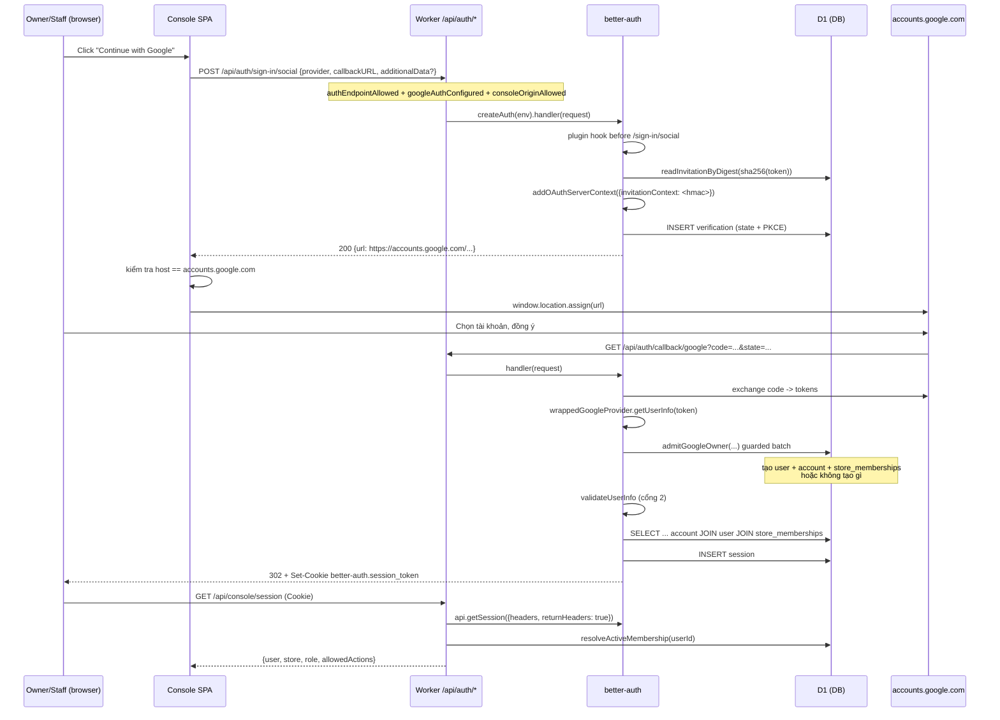

# 03 — better-auth + Google OAuth cho Operator Console (Cloudflare Worker + D1)

Tài liệu tham chiếu bóc tách từ repo mẫu `nexus-handson` (SOURCE). Mọi đường dẫn `path:line` bên dưới là tương đối so với gốc SOURCE. Tài liệu này chỉ nói về xác thực/phân quyền Console; không đề cập PayFS, R2, build pipeline.

Phiên bản thư viện đã xác minh: `better-auth` `1.7.4` (`package.json:deps`, khai báo tại root và `apps/worker/package.json`).

---

## 1. Cấu hình server

### 1.1 Snippet nguyên văn `createAuth`

`apps/worker/src/auth.ts:96-147`:

```ts
export function createAuth(env: AuthEnv) {
  const googleClientId = env.GOOGLE_CLIENT_ID?.trim();
  const googleClientSecret = env.GOOGLE_CLIENT_SECRET?.trim();
  return betterAuth({
    database: env.DB,
    baseURL: env.CONSOLE_ORIGIN,
    secret: env.BETTER_AUTH_SECRET,
    plugins: [ownerInvitationOAuthPlugin(env)],
    socialProviders: googleClientId && googleClientSecret ? {
      google: wrappedGoogleProvider(env, googleClientId, googleClientSecret),
    } : {},
    user: {
      validateUserInfo: async ({ user, source }) => {
        if (source.method !== 'oauth') return;
        const subject = source.oauth?.profile?.['sub'];
        if (
          source.oauth?.providerId !== 'google'
          || user.emailVerified !== true
          || typeof user.email !== 'string'
          || typeof subject !== 'string'
          || subject.length === 0
        ) return { error: 'access_denied', errorDescription: 'This Google account cannot access the Console.' };

        const binding = await env.DB.prepare(
          `SELECT user.email
             FROM account
             JOIN "user" user ON user.id=account.userId
             JOIN store_memberships membership ON membership.user_id=user.id
            WHERE account.providerId='google'
              AND account.accountId=?
              AND membership.status='active'`,
        ).bind(subject).first<{ email: string }>();
        if (!binding || binding.email.toLowerCase() !== user.email.trim().toLowerCase()) {
          return { error: 'access_denied', errorDescription: 'This Google account cannot access the Console.' };
        }
      },
    },
    account: {
      encryptOAuthTokens: true,
      accountLinking: { enabled: false },
    },
    trustedOrigins: [env.CONSOLE_ORIGIN],
    rateLimit: {
      enabled: true,
      storage: 'database',
    },
    advanced: {
      database: { validateSchema: true },
      ipAddress: { ipAddressHeaders: ['cf-connecting-ip'] },
    },
  });
}
```

Provider Google được bọc thêm một lớp, `apps/worker/src/auth.ts:51-94` (trích, đã cắt bớt):

```ts
function wrappedGoogleProvider(env: AuthEnv, clientId: string, clientSecret: string) {
  const googleOptions = {
    clientId,
    clientSecret,
    prompt: 'select_account' as const,
    disableSignUp: true,
    disableIdTokenSignIn: true,
  };
  const nativeGoogle = google(googleOptions);
  return {
    ...googleOptions,
    getUserInfo: async (token: Parameters<typeof nativeGoogle.getUserInfo>[0]) => {
      const result = await nativeGoogle.getUserInfo(token);
      // ...
      await admitGoogleOwner({
        database: env.DB,
        profile: {
          email: result.user.email,
          name: result.user.name,
          googleSubject,
          emailVerified: result.user.emailVerified,
        },
        initialOwnerEmail: env.INITIAL_OWNER_EMAIL,
        invitationContext,
      });
      // ...
      return result;
    },
  };
}
```

### 1.2 Giải thích từng option

| Option | Giá trị trong SOURCE | Ý nghĩa |
|---|---|---|
| `database` | `env.DB` (`auth.ts:100`) | Truyền thẳng binding `D1Database` của Cloudflare. Không có `drizzleAdapter`/`prismaAdapter` nào được import (`auth.ts:1-12`). |
| `baseURL` | `env.CONSOLE_ORIGIN` (`auth.ts:101`) | Origin dùng để dựng callback URL. Phải khớp tuyệt đối với origin trình duyệt và redirect URI đăng ký ở Google (`docs/google-console-login.md:25`). |
| `secret` | `env.BETTER_AUTH_SECRET` (`auth.ts:102`) | Khóa ký cookie/state. Cũng là khóa gốc của HMAC invitation context (`packages/identity/src/invitations.ts:48-51`); code từ chối secret ngắn hơn 32 ký tự (`invitations.ts:109`, `invitations.ts:259`). |
| `plugins` | `ownerInvitationOAuthPlugin(env)` (`auth.ts:103`) | Hook `before` trên `/sign-in/social` để bơm invitation context vào OAuth server state (`auth.ts:17-49`). |
| `socialProviders` | Chỉ `google`, và chỉ khi có đủ client id + secret (`auth.ts:104-106`) | Thiếu cấu hình ⇒ object rỗng ⇒ Worker trả `503 auth_not_configured` (`apps/worker/src/index.ts:74-76`). Fail closed. |
| `user.validateUserInfo` | `auth.ts:108-131` | Cổng chặn thứ hai sau `getUserInfo`: bắt buộc `providerId==='google'`, `emailVerified===true`, có `sub`, và `sub` đó phải đang bind tới một `user` có `store_memberships.status='active'` với email trùng khớp. |
| `account.encryptOAuthTokens` | `true` (`auth.ts:134`) | Mã hóa access/refresh token lưu trong bảng `account`. |
| `account.accountLinking.enabled` | `false` (`auth.ts:135`) | Chặn link ngầm Google vào user local sai (rủi ro được ghi rõ tại `plans/260913-0229-google-oauth-login-cutover/phase-01-google-oauth-login.md:35`). |
| `trustedOrigins` | `[env.CONSOLE_ORIGIN]` (`auth.ts:137`) | Chỉ một origin duy nhất được better-auth tin. |
| `rateLimit.storage` | `'database'` (`auth.ts:138-141`) | Dùng bảng `rateLimit` trong D1 (`migrations/0008-better-auth.sql:47-52`). |
| `advanced.database.validateSchema` | `true` (`auth.ts:143`) | Kiểm tra schema D1 khớp model better-auth lúc chạy. |
| `advanced.ipAddress.ipAddressHeaders` | `['cf-connecting-ip']` (`auth.ts:144`) | Lấy IP từ header Cloudflare thay vì `X-Forwarded-For`. |
| `prompt` | `'select_account'` (`auth.ts:55`) | Luôn cho chọn lại tài khoản Google. |
| `disableSignUp` | `true` (`auth.ts:56`) | better-auth không tự tạo user mới từ callback. Việc tạo user do lớp `admitGoogleOwner` làm trước, bằng SQL thuần. |
| `disableIdTokenSignIn` | `true` (`auth.ts:57`) | Không cho đăng nhập bằng ID token do client gửi lên; chỉ nhận authorization-code flow. |

### 1.3 better-auth nói chuyện với D1 như thế nào

Sự thật xác minh được trong SOURCE:

- `database: env.DB` nhận trực tiếp binding D1 (`apps/worker/src/auth.ts:100`). Không có package ORM nào trong dependency: `package.json` chỉ liệt kê `better-auth`, `papaparse`, `react`, `react-dom`, `@viet-qr/react`.
- Schema các bảng auth do **migration SQL viết tay** định nghĩa (`migrations/0008-better-auth.sql:1-56`), không phải do ORM sinh ra. Migration là file SQL đánh số, append-only (`README.md:12`).
- Toàn bộ code nghiệp vụ identity dùng `database.prepare(...).bind(...)` và `database.batch([...])`, ví dụ `packages/identity/src/membership-store.ts:35-49`, `packages/identity/src/admission.ts:72-91`, `packages/identity/src/google-identity.ts:164-177`.

⇒ **Không cần Drizzle/Prisma.** better-auth tự nhận diện binding D1 và tự chạy các câu lệnh của nó; phần domain của SOURCE dùng raw SQL song song trên cùng một binding.

Hệ quả quan trọng — **D1 không có transaction tương tác thật**. Ghi nhận nguyên văn tại `plans/260915-1046-secure-owner-bootstrap-and-invites/phase-02-identityadmission.md:53`:

> "Better Auth’s D1 adapter does not provide a true interactive transaction; hook order also rejects unknown users before normal signup hooks. The observable signal is an unbound identity, partial write, or callback denial after a purported admission; response is native D1 guarded batch plus durable post-error result reconciliation, never enabling signup or account linking."

Cách SOURCE bù lại, yêu cầu hợp đồng tại `phase-02-identityadmission.md:22`:

> "D1 guarded batches must either create the account, membership, and transition together or leave no authority; every recoverable failure gets a deterministic post-error read."

Kỹ thuật cụ thể là **guarded batch**: điều kiện hợp lệ được nhúng thẳng vào câu `INSERT` dưới dạng `CASE WHEN <eligibility> THEN ? ELSE NULL END` cho cột `PRIMARY KEY NOT NULL`. Nếu điều kiện sai, giá trị `NULL` làm vi phạm `NOT NULL`, cả `batch` bị abort. Trích nguyên văn `packages/identity/src/google-identity.ts:150-179`:

```ts
export function ownerBindingStatements(
  database: D1Database,
  profile: GoogleOwnerProfile,
  eligibilitySql: string,
  eligibilityBinds: unknown[],
): { userId: string; accountRowId: string; membershipId: string; statements: D1PreparedStatement[] } {
  const userId = newAuthId();
  const accountRowId = newAuthId();
  const membershipId = newAuthId();
  const now = new Date().toISOString();
  return {
    userId,
    accountRowId,
    membershipId,
    statements: [
      database.prepare(
        `INSERT INTO "user" (id, name, email, emailVerified, createdAt, updatedAt)
         VALUES (CASE WHEN ${eligibilitySql} THEN ? ELSE NULL END, ?, ?, 1, ?, ?)`,
      ).bind(...eligibilityBinds, userId, profile.name, profile.email, now, now),
      database.prepare(
        `INSERT INTO account (id, accountId, providerId, userId, createdAt, updatedAt)
         VALUES (?, ?, 'google', ?, ?, ?)`,
      ).bind(accountRowId, profile.googleSubject, userId, now, now),
      database.prepare(
        `INSERT INTO store_memberships (id, store_id, user_id, role, status, revoked_at)
         VALUES (?, ?, ?, 'owner', 'active', NULL)`,
      ).bind(membershipId, NEXUS_STORE_ID, userId),
    ],
  };
}
```

Và sau mỗi `catch`, luôn có bước đọc lại xác định trạng thái thật (`reconcileAdmission`, `packages/identity/src/admission.ts:92-95`, `admission.ts:156-159`, `admission.ts:162-190`) — không suy đoán từ exception.

---

## 2. Schema các bảng auth

### 2.1 Bảng do better-auth sở hữu

`migrations/0008-better-auth.sql:1-56` (nguyên văn):

```sql
CREATE TABLE "user" (
  "id" TEXT PRIMARY KEY NOT NULL,
  "name" TEXT NOT NULL,
  "email" TEXT NOT NULL UNIQUE,
  "emailVerified" INTEGER NOT NULL,
  "image" TEXT,
  "createdAt" DATE NOT NULL,
  "updatedAt" DATE NOT NULL
);

CREATE TABLE "session" (
  "id" TEXT PRIMARY KEY NOT NULL,
  "expiresAt" DATE NOT NULL,
  "token" TEXT NOT NULL UNIQUE,
  "createdAt" DATE NOT NULL,
  "updatedAt" DATE NOT NULL,
  "ipAddress" TEXT,
  "userAgent" TEXT,
  "userId" TEXT NOT NULL REFERENCES "user" ("id") ON DELETE CASCADE
);

CREATE TABLE "account" (
  "id" TEXT PRIMARY KEY NOT NULL,
  "accountId" TEXT NOT NULL,
  "providerId" TEXT NOT NULL,
  "userId" TEXT NOT NULL REFERENCES "user" ("id") ON DELETE CASCADE,
  "accessToken" TEXT,
  "refreshToken" TEXT,
  "idToken" TEXT,
  "accessTokenExpiresAt" DATE,
  "refreshTokenExpiresAt" DATE,
  "scope" TEXT,
  "password" TEXT,
  "createdAt" DATE NOT NULL,
  "updatedAt" DATE NOT NULL
);

CREATE TABLE "verification" (
  "id" TEXT PRIMARY KEY NOT NULL,
  "identifier" TEXT NOT NULL,
  "value" TEXT NOT NULL,
  "expiresAt" DATE NOT NULL,
  "createdAt" DATE NOT NULL,
  "updatedAt" DATE NOT NULL
);

CREATE TABLE "rateLimit" (
  "id" TEXT PRIMARY KEY NOT NULL,
  "key" TEXT NOT NULL UNIQUE,
  "count" INTEGER NOT NULL,
  "lastRequest" BIGINT NOT NULL
);

CREATE INDEX "session_userId_idx" ON "session" ("userId");
CREATE INDEX "account_userId_idx" ON "account" ("userId");
CREATE INDEX "verification_identifier_idx" ON "verification" ("identifier");
```

Lưu ý tên bảng `"user"` là từ khóa SQL ⇒ luôn phải quote (thấy trong mọi query, ví dụ `auth.ts:122`, `invitations.ts:118`).

### 2.2 Ràng buộc unique bổ sung cho binding Google

`migrations/0011-google-account-binding-uniqueness.sql:1-5` (toàn bộ file):

```sql
CREATE UNIQUE INDEX account_provider_subject_unique
  ON account (providerId, accountId);

CREATE UNIQUE INDEX account_user_provider_unique
  ON account (userId, providerId);
```

Ý nghĩa đã ghi tại `docs/google-console-login.md:55`: "Migration `0011-google-account-binding-uniqueness.sql` enforces one Google subject per Nexus user and one Nexus user per Google subject. Repeating the exact input is a no-op; reusing a subject for another user, changing the bound subject, Store, or role fails closed."

### 2.3 Bảng domain: membership

`migrations/0009-store-memberships.sql:1-24` (trích phần membership):

```sql
CREATE TABLE store_memberships (
  id TEXT PRIMARY KEY NOT NULL,
  store_id TEXT NOT NULL,
  user_id TEXT NOT NULL,
  role TEXT NOT NULL CHECK (role IN ('owner','staff')),
  status TEXT NOT NULL DEFAULT 'active' CHECK (status IN ('active','revoked')),
  created_at TEXT NOT NULL DEFAULT (strftime('%Y-%m-%dT%H:%M:%fZ', 'now')),
  updated_at TEXT NOT NULL DEFAULT (strftime('%Y-%m-%dT%H:%M:%fZ', 'now')),
  revoked_at TEXT,
  CONSTRAINT store_memberships_store_fk FOREIGN KEY (store_id) REFERENCES stores(id),
  CONSTRAINT store_memberships_user_fk FOREIGN KEY (user_id) REFERENCES "user"("id"),
  CONSTRAINT store_memberships_id_store_unique UNIQUE (id, store_id),
  CONSTRAINT store_memberships_user_store_unique UNIQUE (user_id, store_id),
  CONSTRAINT store_memberships_status_time CHECK (
    (status = 'active' AND revoked_at IS NULL)
    OR (status = 'revoked' AND revoked_at IS NOT NULL)
  )
);

CREATE UNIQUE INDEX store_memberships_one_active_user
  ON store_memberships (user_id)
  WHERE status = 'active';
CREATE INDEX store_memberships_store_role_status_idx
  ON store_memberships (store_id, role, status, user_id);
```

Ràng buộc đáng chú ý:
- `store_memberships_one_active_user` (partial unique index): mỗi user chỉ có **đúng một** membership `active` trên toàn hệ thống ⇒ không có Store picker.
- `store_memberships_status_time`: `revoked` bắt buộc có `revoked_at`, `active` bắt buộc `revoked_at IS NULL`.
- `store_memberships_id_store_unique UNIQUE (id, store_id)` tồn tại để các bảng khác FK theo cặp `(x_id, store_id)` — xem `order_assignments_assignee_membership_fk` (`migrations/0009-store-memberships.sql:236-237`).

### 2.4 Bảng domain: bootstrap claim + invitation

`migrations/0012-store-bootstrap-and-owner-invitations.sql:1-12`:

```sql
CREATE TABLE store_bootstrap_claims (
  store_id TEXT PRIMARY KEY NOT NULL CHECK (store_id = 'store_nexus'),
  membership_id TEXT NOT NULL,
  user_id TEXT NOT NULL,
  claimed_at TEXT NOT NULL DEFAULT (strftime('%Y-%m-%dT%H:%M:%fZ', 'now')),
  CONSTRAINT store_bootstrap_claims_store_fk FOREIGN KEY (store_id) REFERENCES stores(id),
  CONSTRAINT store_bootstrap_claims_membership_fk
    FOREIGN KEY (membership_id, store_id) REFERENCES store_memberships(id, store_id),
  CONSTRAINT store_bootstrap_claims_user_fk FOREIGN KEY (user_id) REFERENCES "user"("id"),
  CONSTRAINT store_bootstrap_claims_membership_unique UNIQUE (membership_id),
  CONSTRAINT store_bootstrap_claims_user_unique UNIQUE (user_id)
);
```

`store_id` là PRIMARY KEY ⇒ mỗi store chỉ bootstrap được **một lần**, kể cả khi hai callback chạy song song.

`migrations/0012-store-bootstrap-and-owner-invitations.sql:14-81` (bảng invitation, trích các phần ràng buộc chính):

```sql
CREATE TABLE owner_invitations (
  id TEXT PRIMARY KEY NOT NULL,
  store_id TEXT NOT NULL CHECK (store_id = 'store_nexus'),
  token_digest TEXT NOT NULL CHECK (
    length(token_digest) = 64
    AND token_digest NOT GLOB '*[^0-9a-f]*'
  ),
  context_hmac TEXT NOT NULL CHECK (
    length(context_hmac) = 64
    AND context_hmac NOT GLOB '*[^0-9a-f]*'
    AND context_hmac != token_digest
  ),
  target_email TEXT NOT NULL CHECK (
    length(target_email) BETWEEN 3 AND 320
    AND target_email = lower(target_email)
  ),
  role TEXT NOT NULL CHECK (role = 'owner'),
  issuer_membership_id TEXT NOT NULL,
  issuer_user_id TEXT NOT NULL,
  expires_at TEXT NOT NULL,
  revoked_at TEXT,
  consumed_at TEXT,
  consumed_membership_id TEXT,
  consumed_user_id TEXT,
  created_at TEXT NOT NULL DEFAULT (strftime('%Y-%m-%dT%H:%M:%fZ', 'now')),
  -- ... các FK issuer/consumed ...
  CONSTRAINT owner_invitations_state CHECK (
    (
      revoked_at IS NULL
      AND consumed_at IS NULL
      AND consumed_membership_id IS NULL
      AND consumed_user_id IS NULL
    )
    OR (
      revoked_at IS NOT NULL
      AND consumed_at IS NULL
      AND consumed_membership_id IS NULL
      AND consumed_user_id IS NULL
    )
    OR (
      revoked_at IS NULL
      AND consumed_at IS NOT NULL
      AND consumed_membership_id IS NOT NULL
      AND consumed_user_id IS NOT NULL
    )
  )
);

CREATE UNIQUE INDEX owner_invitations_token_digest_unique
  ON owner_invitations (token_digest);

CREATE UNIQUE INDEX owner_invitations_context_hmac_unique
  ON owner_invitations (context_hmac);

CREATE INDEX owner_invitations_pending_lookup_idx
  ON owner_invitations (store_id, token_digest, target_email, expires_at)
  WHERE revoked_at IS NULL AND consumed_at IS NULL;
```

`owner_invitations_state` là state machine cưỡng chế ở tầng DB: lời mời chỉ có 3 trạng thái hợp lệ — pending, revoked, consumed. Không tồn tại "consumed nhưng không biết ai consume".

---

## 3. Luồng đăng nhập Google end-to-end

### 3.1 Bề mặt route được mở

Worker chỉ cho phép đúng 3 endpoint auth, `apps/worker/src/index.ts:30-34`:

```ts
function authEndpointAllowed(request: Request, pathname: string): boolean {
  return (request.method === 'POST'
    && (pathname === '/api/auth/sign-in/social' || pathname === '/api/auth/sign-out'))
    || (request.method === 'GET' && pathname === '/api/auth/callback/google');
}
```

Mọi path `/api/auth/*` khác trả 404 (`index.ts:73`). Xác nhận hành vi: `docs/google-console-login.md:61` — "Email/password signup and sign-in are unavailable."

### 3.2 Client khởi tạo sign-in

`apps/console/src/auth-client.ts:64-84` (nguyên văn):

```ts
export async function startGoogleSignIn(callbackURL: string, options: GoogleSignInOptions = {}): Promise<string> {
  const result = await decodeAuthResponse<{ url: string }>(await fetch('/api/auth/sign-in/social', {
    method: 'POST',
    credentials: 'same-origin',
    headers: { Accept: 'application/json', 'Content-Type': 'application/json; charset=utf-8' },
    body: JSON.stringify({
      provider: 'google',
      callbackURL,
      errorCallbackURL: '/console/login?error=google_sign_in_failed',
      ...(options.invitationToken === undefined ? {} : {
        additionalData: { [OWNER_INVITATION_TOKEN_FIELD]: options.invitationToken },
      }),
    }),
    signal: options.signal,
  }));
  const authorizationURL = new URL(result.url);
  if (authorizationURL.protocol !== 'https:' || authorizationURL.hostname !== 'accounts.google.com') {
    throw new ConsoleApiError(502, 'invalid_oauth_redirect', 'Google sign-in returned an invalid redirect.', [], null);
  }
  return authorizationURL.href;
}
```

Điểm đáng học: Console **không dùng** `createAuthClient` của better-auth — nó gọi `fetch` trần tới `/api/auth/sign-in/social` với `credentials: 'same-origin'`, rồi tự validate redirect URL phải là `https://accounts.google.com` trước khi `window.location.assign` (`apps/console/src/production-console-app.tsx:930`).

Nút bấm: `apps/console/src/sign-in-screen.tsx:39-41` — `'Continue with Google'`.

### 3.3 Sequence



### 3.4 Authorize các request sau đó

Mỗi request `/api/console/*` giải lại membership từ DB, không tin cache trong cookie. `apps/worker/src/auth.ts:163-199` (trích):

```ts
export async function resolveConsoleRequestContext(
  request: Request,
  env: AuthEnv,
): Promise<ConsoleContextResolution> {
  const authHeaders = new Headers();
  try {
    const sessionResult = await createAuth(env).api.getSession({
      headers: request.headers,
      returnHeaders: true,
    });
    for (const cookie of sessionResult.headers.getSetCookie()) authHeaders.append('Set-Cookie', cookie);
    const session = sessionResult.response;
    if (session === null) return { kind: 'unauthenticated', authHeaders };

    const membership = await resolveActiveMembership(env.DB, session.user.id);
    if (membership.kind !== 'resolved') return { kind: 'store-access-denied', authHeaders };
    // ...
  } catch {
    return { kind: 'service-unavailable', authHeaders };
  }
}
```

`resolveActiveMembership` cố tình `LIMIT 2` để phát hiện trạng thái mơ hồ thay vì chọn bừa (`packages/identity/src/membership-store.ts:35-53`):

```ts
      WHERE membership.user_id = ? AND membership.status = 'active'
      ORDER BY membership.id
      LIMIT 2`,
  ).bind(userId).all<ActiveMembershipRow>();

  if (rows.results.length === 0) return { kind: 'absent' };
  if (rows.results.length !== 1) return { kind: 'ambiguous' };
  return { kind: 'resolved', membership: membershipFromRow(rows.results[0]) };
```

Ánh xạ kết quả sang HTTP, `apps/worker/src/index.ts:100-114`: `unauthenticated` → 401, `store-access-denied` → 403 `store_access_denied`, `service-unavailable` → 503. Cookie refresh do better-auth phát ra luôn được ghép lại vào response bằng `withConsoleAuthHeaders` (`apps/worker/src/http-response.ts:67-76`), kể cả trên response lỗi — hành vi này được test khóa tại `tests/integration/console-auth-routes.test.ts:248-249` (403 vẫn giữ cookie) và `:257` (401 do hết hạn thì cookie bị `Max-Age=0`).

---

## 4. Mô hình phân quyền

### 4.1 Nguồn sự thật

Google chỉ xác thực **con người**; `store_memberships` quyết định store/role/quyền. `docs/google-console-login.md:3`:

> "Google authenticates the person. The existing Nexus `store_memberships` row continues to select the Store, Owner/Staff role, and allowed actions."

Kiểu dữ liệu context: `packages/identity/src/identity-types.ts:1-23` — `StoreRole = 'owner' | 'staff'`, `MembershipStatus = 'active' | 'revoked'`, và `IdentityContext` là union của `console` | `customer` | `public`.

### 4.2 Hàm quyết định duy nhất

`packages/identity/src/permissions.ts:1-46` (nguyên văn):

```ts
const OWNER_ACTIONS = new Set<PermissionAction>([
  'catalog:read',
  'catalog:write',
  'catalog:import',
  'catalog:file:read',
  'catalog:file:write',
  'catalog:remove',
  'order:read',
  'order:process',
  'order:assign',
  'staff:list',
  'provider-events:read',
  'refund:request',
  'refund:decide',
]);

const STAFF_STORE_ACTIONS = new Set<PermissionAction>(['catalog:read', 'catalog:file:read']);
const STAFF_ASSIGNED_ACTIONS = new Set<PermissionAction>(['order:read', 'order:process', 'refund:request']);
const CUSTOMER_ACTIONS = new Set<PermissionAction>(['order:read', 'refund:request']);

function isKnownAction(action: string): action is PermissionAction {
  return OWNER_ACTIONS.has(action as PermissionAction);
}

export function evaluatePermission(
  context: IdentityContext,
  action: string,
  resource: PermissionResource,
): boolean {
  if (!isKnownAction(action)) return false;
  if (context.kind === 'public') return false;
  if (context.storeId !== resource.storeId) return false;

  if (context.kind === 'customer') {
    return resource.customerId === context.customerId && CUSTOMER_ACTIONS.has(action);
  }
  if (context.membershipStatus !== 'active') return false;
  if (context.role === 'owner') return OWNER_ACTIONS.has(action);
  if (context.role === 'staff') {
    if (STAFF_STORE_ACTIONS.has(action)) return true;
    return resource.assignedUserId === context.userId && STAFF_ASSIGNED_ACTIONS.has(action);
  }
  return false;
}
```

Đọc ra:
- `OWNER_ACTIONS` đồng thời là danh sách action hợp lệ toàn hệ thống (`isKnownAction`), action lạ ⇒ `false`.
- Staff chỉ đọc catalog; muốn xử lý order thì order phải `assignedUserId === userId`.
- Cross-store luôn bị chặn ở dòng `context.storeId !== resource.storeId`.

### 4.3 Nơi enforce

Ba tầng, theo thứ tự trong `apps/worker/src/index.ts:92-126`:

1. **Route allowlist** — `isKnownConsoleRequest(request)` (`apps/worker/src/console-route-match.ts:5-36`): method + regex path phải nằm trong union đã liệt kê, sai thì 404 trước cả khi đọc session.
2. **Identity gate** — `resolveConsoleRequestContext` (mục 3.4) + kiểm tra origin `consoleOriginAllowed` (`index.ts:57-62`, `index.ts:109-114`).
3. **Permission gate trong từng route handler** — gọi `evaluatePermission`. Ví dụ endpoint session tự lọc action để trả về cho UI, `apps/worker/src/console-session-routes.ts:27-37`:

```ts
  const allowedActions = SESSION_ACTIONS.filter((action) => evaluatePermission(
    context.identity,
    action,
    { storeId: context.store.id, assignedUserId: context.user.id },
  ));
  return jsonResponse({
    user: context.user,
    store: context.store,
    role: context.identity.role,
    allowedActions,
  });
```

Riêng route mời owner kiểm tra role trực tiếp thay vì qua `evaluatePermission` (`apps/worker/src/console-owner-invitation-routes.ts:14-18`):

```ts
  if (
    context.identity.role !== 'owner'
    || context.identity.membershipStatus !== 'active'
    || context.identity.storeId !== NEXUS_STORE_ID
  ) return jsonError(403, 'issuer_not_owner', 'Active Owner access is required to invite an Owner.');
```

### 4.4 Chặn user Google lạ

Không có allowlist tĩnh. Có **hai cổng nối tiếp**:

- **Cổng 1 — admission** trong `getUserInfo` (`auth.ts:76-90`): gọi `admitGoogleOwner`. Hàm này chỉ tạo authority khi thỏa bootstrap hoặc invitation (`packages/identity/src/admission.ts:30-56`):

```ts
  const profile = normalizeGoogleOwnerProfile(input.profile);
  if (profile === null) return { kind: 'denied' };

  const [bySubject, byEmail] = await Promise.all([
    readIdentityByGoogleSubject(input.database, profile.googleSubject),
    readIdentityByEmail(input.database, profile.email),
  ]);
  if (identitiesConflict(profile, bySubject, byEmail)) return { kind: 'denied' };

  const existing = matchingBoundIdentity(profile, bySubject, byEmail);
  if (existing && hasActiveNexusMembership(existing) && existing.membershipId) {
    return { kind: 'admitted', userId: existing.userId, membershipId: existing.membershipId, created: false };
  }

  const invitation = parseUntrustedInvitationContext(input.invitationContext);
  if (invitation.kind === 'invalid') return { kind: 'denied' };
  if (invitation.kind === 'present') {
    return redeemInvitation(input.database, profile, invitation.context, input.now ?? new Date());
  }

  const initialOwnerEmail = typeof input.initialOwnerEmail === 'string'
    ? normalizeEmail(input.initialOwnerEmail)
    : null;
  if (initialOwnerEmail === null || initialOwnerEmail !== profile.email) return { kind: 'denied' };
  return claimBootstrap(input.database, profile, existing);
```

- **Cổng 2 — `validateUserInfo`** (`auth.ts:108-131`): dù cổng 1 có lỗi (`getUserInfo` nuốt exception và `return result`, `auth.ts:88-90`), callback vẫn bị từ chối nếu `sub` không bind tới membership `active` có email khớp. Đây chính là "second fail-closed verification" trong sơ đồ `plans/260915-1046-secure-owner-bootstrap-and-invites/plan.md:43`.

Thông báo lỗi giống hệt nhau cho mọi nguyên nhân (`'This Google account cannot access the Console.'`, `auth.ts:117` và `auth.ts:129`) — yêu cầu "without leaking invitation existence" tại `phase-02-identityadmission.md:42`.

---

## 5. Bootstrap owner đầu tiên + mời thành viên

### 5.1 Hợp đồng

`plans/260915-1046-secure-owner-bootstrap-and-invites/plan.md:23`:

> "`INITIAL_OWNER_EMAIL` is a Worker secret. Only its verified Google identity can bootstrap `store_nexus`, and only before the bootstrap claim has succeeded."

`plan.md:25-26`:

> "An active owner creates a copyable invite link for one normalized email. The raw token is returned once, stored only as a digest, expires, is single-use, and must match the email returned by Google OAuth."
> "The invite carries its token in a URL fragment; the client sends it in the OAuth initiation body, not as a server-visible query string or Google referrer."

### 5.2 Bootstrap — one-shot bằng PRIMARY KEY

`packages/identity/src/admission.ts:58-96` (trích):

```ts
async function claimBootstrap(
  database: D1Database,
  profile: GoogleOwnerProfile,
  existing: BoundGoogleIdentity | null,
): Promise<OwnerAdmissionResult> {
  if (existing) return { kind: 'denied' };

  const binding = ownerBindingStatements(
    database,
    profile,
    'EXISTS (SELECT 1 FROM stores WHERE id = ?) AND NOT EXISTS (SELECT 1 FROM store_bootstrap_claims WHERE store_id = ?)',
    [NEXUS_STORE_ID, NEXUS_STORE_ID],
  );
  try {
    await database.batch([
      ...binding.statements,
      database.prepare(
        `INSERT INTO store_bootstrap_claims (store_id, membership_id, user_id)
         VALUES (
           CASE WHEN EXISTS (
             SELECT 1 FROM store_memberships
              WHERE id = ? AND user_id = ? AND store_id = ? AND role = 'owner' AND status = 'active'
           ) THEN ? ELSE NULL END,
           ?, ?
         )`,
      ).bind(/* ... */),
    ]);
  } catch {
    return reconcileAdmission(database, profile, 'bootstrap', undefined, false);
  }
  return reconcileAdmission(database, profile, 'bootstrap', undefined, true);
}
```

Hai lớp bảo vệ chống race: điều kiện `NOT EXISTS (... store_bootstrap_claims ...)` trong guarded insert, **và** `store_id` là PRIMARY KEY của bảng claim. Callback thứ hai chạy song song sẽ vi phạm khóa chính ⇒ batch abort ⇒ `reconcileAdmission` đọc lại và so `claim.user_id !== identity.userId` ⇒ `denied` (`admission.ts:177-183`).

### 5.3 Tạo lời mời

Token sinh 32 byte ngẫu nhiên, base64url (`packages/identity/src/invitations.ts:53-58`):

```ts
function randomInvitationToken(): string {
  const bytes = crypto.getRandomValues(new Uint8Array(32));
  let binary = '';
  for (const byte of bytes) binary += String.fromCharCode(byte);
  return btoa(binary).replaceAll('+', '-').replaceAll('/', '_').replaceAll('=', '');
}
```

Hai dẫn xuất khác nhau từ cùng một token (`invitations.ts:44-51`):

```ts
export async function digestInvitationToken(token: string): Promise<string> {
  return sha256Hex(token);
}

export async function invitationContextHmac(secret: string, token: string): Promise<string> {
  const derived = await hmacSha256(new TextEncoder().encode(secret), INVITATION_CONTEXT_KEY_INFO);
  return Array.from(await hmacSha256(derived, token), (byte) => byte.toString(16).padStart(2, '0')).join('');
}
```

- `token_digest` = SHA-256 thuần → dùng để **tra cứu** lời mời từ token client gửi lên.
- `context_hmac` = HMAC hai tầng khóa bằng `BETTER_AUTH_SECRET` → giá trị duy nhất được cất vào OAuth state; client không tính được. DB cưỡng chế `context_hmac != token_digest` (`migrations/0012-...sql:24`), code cũng kiểm tra lại (`invitations.ts:125-127`).

TTL 7 ngày: `OWNER_INVITATION_TTL_MS = 7 * 24 * 60 * 60 * 1000` (`packages/identity/src/identity-types.ts:65`), áp dụng tại `invitations.ts:130`.

Insert guarded (`invitations.ts:133-161`), điều kiện gộp trong `CASE WHEN`: issuer phải là owner active **và** email đích chưa tồn tại trong bảng `"user"`:

```sql
         INSERT INTO owner_invitations (
           id, store_id, token_digest, context_hmac, target_email, role,
           issuer_membership_id, issuer_user_id, expires_at
         ) VALUES (
           CASE WHEN EXISTS (
             SELECT 1 FROM store_memberships
              WHERE id = ? AND user_id = ? AND store_id = ? AND role = 'owner' AND status = 'active'
           ) AND NOT EXISTS (
             SELECT 1 FROM "user" WHERE email = ?
           ) THEN ? ELSE NULL END,
           ?, ?, ?, ?, 'owner', ?, ?, ?
         )
```

Link trả về đặt token trong **fragment**, không phải query string (`apps/worker/src/console-owner-invitation-routes.ts:46-53`):

```ts
    const invitationUrl = new URL('/console/login', consoleOrigin);
    invitationUrl.hash = `invite=${encodeURIComponent(invitation.token)}`;
    return jsonResponse({
      id: invitation.id,
      invitationUrl: invitationUrl.href,
      expiresAt: invitation.expiresAt,
      targetEmail: invitation.targetEmail,
    }, { status: 201, headers: { 'Referrer-Policy': 'no-referrer' } });
```

Client đọc fragment rồi **xóa ngay khỏi URL hiển thị** (`apps/console/src/auth-client.ts:46-57`):

```ts
export function consumeOwnerInvitationFragment(): string | null {
  const { pathname, search, hash } = window.location;
  if (pathname !== '/console/login' || !hash.startsWith('#invite=')) return null;
  window.history.replaceState(window.history.state, '', `${pathname}${search}`);
  const match = /^#invite=([^&?#=]+)$/.exec(hash);
  if (!match) return null;
  // ...
}
```

### 5.4 Bơm token vào OAuth state (plugin)

`apps/worker/src/auth.ts:17-49` — hook `before` trên `/sign-in/social`: xóa `additionalData` khỏi body, parse token, đổi lấy `context_hmac`, rồi `addOAuthServerContext`. Đây là chỗ raw token **dừng lại**: chỉ HMAC đi tiếp vào state.

```ts
          const parsed = parseUntrustedInvitationToken(
            (additionalData as Record<string, unknown>)[OWNER_INVITATION_TOKEN_FIELD],
          );
          if (parsed.kind !== 'present') return;

          const invitationContext = await resolveInvitationOAuthContext({
            database: env.DB,
            secret: env.BETTER_AUTH_SECRET,
            token: parsed.token,
          });
          if (invitationContext === null) return;
          await addOAuthServerContext({ [OWNER_INVITATION_CONTEXT_FIELD]: invitationContext });
```

Yêu cầu bảo mật tương ứng, `docs/google-console-login.md:31`: "Better Auth verification storage must not contain the raw token. Admission consumes the stored HMAC context, not a client-supplied token or digest."

`resolveInvitationOAuthContext` (`invitations.ts:258-272`) kiểm tra đủ: secret ≥32 ký tự, token đúng định dạng, tồn tại digest, chưa revoke, chưa consume, chưa hết hạn, và so HMAC bằng **constant-time** `hexEqual` (`invitations.ts:60-67`).

### 5.5 Tiêu thụ lời mời — single-use atomic

`packages/identity/src/admission.ts:98-159` (trích điều kiện và UPDATE):

```ts
  const binding = ownerBindingStatements(
    database,
    profile,
    `EXISTS (SELECT 1 FROM stores WHERE id = ?)
     AND EXISTS (
       SELECT 1 FROM owner_invitations
        WHERE context_hmac = ?
          AND store_id = ?
          AND target_email = ?
          AND revoked_at IS NULL
          AND consumed_at IS NULL
          AND expires_at > ?
     )`,
    [NEXUS_STORE_ID, contextHmac, NEXUS_STORE_ID, profile.email, nowIso],
  );
  try {
    await database.batch([
      ...binding.statements,
      database.prepare(
        `UPDATE owner_invitations
            SET consumed_at = CASE
                  WHEN revoked_at IS NULL
                   AND consumed_at IS NULL
                   AND target_email = ?
                   AND expires_at > ?
                   AND EXISTS (
                     SELECT 1 FROM store_memberships
                      WHERE id = ?
                        AND user_id = ?
                        AND store_id = owner_invitations.store_id
                        AND role = 'owner'
                        AND status = 'active'
                   )
                  THEN ?
                  ELSE NULL
                END,
                consumed_membership_id = ?,
                consumed_user_id = ?
          WHERE context_hmac = ? AND store_id = ?`,
      ).bind(/* ... */),
    ]);
```

Thủ pháp: nếu điều kiện sai, `consumed_at` bị set `NULL` trong khi `consumed_membership_id`/`consumed_user_id` khác `NULL` ⇒ vi phạm `owner_invitations_state` CHECK (`migrations/0012-...sql:47-66`) ⇒ abort cả batch. Replay lần hai luôn thất bại vì `consumed_at IS NULL` không còn đúng. Email Google phải trùng tuyệt đối `target_email` đã chuẩn hóa lowercase.

Ràng buộc bổ sung tại `docs/google-console-login.md:31`: "Existing bound, Staff, or revoked identities cannot be invited, promoted, or revived." — thực thi bằng `NOT EXISTS (SELECT 1 FROM "user" WHERE email = ?)` khi tạo mời (`invitations.ts:142-144`) và bằng `if (existing) return { kind: 'denied' }` trong bootstrap (`admission.ts:63`).

---

## 6. Cấu hình Google Cloud Console + biến môi trường

### 6.1 OAuth client

`docs/google-console-login.md:7-14` (nguyên văn):

> Create a Google OAuth client of type **Web application**. Register the exact Console origin and callback URL:

```text
Local origin:        http://127.0.0.1:5173
Local callback:      http://127.0.0.1:5173/api/auth/callback/google
Production origin:   https://nexus-handson-console.cppai.workers.dev
Production callback: https://nexus-handson-console.cppai.workers.dev/api/auth/callback/google
```

Callback path cố định `/api/auth/callback/google` — chính là endpoint duy nhất được mở cho GET (`apps/worker/src/index.ts:33`).

### 6.2 Biến môi trường

`docs/google-console-login.md:18-23` (nguyên văn, giá trị trong SOURCE đã là placeholder):

```dotenv
BETTER_AUTH_SECRET=<at-least-32-random-characters>
GOOGLE_CLIENT_ID=<google-oauth-client-id>
GOOGLE_CLIENT_SECRET=<google-oauth-client-secret>
INITIAL_OWNER_EMAIL=<verified-google-email-for-first-owner>
```

Khai báo type tại `apps/worker/src/environment.ts:2-6` (`BETTER_AUTH_SECRET`, `CONSOLE_ORIGIN`, `GOOGLE_CLIENT_ID`, `GOOGLE_CLIENT_SECRET`, `STOREFRONT_ORIGIN`).

`CONSOLE_ORIGIN` và `STOREFRONT_ORIGIN` **không phải secret** — chúng là `vars` trong wrangler, khác nhau theo env (`wrangler.jsonc:17-20` cho local, `wrangler.jsonc:40-43` cho `env.production`):

```jsonc
	"vars": {
		"CONSOLE_ORIGIN": "http://127.0.0.1:5173",
		"STOREFRONT_ORIGIN": "http://127.0.0.1:5174"
	},
```

```jsonc
			"vars": {
				"CONSOLE_ORIGIN": "https://nexus-handson-console.cppai.workers.dev",
				"STOREFRONT_ORIGIN": "https://nexus-handson-akbuild.cppai.workers.dev"
			},
```

### 6.3 Local vs production

| | Local | Production |
|---|---|---|
| Nơi đặt 4 biến bí mật | file `.dev.vars` ở gốc repo (`README.md:110` gọi tên `.dev.vars` là nguồn secret của developer) | Worker secret. `plan.md:48` ghi "New Worker secret: `INITIAL_OWNER_EMAIL`" |
| `CONSOLE_ORIGIN` | `http://127.0.0.1:5173` (`wrangler.jsonc:18`) | `https://nexus-handson-console.cppai.workers.dev` (`wrangler.jsonc:41`) |
| Google redirect URI | `http://127.0.0.1:5173/api/auth/callback/google` | `https://nexus-handson-console.cppai.workers.dev/api/auth/callback/google` (`docs/google-console-login.md:13`) |
| Consent thật | Test stub provider callback | Bắt buộc smoke thật: `docs/google-console-login.md:69` — "Automated tests stub the Google provider callback; a real Google consent smoke remains required before reporting a deployment ready." |

Cảnh báo về khớp origin, `docs/google-console-login.md:25`:

> "`CONSOLE_ORIGIN` in `wrangler.jsonc`, the browser origin, and the registered callback must match exactly. Do not expose the client secret through a `VITE_*` variable."

**Chưa xác minh trong SOURCE**: lệnh `wrangler secret put BETTER_AUTH_SECRET|GOOGLE_CLIENT_ID|GOOGLE_CLIENT_SECRET|INITIAL_OWNER_EMAIL` không xuất hiện ở bất kỳ file nào của SOURCE. SOURCE chỉ nói "Provide these server-side values without committing them" (`docs/google-console-login.md:16`) và gọi chúng là Worker secret (`plan.md:23`, `plan.md:48`). Lệnh cụ thể cần tự xác định khi dựng TARGET.

---

## 7. Cạm bẫy đã ghi nhận trong SOURCE

### 7.1 Console cùng origin với API; Storefront khác origin

`README.md:9`:

> "Console and the API Worker share root `wrangler.jsonc` and same-origin `/console` plus `/api`; Storefront keeps its own `apps/storefront/wrangler.jsonc`."

⇒ Cookie session better-auth **không bao giờ phải đi cross-origin**. Đây là quyết định kiến trúc, không phải may mắn: client gọi `credentials: 'same-origin'` (`apps/console/src/auth-client.ts:40`, `:66`, `:89`) và storefront ở origin khác hoàn toàn không có cookie Console (`tests/e2e/storefront-orders.spec.ts:307` khẳng định 0 cookie `better-auth.session_token` ở storefront origin).

### 7.2 CSRF: kiểm tra Origin + Sec-Fetch-Site thủ công

`trustedOrigins: [env.CONSOLE_ORIGIN]` (`auth.ts:137`) là chưa đủ. Worker tự chặn thêm, `apps/worker/src/index.ts:57-62`:

```ts
function consoleOriginAllowed(request: Request, consoleOrigin: string): boolean {
  if (request.method === 'GET' || request.method === 'HEAD') return true;
  if (request.headers.get('Origin') !== consoleOrigin) return false;
  const fetchSite = request.headers.get('Sec-Fetch-Site');
  return fetchSite === null || fetchSite === 'same-origin';
}
```

Áp dụng cho cả `/api/auth/*` POST (`index.ts:77-79`) và `/api/console/*` POST (`index.ts:109-114`). Test khóa 4 biến thể bị từ chối: thiếu Origin, `Origin: null`, origin lạ, và `Sec-Fetch-Site: cross-site` (`tests/integration/console-auth-routes.test.ts:262-267`).

### 7.3 CORS storefront không mang credentials

`apps/worker/src/storefront-cors.ts:65-74` chỉ set `Access-Control-Allow-Origin/Headers/Methods` + `Vary: Origin`. **Không có** `Access-Control-Allow-Credentials` ⇒ browser không gửi cookie sang các route storefront. Preflight bị siết theo cặp path↔method (`storefront-cors.ts:40-48`, `:81-85`), header lạ bị từ chối (`storefront-cors.ts:55-63`).

### 7.4 Sai origin ⇒ vỡ cả OAuth lẫn CORS

`plans/260915-1046-secure-owner-bootstrap-and-invites/phase-01-start.md:47`:

> "An incomplete origin cutover breaks OAuth, same-origin Console requests, or Storefront CORS. The observable signal is any active legacy hostname in source/build inputs or an OAuth `redirect_uri_mismatch`; response is to stop before deployment and correct the specific origin/configuration mismatch."

`phase-04-verification.md:47`:

> "The highest residual risk is environment mismatch: Cloudflare hostname, Google OAuth redirect registration, and Worker secrets must agree exactly."

### 7.5 D1 không có transaction tương tác

Đã trích ở mục 1.3 (`phase-02-identityadmission.md:53`). Hệ quả thực hành: **mọi** ghi nhiều bảng liên quan tới authority phải là guarded batch + post-error reconcile, không được `if (check) { insert }`.

### 7.6 Account linking ngầm

`plans/260913-0229-google-oauth-login-cutover/phase-01-google-oauth-login.md:35`:

> "Unsafe implicit account linking could attach Google to the wrong local user. Disable implicit linking and provision the verified Google subject directly against the existing user ID; callback profile email must still match the provisioned user email and active membership."

### 7.7 Cookie refresh phải được forward trên mọi response, kể cả lỗi

`resolveConsoleRequestContext` gom `Set-Cookie` từ `getSession` (`auth.ts:173`) và `withConsoleAuthHeaders` ghép lại (`http-response.ts:67-76`). Quên bước này ⇒ session rolling bị mất khi endpoint trả 403. Test: `tests/integration/console-auth-routes.test.ts:248-249`.

### 7.8 Response auth phải `no-store`

`apps/worker/src/index.ts:39-42` xóa `Content-Length` và set `Cache-Control: no-store` + `Referrer-Policy: no-referrer` trên mọi response `/api/auth/*`. `Referrer-Policy: no-referrer` cũng được set trên response tạo invitation (`console-owner-invitation-routes.ts:53`) để token không rò qua Referer.

### 7.9 `getUserInfo` nuốt lỗi admission

`auth.ts:88-90`: `catch { return result; }`. Nếu chỉ có cổng này thì user lạ vẫn đi tiếp. An toàn hoàn toàn phụ thuộc cổng 2 `validateUserInfo`. Bỏ `validateUserInfo` = mở cửa.

### 7.10 Session hết hạn ≠ mất quyền

Hai trạng thái phải phân biệt được ở API: 401 `unauthenticated` (cookie hết hạn, cookie bị xóa `Max-Age=0`) vs 403 `store_access_denied` (cookie còn, membership bị revoke, cookie **giữ nguyên**) — `apps/worker/src/index.ts:102-106`, test `tests/integration/console-auth-routes.test.ts:233-257`. UI phản ứng khác nhau: `docs/google-console-login.md:65`.

---

## 8. Áp dụng cho QR Menu

### 8.1 Ranh giới hai bề mặt

TARGET có đúng cấu trúc hai bề mặt như SOURCE, nên biên giới auth bê nguyên được:

| | Console (`apps/console`) | Storefront (`apps/storefront`) |
|---|---|---|
| Ai dùng | Owner (chủ quán), Staff (bếp/phục vụ) — PRD §2.2, §2.3 | Khách tại bàn, vô danh — PRD §2.1 |
| Xác thực | better-auth + Google OAuth, cookie session | **Không** better-auth. Định danh bằng `table_token` trong QR |
| Origin | Cùng origin với Worker API (`/console` + `/api`) | Origin riêng ⇒ CORS, không credentials |
| Prefix API | `/api/console/*` | `/api/storefront/*` |
| Identity context | `{ kind: 'console', userId, storeId, membershipId, role, membershipStatus }` | `{ kind: 'public' }` hoặc `{ kind: 'customer', storeId, customerId }` |

SOURCE đã có sẵn đúng mô hình identity ba nhánh này (`packages/identity/src/identity-types.ts:4-23`) và storefront dựng context không-cookie ngay trong route (`apps/worker/src/storefront-order-routes.ts:32-40`):

```ts
function storefrontContext(customerId: string | null = null): OrderContext {
  return {
    storeId: PUBLIC_STORE_ID,
    actor: { source: 'storefront', id: customerId },
    identity: customerId === null
      ? { kind: 'public' }
      : { kind: 'customer', storeId: PUBLIC_STORE_ID, customerId },
  };
}
```

**Bê nguyên được**: toàn bộ `IdentityContext` union, `evaluatePermission`, `resolveActiveMembership`, `resolveConsoleRequestContext`, `consoleOriginAllowed`, `withConsoleAuthHeaders`, `isKnownConsoleRequest`, `withStorefrontCors`.

### 8.2 `table_token` thay cho capability header

SOURCE dùng header `X-Nexus-Order-Capability` cho khách vô danh, đã nằm trong CORS allowlist (`apps/worker/src/storefront-cors.ts:2-6`). TARGET thay bằng `table_token`:

- Token nằm trong URL QR (`/t/<table_token>`), storefront gửi lên qua header riêng hoặc body — **đăng ký nó vào `CATALOG_ALLOWED_HEADERS`**, nếu không preflight sẽ rớt (`storefront-cors.ts:55-63`).
- Vẫn **không** thêm `Access-Control-Allow-Credentials`. Storefront không được chạm cookie Console.
- `table_token` nên hash-at-rest giống `token_digest` của invitation: lưu `sha256Hex(token)`, so sánh constant-time (`packages/identity/src/invitations.ts:44-46`, `:60-67`). Đừng lưu raw token trong bảng `tables`.

### 8.3 Ánh xạ vai trò

| SOURCE | TARGET | Ghi chú |
|---|---|---|
| `store_memberships.role='owner'` | Owner (chủ quán) | Quản lý menu/ảnh/bàn, duyệt refund |
| `store_memberships.role='staff'` | Staff (bếp/phục vụ) | Nhận đơn, đổi trạng thái, `Request Refund` |
| `NEXUS_STORE_ID = 'store_nexus'` (`identity-types.ts:62`) | `store_id` của quán | Giữ hằng single-store nếu TARGET một quán; nếu multi-tenant thì **phải bỏ** `store_memberships_one_active_user` (partial unique index, `migrations/0009-store-memberships.sql:20-22`) vì nó cấm user có 2 membership active |

Action list phải viết lại cho domain món ăn. Giữ nguyên cấu trúc `Set<PermissionAction>` và 4 nhóm (`OWNER_ACTIONS`, `STAFF_STORE_ACTIONS`, `STAFF_ASSIGNED_ACTIONS`, `CUSTOMER_ACTIONS`), chỉ đổi tên action:

```
menu:read, menu:write, menu:image:write, menu:stock:toggle,
table:read, table:write, table:qr:export,
order:read, order:accept, order:prepare, order:fulfill, order:assign,
refund:request, refund:decide, report:read
```

Phân bổ đề xuất (giữ đúng luật của SOURCE `permissions.ts:19-21`):
- Owner: tất cả.
- `STAFF_STORE_ACTIONS`: `menu:read`, `table:read`, `order:read` — staff bếp cần thấy mọi đơn đang chờ của quán, khác SOURCE (SOURCE để `order:read` ở nhóm assigned).
- `STAFF_ASSIGNED_ACTIONS`: `order:accept`, `order:prepare`, `order:fulfill`, `refund:request`.
- `CUSTOMER_ACTIONS`: `order:read`, `refund:request` — dùng cho Secret Link theo dõi đơn (PRD §2.1 bước 4), với `resource.customerId` là chủ đơn.

⚠️ Điểm phải đổi: SOURCE quy ước `isKnownAction` đọc từ `OWNER_ACTIONS` (`permissions.ts:23-25`). Nếu TARGET có action mà Owner **không** được phép, quy ước này vỡ. Với QR Menu, Owner được tất cả nên giữ được; cần ghi comment cảnh báo.

### 8.4 Bảng cần tạo cho TARGET

Bê nguyên: `user`, `session`, `account`, `verification`, `rateLimit` (`migrations/0008-better-auth.sql` — copy nguyên si), hai unique index của `0011`, và `store_memberships` (`0009:1-24`).

Domain mới của TARGET (`categories`, `products`, `tables`, `orders`, `order_items`, `refund_requests`) không thuộc phạm vi tài liệu này, nhưng hai ràng buộc nên sao chép phong cách:
- FK theo cặp `(id, store_id)` để mọi bảng con bị khóa vào đúng store (mẫu `store_memberships_id_store_unique`, `0009:12`).
- Trigger `BEFORE INSERT ... RAISE(ABORT, ...)` để cưỡng chế actor phải là membership hợp lệ — mẫu `order_history_require_member_actor_insert` (`0009:118-127`) và `order_assignments_require_active_staff` (`0009:248-259`). Với TARGET: đơn chuyển `preparing`/`fulfilled` chỉ bởi staff/owner active.

`store_bootstrap_claims` và `owner_invitations` (`migrations/0012-...sql`) bê nguyên, chỉ đổi `CHECK (store_id = 'store_nexus')` thành store id của TARGET (hoặc bỏ CHECK nếu multi-tenant, nhưng khi đó `store_bootstrap_claims.store_id` vẫn giữ PRIMARY KEY để one-shot theo từng store).

### 8.5 Bootstrap và mời nhân viên — điểm phải đổi

SOURCE chỉ mời được **owner**: `role TEXT NOT NULL CHECK (role = 'owner')` (`migrations/0012-...sql:30`) và hard-code `'owner'` trong INSERT (`invitations.ts:145`) lẫn trong `ownerBindingStatements` (`google-identity.ts:175`).

TARGET cần mời **cả staff** (PRD §2.2). Phải sửa:
1. `CHECK (role = 'owner')` → `CHECK (role IN ('owner','staff'))`.
2. `ownerBindingStatements` nhận thêm tham số `role` thay vì hằng `'owner'` (`google-identity.ts:174-176`).
3. Guarded UPDATE khi consume đang kiểm `role = 'owner'` của membership vừa tạo (`admission.ts:135`) — đổi thành so với `owner_invitations.role`.
4. Route `/api/console/owner-invitations` → `/api/console/invitations`, body nhận `{ targetEmail, role }`; guard issuer vẫn là owner active (`console-owner-invitation-routes.ts:14-18` giữ nguyên logic).

Giữ nguyên không đổi: TTL 7 ngày (`identity-types.ts:65`), token 32 byte base64url, tách `token_digest` / `context_hmac`, link dạng fragment `#invite=`, `Referrer-Policy: no-referrer`, và cơ chế one-time bằng CHECK constraint `owner_invitations_state`.

### 8.6 Điểm TARGET **không** được sao chép mù

| Thứ | Lý do |
|---|---|
| `store_memberships_one_active_user` | Chỉ đúng khi single-store. Multi-quán ⇒ phải bỏ, và `resolveActiveMembership` phải nhận thêm `storeId` thay vì `LIMIT 2` toàn cục (`membership-store.ts:46-48`) |
| Hằng `NEXUS_STORE_ID` rải khắp `packages/identity` | SOURCE hard-code store id trong 10+ chỗ (`admission.ts:69`, `:86`, `:118`, `invitations.ts:103`, `:150`, `:238`...). Với TARGET nên truyền `storeId` qua tham số ngay từ đầu |
| Provisioner CLI `scripts/provision-s4-identities.ts` | `docs/google-console-login.md:37` nói nó "not required for first-owner bootstrap or Owner invitations, and remote apply remains blocked". Bỏ được |
| `disableSignUp: true` | **Giữ**. Bỏ nó là mở cửa cho mọi tài khoản Google |
| Storefront đi qua better-auth | **Không**. Khách quét QR là `{ kind: 'public' }`/`{ kind: 'customer' }`, xác thực bằng `table_token` + Secret Link, không tạo row `user`/`session` |

### 8.7 Checklist dựng auth cho TARGET

1. Copy `0008` (bảng better-auth) + `0011` (unique index Google binding) nguyên văn, đổi số thứ tự migration.
2. Viết migration `memberships` theo mẫu `0009:1-24`, quyết định giữ hay bỏ partial unique index.
3. Viết migration `bootstrap_claims` + `invitations` theo mẫu `0012`, nới `role` cho staff.
4. Port `createAuth` (`auth.ts:96-147`) nguyên cấu hình, chỉ đổi query trong `validateUserInfo` sang tên bảng TARGET.
5. Port `evaluatePermission` với action list mới.
6. Port `consoleOriginAllowed`, `withConsoleAuthHeaders`, `isKnownConsoleRequest` — ba hàm này là xương sống CSRF/route allowlist.
7. Đăng ký redirect URI Google cho cả local (`http://127.0.0.1:<port>/api/auth/callback/google`) và production trước khi deploy.
8. Smoke consent Google thật trước khi báo ready (`docs/google-console-login.md:69`).

---

### Lưu ý về nguồn

Các mục ghi "chưa xác minh trong SOURCE" ở mục 6.3 là phần duy nhất không có `path:line` hậu thuẫn. Nội bộ `node_modules/better-auth` trong SOURCE là thư mục rỗng (không có dist), nên cơ chế nội tại của adapter D1 trong better-auth 1.7.4 không đọc trực tiếp được; mọi khẳng định về nó trong tài liệu này đều dựa trên file SOURCE do dự án viết (`auth.ts`, migrations, plans), không suy đoán.
