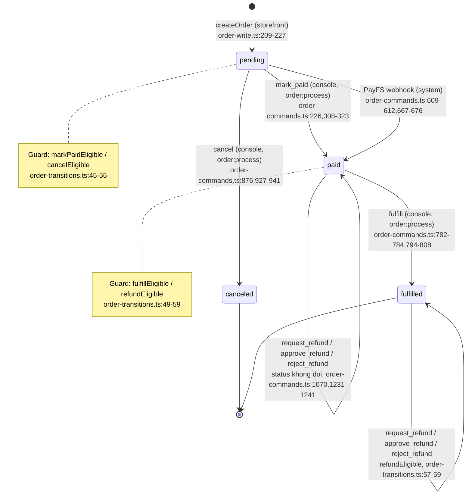
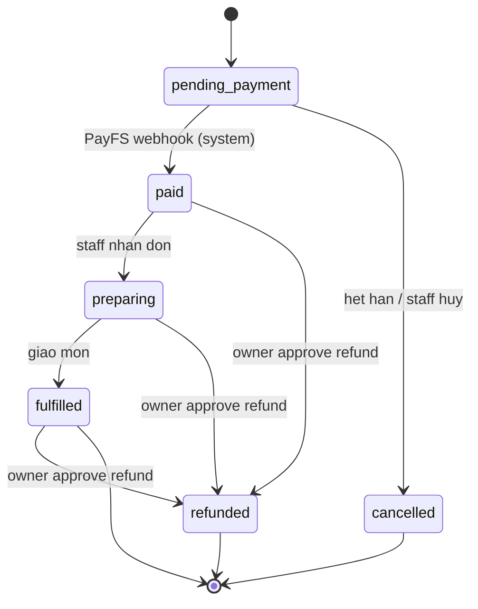

# 04 — PayFS webhook & business contracts (tham chiếu từ `nexus-handson`)

Tài liệu bóc tách từ repo mẫu `nexus-handson` (SOURCE, chỉ đọc). Mọi đường dẫn dạng `path:line` đều
tương đối so với gốc SOURCE. Snippet là trích nguyên văn, chỗ cắt bớt đánh dấu `// ...`.

Phạm vi: kiến trúc thanh toán PayFS/VietQR qua webhook, idempotency, provider event log,
server-side pricing + price snapshot, state machine đơn hàng, secret link, email outbox + cron,
dev workflow nhận webhook local.

Ngoài phạm vi (xem tài liệu khác trong thư mục này): build pipeline, R2, cấu hình Google OAuth.

Quy ước viết tắt: trong bảng và danh sách, các tên file dưới đây được rút gọn; dạng đầy đủ là:

| Viết tắt | Đường dẫn đầy đủ trong SOURCE |
|---|---|
| `order-commands.ts` | `packages/orders/src/commands/order-commands.ts` |
| `order-write.ts` | `packages/orders/src/commands/order-write.ts` |
| `order-transitions.ts` | `packages/orders/src/transitions/order-transitions.ts` |
| `order-validation.ts` | `packages/orders/src/order-validation.ts` |
| `private-order-snapshot.ts` | `packages/catalog/src/private-order-snapshot.ts` |
| `payfs-webhook-routes.ts` | `apps/worker/src/payfs-webhook-routes.ts` |
| `storefront-order-routes.ts` | `apps/worker/src/storefront-order-routes.ts` |
| `order-email-service.ts` | `apps/worker/src/order-email-service.ts` |
| `plan.md` | `plans/260915-1512-payfs-bank-transfer-payment/plan.md` |
| `migrations/0006-...` | `migrations/0006-order-brief-contract.sql` |
| `migrations/0010-...` | `migrations/0010-refund-decisions.sql` |
| `migrations/0013-...` | `migrations/0013-payfs-webhook-payments.sql` |
| `migrations/0015-...` | `migrations/0015-provider-events-and-payments.sql` |

---

## 1. Kiến trúc thanh toán

### 1.1 Sơ đồ tổng thể theo plan gốc

SOURCE mô tả kiến trúc trong `plans/260915-1512-payfs-bank-transfer-payment/plan.md:41-48`:

```text
PayFS transaction.credit
  -> POST /api/payfs/webhook
  -> Worker: method, configuration, API-key and payload gate
  -> @nexus/orders: exact match + durable provider receipt
  -> one D1 batch: system order_paid history, pending -> paid, confirmed receipt
  -> safe 200 acknowledgement only after durable terminal outcome
```

### 1.2 Ai tạo mã VietQR

**Client tạo QR, server KHÔNG tạo QR.** Storefront render QR bằng package `@viet-qr/react`
(`package.json:47`, `apps/storefront/src/storefront-app.tsx:2`), chỉ khi đơn còn `pending`
(`apps/storefront/src/storefront-app.tsx:459`):

```tsx
// apps/storefront/src/storefront-app.tsx:470-479
              <div className="payment-qr">
                <VietQR
                  bankId={visibleOrder.paymentInstructions.bank}
                  accountNo={visibleOrder.paymentInstructions.accountNumber}
                  amount={visibleOrder.totalMinor}
                  content={visibleOrder.paymentReference}
                  renderAs="svg"
                  size={192}
                />
              </div>
```

Server chỉ trả về *chỉ dẫn chuyển khoản* (bank + số tài khoản), có validate và fail-closed
(`apps/worker/src/storefront-order-routes.ts:42-57`):

```ts
// apps/worker/src/storefront-order-routes.ts:42-57
function bankTransferInstructions(
  order: CustomerOrderProjection,
  payment: Pick<Env, 'PAYFS_MERCHANT_BANK' | 'PAYFS_MERCHANT_ACCOUNT'> | undefined,
): BankTransferInstructions | null {
  const bank = payment?.PAYFS_MERCHANT_BANK;
  const accountNumber = payment?.PAYFS_MERCHANT_ACCOUNT;
  if (
    order.status !== 'pending'
    || order.currency !== 'VND'
    || typeof bank !== 'string'
    || !/^[A-Za-z0-9]{2,16}$/u.test(bank)
    || typeof accountNumber !== 'string'
    || !/^[A-Za-z0-9-]{1,80}$/u.test(accountNumber)
  ) return null;
  return { bank: bank.toUpperCase(), accountNumber };
}
```

Hệ quả kiến trúc: đơn `paid`/`fulfilled`/`canceled` không còn `paymentInstructions`, UI tự ẩn QR
(`apps/worker/src/storefront-order-routes.ts:49`, `apps/storefront/src/storefront-app.tsx:459`).

### 1.3 Đối soát dựa trên field nào

Đối soát dựa trên **3 field cùng lúc**: nội dung chuyển khoản (`content`) chứa
`payment_reference`, số tiền (`amount`) khớp `total_minor`, và tài khoản nhận khớp merchant.

`payment_reference` là identity thanh toán nội bộ, sinh **server-side** lúc tạo đơn
(`packages/orders/src/commands/order-write.ts:29-31`):

```ts
// packages/orders/src/commands/order-write.ts:25-31
function orderReference(): string {
  return `NX-${crypto.randomUUID().replaceAll('-', '').slice(0, 16).toUpperCase()}`;
}

function paymentReference(): string {
  return `NP${crypto.randomUUID().replaceAll('-', '').slice(0, 18)}`;
}
```

Hai reference tách bạch về mặt hợp đồng (`README.md:30-33`): `reference` (`NX-…`) là mã đơn hiển thị
cho khách; `payment_reference` (`NP…`) là mã dùng trong nội dung chuyển khoản. Cột trong D1 có
DEFAULT và UNIQUE toàn cục (`migrations/0006-order-brief-contract.sql:35-38,43`):

```sql
-- migrations/0006-order-brief-contract.sql:35-38
  payment_reference TEXT NOT NULL DEFAULT ('NP' || lower(hex(randomblob(16)))) CHECK (
    length(payment_reference) BETWEEN 3 AND 80
    AND payment_reference GLOB 'NP*'
  ),
-- migrations/0006-order-brief-contract.sql:43
  CONSTRAINT orders_payment_reference_unique UNIQUE (payment_reference),
```

Matcher quét token trong `content` bằng regex có biên token, case-insensitive, và **từ chối nếu có
2 token khác nhau** (`packages/orders/src/commands/order-commands.ts:375,456-464`):

```ts
// packages/orders/src/commands/order-commands.ts:375
const PAYFS_REFERENCE_TOKEN = /(?<![A-Za-z0-9])NP[0-9a-f]{18}(?![A-Za-z0-9])/giu;

// packages/orders/src/commands/order-commands.ts:456-464
function matchedPayfsPaymentReference(content: string): { reference: string | null; reason: PayfsIgnoredReason | null } {
  const references = new Set<string>();
  for (const match of content.matchAll(PAYFS_REFERENCE_TOKEN)) {
    references.add(`NP${match[0].slice(2).toLowerCase()}`);
  }
  if (references.size === 0) return { reference: null, reason: 'reference_missing' };
  if (references.size > 1) return { reference: null, reason: 'reference_ambiguous' };
  return { reference: [...references][0]!, reason: null };
}
```

Bộ lọc semantic đầy đủ (`packages/orders/src/commands/order-commands.ts:466-475`):

```ts
// packages/orders/src/commands/order-commands.ts:466-475
function payfsIgnoredReason(
  credit: PayfsCreditInput,
  merchant: { bank: string; accountNumber: string },
): { reference: string | null; reason: PayfsIgnoredReason | null } {
  if (credit.transferType !== 'credit') return { reference: null, reason: 'not_credit' };
  if (credit.bank !== merchant.bank || credit.bankAccountNumber !== merchant.accountNumber) {
    return { reference: null, reason: 'recipient_mismatch' };
  }
  return matchedPayfsPaymentReference(credit.content);
}
```

Truy vấn tìm đơn đích — **khớp tuyệt đối 4 điều kiện**, không có dung sai số tiền
(`packages/orders/src/commands/order-commands.ts:477-491`):

```ts
// packages/orders/src/commands/order-commands.ts:482-490
  return database.prepare(
    `SELECT id
       FROM orders
      WHERE store_id = ?
        AND payment_reference = ?
        AND status = 'pending'
        AND currency = 'VND'
        AND total_minor = ?`,
  ).bind(PUBLIC_STORE_ID, paymentReference, amount).first<PayfsSettlementTarget>();
```

Lưu ý: `PUBLIC_STORE_ID` là hằng số từ cấu hình, **không** lấy từ payload — invariant #1/#2 trong
`plans/260915-1512-payfs-bank-transfer-payment/plan.md:54-55`.

### 1.4 Endpoint & schema payload

Endpoint duy nhất: `POST /api/payfs/webhook` (`apps/worker/src/payfs-webhook-routes.ts:6`,
`plan.md:81`). Payload phẳng, allowlist 8 field, reject field lạ
(`packages/orders/src/order-validation.ts:298-326`):

```ts
// packages/orders/src/order-validation.ts:298-326
export function parsePayfsCreditInput(body: unknown): PayfsCreditInput {
  const request = objectAt(body, '');
  rejectUnknown(request, [
    'account_id',
    'amount',
    'bank',
    'bank_account_number',
    'content',
    'transaction_date',
    'transaction_id',
    'transfer_type',
  ], '');
  if (typeof request.amount !== 'number' || !Number.isSafeInteger(request.amount) || request.amount <= 0) {
    return payfsInvalid('/amount');
  }
  if (request.transfer_type !== 'credit' && request.transfer_type !== 'debit') {
    return payfsInvalid('/transfer_type');
  }
  return {
    accountId: payfsOpaque(request.account_id, '/account_id', /^[A-Za-z0-9_-]+$/u),
    amount: request.amount,
    bank: payfsOpaque(request.bank, '/bank', /^[A-Za-z0-9]+$/u, 2, 16).toUpperCase(),
    bankAccountNumber: payfsOpaque(request.bank_account_number, '/bank_account_number', /^[A-Za-z0-9-]+$/u, 1, 80),
    content: payfsContent(request.content),
    transactionDate: payfsTransactionDate(request.transaction_date),
    transactionId: payfsOpaque(request.transaction_id, '/transaction_id', /^[A-Za-z0-9_-]+$/u),
    transferType: request.transfer_type,
  };
}
```

Payload mẫu thực tế dùng trong test (`tests/integration/payfs-webhook.test.ts:64-76`):

```ts
// tests/integration/payfs-webhook.test.ts:65-75
  return {
    account_id: '1418079746853494784',
    amount: 14_000,
    bank: 'MB',
    bank_account_number: PAYFS_BINDINGS.PAYFS_MERCHANT_ACCOUNT,
    content: 'Ada transfer NP0123456789abcdef0123456789abcdef',
    transaction_date: '2025-09-15T15:02:00.000Z',
    transaction_id: '1418108930751619072',
    transfer_type: 'credit',
    ...overrides,
  };
```

### 1.5 Xác thực webhook — trích nguyên văn đoạn verify

**Chỉ API key tĩnh trong header `X-Client-API-Key`. Không HMAC signature, không timestamp window,
không IP allowlist.** Đây là quyết định có chủ đích, ghi rõ trong `plan.md:23` và `README.md:47`.

```ts
// apps/worker/src/payfs-webhook-routes.ts:93-122
export async function routePayfsWebhookRequest(
  request: Request,
  env: PayfsRouteEnv | Pick<Env, 'ASSETS'>,
): Promise<Response | null> {
  if (new URL(request.url).pathname !== PAYFS_WEBHOOK_PATH) return null;
  if (request.method !== 'POST') return methodNotAllowed();
  if (!('DB' in env)) {
    return jsonError(503, 'payfs_not_configured', 'The PayFS webhook is not configured.');
  }
  const configuration = payfsConfiguration(env);
  if (!env.DB || configuration === null) {
    return jsonError(503, 'payfs_not_configured', 'The PayFS webhook is not configured.');
  }
  if (request.headers.get('X-Client-API-Key') !== configuration.apiKey) {
    return jsonError(401, 'unauthorized', 'The PayFS webhook is unauthorized.');
  }
  try {
    const payload = await parsePayfsBody(request);
    const outcome = await confirmPayfsCredit({
      database: env.DB,
      body: payload.body,
      payloadJson: payload.payloadJson,
      merchantBank: configuration.merchantBank,
      merchantAccount: configuration.merchantAccount,
    });
    return jsonResponse({ status: outcome });
  } catch (error) {
    return payfsFailure(error);
  }
}
```

Fail-closed khi thiếu cấu hình (`apps/worker/src/payfs-webhook-routes.ts:19-29`):

```ts
// apps/worker/src/payfs-webhook-routes.ts:19-29
function payfsConfiguration(env: PayfsRouteEnv): PayfsConfiguration | null {
  const apiKey = env.PAYFS_WEBHOOK_API_KEY;
  const merchantBank = env.PAYFS_MERCHANT_BANK;
  const merchantAccount = env.PAYFS_FEFAULT_ACCOUNT;
  if (
    typeof apiKey !== 'string' || apiKey.trim() === ''
    || typeof merchantBank !== 'string' || !/^[A-Za-z0-9]{2,16}$/u.test(merchantBank)
    || typeof merchantAccount !== 'string' || !/^[A-Za-z0-9-]{1,80}$/u.test(merchantAccount)
  ) return null;
  return { apiKey, merchantBank: merchantBank.toUpperCase(), merchantAccount };
}
```

Chi tiết cần chú ý:

- Env binding có typo `PAYFS_FEFAULT_ACCOUNT` (`apps/worker/src/payfs-webhook-routes.ts:10,22`),
  khác với `PAYFS_MERCHANT_ACCOUNT` mà storefront dùng (`apps/worker/src/storefront-order-routes.ts:44`).
  Test phải set cả hai (`tests/integration/payfs-webhook.test.ts:20-21`). Đây là bug cần tránh lặp lại.
- Body có hard limit 16 KiB, đọc theo stream, kiểm tra cả `Content-Length` lẫn kích thước thật, decode
  UTF-8 `fatal: true` (`apps/worker/src/payfs-webhook-routes.ts:7,36-76`).
- Route mount **trước** CORS preflight và trước console/storefront, nên webhook không có CORS,
  không Origin check, không cookie (`apps/worker/src/index.ts:82-90`):

```ts
// apps/worker/src/index.ts:82-90
      const payfsResponse = await routePayfsWebhookRequest(request, env);
      if (payfsResponse !== null) {
        if (payfsResponse.status === 200 && 'DB' in env) ctx?.waitUntil(dispatchDueOrderEmails(env));
        return payfsResponse;
      }

      const storefrontOrigin = 'STOREFRONT_ORIGIN' in env ? env.STOREFRONT_ORIGIN : undefined;
      const preflight = routeStorefrontPreflight(request, storefrontOrigin);
      if (preflight !== null) return preflight;
```

- Webhook **không** yêu cầu header `X-Nexus-Order-Contract: 2` (khác mọi route Order khác —
  `README.md:39`, `apps/worker/src/http-response.ts:21-26`).

### 1.6 Bảng response contract

Từ `plans/260915-1512-payfs-bank-transfer-payment/plan.md:83-92` và code
`apps/worker/src/payfs-webhook-routes.ts:78-91,118`:

| Điều kiện | Response |
|---|---|
| Khớp tuyệt đối, đã commit | `200 { "status": "confirmed" }` |
| Replay đúng facts | `200 { "status": "already_processed" }` |
| Bị từ chối semantic (debit, sai người nhận, thiếu/nhập nhằng reference, đơn không eligible) | `200 { "status": "ignored" }` |
| Payload sai, hoặc cùng `transaction_id` nhưng facts khác | `400 invalid_payfs_request` |
| Sai/thiếu API key | `401 unauthorized` |
| Method khác POST (kể cả OPTIONS) | `405` + `Allow: POST` |
| Thiếu binding/DB | `503 payfs_not_configured` |
| Lỗi persistence/nội bộ | `500` (retryable) |

`200 ignored` là chủ ý: provider không retry vô hạn với các credit không bao giờ khớp được.

---

## 2. Idempotency — đúng 2 tầng (thực ra 3 lớp khoá)

### 2.1 Tầng A — khách bấm "đặt đơn" nhiều lần

**Khoá**: header `Idempotency-Key` do client sinh, lưu ở bảng `order_idempotency`, cột `request_key`.

Client sinh key một lần cho mỗi "attempt identity"
(`apps/storefront/src/api-client.ts:70-75`):

```ts
// apps/storefront/src/api-client.ts:70-75
export function createOrderAttemptIdentity(): OrderAttemptIdentity {
  return {
    capability: randomOpaqueValue(32),
    idempotencyKey: crypto.randomUUID(),
  };
}
```

Worker đọc header và đẩy xuống domain (`apps/worker/src/storefront-order-routes.ts:153-159`);
validate định dạng `^[A-Za-z0-9_-]{16,128}$` (`packages/orders/src/order-validation.ts:5,143-149`).

Schema + ràng buộc UNIQUE (`migrations/0006-order-brief-contract.sql:132-151`):

```sql
-- migrations/0006-order-brief-contract.sql:140-151
  capability_digest TEXT NOT NULL CHECK (
    length(capability_digest) = 64
    AND capability_digest NOT GLOB '*[^0-9a-f]*'
  ),
  created_at TEXT NOT NULL DEFAULT (strftime('%Y-%m-%dT%H:%M:%fZ', 'now')),
  CONSTRAINT order_idempotency_store_fk FOREIGN KEY (store_id) REFERENCES stores(id),
  CONSTRAINT order_idempotency_access_fk
    FOREIGN KEY (order_id, store_id, capability_digest)
    REFERENCES order_access(order_id, store_id, capability_digest),
  CONSTRAINT order_idempotency_id_store_unique UNIQUE (id, store_id),
  CONSTRAINT order_idempotency_store_request_unique UNIQUE (store_id, request_key)
);
```

Hành vi khi trùng — **trả lại kết quả cũ, không 409**, trừ khi capability khác
(`packages/orders/src/commands/order-write.ts:43-72,98-100`):

```ts
// packages/orders/src/commands/order-write.ts:55-72
async function replayOrder(
  database: D1Database,
  storeId: string,
  row: IdempotencyRow,
  capabilityDigest: string,
): Promise<CustomerOrderProjection> {
  if (row.capability_digest !== capabilityDigest) {
    throw new OrderValidationError(
      'idempotency_conflict',
      'The idempotency key is already bound to another Order capability.',
      [],
      409,
    );
  }
  const order = await readCustomerOrderById({ database, storeId, orderId: row.order_id });
  if (!order) throw new OrderPersistenceError(new Error('The idempotency result has no Order aggregate.'));
  return order;
}
```

```ts
// packages/orders/src/commands/order-write.ts:97-100
  const request = parseOrderCreateInput(input.body, input.idempotencyKey, input.capability);
  const capabilityDigest = await digestOrderCapability(request.capability);
  const existing = await readIdempotency(input.database, context.storeId, request.idempotencyKey);
  if (existing) return replayOrder(input.database, context.storeId, existing, capabilityDigest);
```

Tóm tắt matrix tầng A:

| Tình huống | Kết quả |
|---|---|
| Cùng `Idempotency-Key` + cùng capability | Trả lại đơn cũ, HTTP `201` (route luôn 201 — `apps/worker/src/storefront-order-routes.ts:160`) |
| Cùng key + capability khác | `409 idempotency_conflict` |
| Key mới | Tạo đơn mới |

Race thật (2 request song song cùng key) được xử lý sau khi batch fail
(`packages/orders/src/commands/order-write.ts:291-295`):

```ts
// packages/orders/src/commands/order-write.ts:291-295
  try {
    await input.database.batch(statements);
  } catch (error) {
    const raced = await readIdempotency(input.database, context.storeId, request.idempotencyKey);
    if (raced) return replayOrder(input.database, context.storeId, raced, capabilityDigest);
```

### 2.2 Tầng A′ — command ledger cho Console/Storefront (mark_paid, fulfill, cancel, refund)

Khác bảng, khác cơ chế: bảng `order_commands`, khoá `UNIQUE (store_id, request_key)` +
`payload_hash` để phát hiện reuse key với payload khác
(`migrations/0010-refund-decisions.sql:291-324`):

```sql
-- migrations/0010-refund-decisions.sql:300-323
  payload_hash TEXT NOT NULL CHECK (
    length(payload_hash) = 64
    AND payload_hash NOT GLOB '*[^0-9a-f]*'
  ),
  result_history_id TEXT NOT NULL,
  created_at TEXT NOT NULL DEFAULT (strftime('%Y-%m-%dT%H:%M:%fZ', 'now')),
  contract_version INTEGER NOT NULL DEFAULT 2,
  result_refund_request_id TEXT,
-- ...
  CONSTRAINT order_commands_store_request_unique UNIQUE (store_id, request_key)
```

Hash canonical gồm action + orderId + actor, nên cùng key cho action khác sẽ conflict
(`packages/orders/src/commands/order-commands.ts:67-70,98-104`):

```ts
// packages/orders/src/commands/order-commands.ts:98-104
  const hash = await payloadHash([
    input.action,
    order.id,
    actor.source,
    actor.id,
    ...input.canonicalBody(parsed),
  ]);
```

Quyết định replay vs conflict (`packages/orders/src/commands/order-commands.ts:113-132`):

```ts
// packages/orders/src/commands/order-commands.ts:113-132
  const existing = await readLedger(input.database, input.context.storeId, parsed.idempotencyKey);
  if (existing) {
    // ...
    if (existing.contract_version === 1) legacyKeyConflict();
    if (!ledgerMatches(existing, input.action, order.id, hash)) keyConflict();
    return {
      order,
      actor,
      hash,
      parsed,
      replay: await authorizedResult(input.database, input.context, order.id, parsed.idempotencyKey, input.action),
    };
  }
```

`ledgerMatches` so 3 field (`packages/orders/src/persistence/command-store.ts:96-103`);
`keyConflict()` ném `409 idempotency_conflict`
(`packages/orders/src/persistence/command-store.ts:57-64`).

### 2.3 Tầng B — provider gửi lại webhook

**Khoá**: `payfs_payment_receipts.transaction_id` với `UNIQUE` toàn cục (không scope theo store)
(`migrations/0013-payfs-webhook-payments.sql:3-7`):

```sql
-- migrations/0013-payfs-webhook-payments.sql:1-12
CREATE TABLE payfs_payment_receipts (
  id TEXT PRIMARY KEY NOT NULL,
  transaction_id TEXT NOT NULL UNIQUE CHECK (
    length(transaction_id) BETWEEN 1 AND 128
    AND transaction_id = trim(transaction_id)
    AND transaction_id NOT GLOB '*[^A-Za-z0-9_-]*'
  ),
  facts_fingerprint TEXT NOT NULL CHECK (
    length(facts_fingerprint) = 64
    AND facts_fingerprint NOT GLOB '*[^0-9a-f]*'
  ),
  outcome TEXT NOT NULL CHECK (outcome IN ('confirmed', 'ignored')),
```

Kèm CHECK "terminal shape" ép receipt `confirmed` phải trỏ đủ store/order/history, receipt `ignored`
phải NULL cả ba, và UNIQUE mỗi đơn chỉ một receipt
(`migrations/0013-payfs-webhook-payments.sql:21-31`):

```sql
-- migrations/0013-payfs-webhook-payments.sql:21-32
  CONSTRAINT payfs_receipt_terminal_shape CHECK (
    (outcome = 'confirmed' AND ignored_reason IS NULL AND store_id IS NOT NULL AND order_id IS NOT NULL AND history_id IS NOT NULL)
    OR (outcome = 'ignored' AND ignored_reason IS NOT NULL AND store_id IS NULL AND order_id IS NULL AND history_id IS NULL)
  ),
  CONSTRAINT payfs_receipt_store_fk FOREIGN KEY (store_id) REFERENCES stores(id),
  CONSTRAINT payfs_receipt_order_fk FOREIGN KEY (order_id, store_id) REFERENCES orders(id, store_id),
  CONSTRAINT payfs_receipt_history_fk
    FOREIGN KEY (history_id, order_id, store_id)
    REFERENCES order_history(id, order_id, store_id),
  CONSTRAINT payfs_receipt_confirmed_order_unique UNIQUE (store_id, order_id),
  CONSTRAINT payfs_receipt_confirmed_history_unique UNIQUE (history_id)
);
```

Chống "cùng transaction_id nhưng payload khác": fingerprint SHA-256 trên 8 field đã normalize NFKC
(`packages/orders/src/commands/order-commands.ts:382-395`):

```ts
// packages/orders/src/commands/order-commands.ts:382-395
async function payfsFingerprint(input: PayfsCreditInput): Promise<string> {
  const canonical = JSON.stringify([
    input.accountId,
    input.amount,
    input.bank,
    input.bankAccountNumber,
    input.content.normalize('NFKC'),
    input.transactionDate,
    input.transactionId,
    input.transferType,
  ]);
  const digest = await crypto.subtle.digest('SHA-256', payfsEncoder.encode(canonical));
  return Array.from(new Uint8Array(digest), (byte) => byte.toString(16).padStart(2, '0')).join('');
}
```

```ts
// packages/orders/src/commands/order-commands.ts:397-410
async function existingPayfsReceipt(
  database: D1Database,
  transactionId: string,
  fingerprint: string,
): Promise<PayfsReceiptRow | null> {
  const receipt = await database.prepare(
    `SELECT id, facts_fingerprint, outcome, ignored_reason
       FROM payfs_payment_receipts
      WHERE transaction_id = ?`,
  ).bind(transactionId).first<PayfsReceiptRow>();
  if (receipt === null) return null;
  if (receipt.facts_fingerprint !== fingerprint) payfsTransactionConflict();
  return receipt;
}
```

`payfsTransactionConflict()` ném `OrderValidationError` → adapter map thành **`400`**, không phải 409
(`packages/orders/src/commands/order-commands.ts:378-380`,
`apps/worker/src/payfs-webhook-routes.ts:79-81`).

Hành vi khi trùng (`packages/orders/src/commands/order-commands.ts:500-519`):

```ts
// packages/orders/src/commands/order-commands.ts:500-519
  const credit = parsePayfsCreditInput(input.body);
  const fingerprint = await payfsFingerprint(credit);
  const existing = await existingPayfsReceipt(input.database, credit.transactionId, fingerprint);
  const disposition = payfsIgnoredReason(credit, {
    bank: input.merchantBank,
    accountNumber: input.merchantAccount,
  });
  const reconcilingRecipientMismatch = existing?.outcome === 'ignored'
    && existing.ignored_reason === 'recipient_mismatch'
    && disposition.reason === null;
  if (existing !== null && !reconcilingRecipientMismatch) return 'already_processed';
  if (disposition.reason !== null) {
    return persistIgnoredPayfsReceipt({
      database: input.database,
      transactionId: credit.transactionId,
      fingerprint,
      payloadJson: input.payloadJson,
      reason: disposition.reason,
    });
  }
```

Matrix tầng B:

| Tình huống | Kết quả |
|---|---|
| `transaction_id` mới, khớp tuyệt đối | `confirmed`, 1 receipt + 1 history + 1 provider_payment + transition |
| `transaction_id` đã có, fingerprint giống | `already_processed` (idempotent, không ghi gì) |
| `transaction_id` đã có, fingerprint khác | `400` — không bao giờ retarget receipt cũ |
| `transaction_id` đã có, receipt cũ `ignored/recipient_mismatch`, giờ cấu hình merchant đã đúng | Đường reconcile: `UPDATE ... SET outcome='confirmed'` (`order-commands.ts:549-581`) |
| Không khớp semantic | Ghi receipt `ignored` + provider_event, trả `ignored` |

Hai lớp UNIQUE nữa cùng bảo vệ tầng B
(`migrations/0015-provider-events-and-payments.sql:19,52-53`):

```sql
-- migrations/0015-provider-events-and-payments.sql:19
  CONSTRAINT provider_events_provider_event_unique UNIQUE (provider, provider_event_id),
-- migrations/0015-provider-events-and-payments.sql:52-53
  CONSTRAINT provider_payments_gateway_transaction_unique UNIQUE (gateway, provider_transaction_id),
  CONSTRAINT provider_payments_succeeded_order_unique UNIQUE (store_id, order_id),
```

Ngay cả receipt `ignored` cũng được ghi durable trong một batch cùng `provider_events`, và nếu batch
đó fail vì race thì đọc lại outcome cũ (`packages/orders/src/commands/order-commands.ts:430-453`):

```ts
// packages/orders/src/commands/order-commands.ts:448-452
  } catch (error) {
    const existing = await existingPayfsOutcome(input.database, input.transactionId, input.fingerprint);
    if (existing !== null) return existing;
    throw new OrderPersistenceError(error);
  }
```

### 2.4 Xác nhận "đã commit thật" trước khi trả 200

Batch settlement gồm 6 statement; kết quả `confirmed` chỉ trả khi statement receipt báo đúng 1 row
thay đổi (`packages/orders/src/commands/order-commands.ts:603-678`):

```ts
// packages/orders/src/commands/order-commands.ts:678-693
    if (results[1]?.meta.changes === 1) return 'confirmed';
  } catch (error) {
    const existing = await existingPayfsOutcome(input.database, credit.transactionId, fingerprint);
    if (existing !== null) return existing;
    const current = await readPayfsSettlementTarget(input.database, disposition.reference!, credit.amount);
    if (current === null) {
      return persistIgnoredPayfsReceipt({
        database: input.database,
        transactionId: credit.transactionId,
        fingerprint,
        payloadJson: input.payloadJson,
        reason: 'order_not_eligible',
      });
    }
    throw new OrderPersistenceError(error);
  }
```

---

## 3. Provider event log (`provider_events`)

Tên bảng thật: **`provider_events`** (`migrations/0015-provider-events-and-payments.sql:1`).

```sql
-- migrations/0015-provider-events-and-payments.sql:1-25
CREATE TABLE provider_events (
  id TEXT PRIMARY KEY NOT NULL CHECK (length(id) BETWEEN 1 AND 80 AND id = trim(id)),
  type TEXT NOT NULL CHECK (type IN ('payment', 'logistics')),
  provider TEXT NOT NULL CHECK (length(provider) BETWEEN 1 AND 80 AND provider = trim(provider)),
  provider_event_id TEXT NOT NULL CHECK (
    length(provider_event_id) BETWEEN 1 AND 160
    AND provider_event_id = trim(provider_event_id)
  ),
  payload_json TEXT NOT NULL CHECK (json_valid(payload_json)),
  store_id TEXT,
  order_id TEXT,
  received_at TEXT NOT NULL DEFAULT (strftime('%Y-%m-%dT%H:%M:%fZ', 'now')),
  CONSTRAINT provider_events_order_shape CHECK (
    (store_id IS NULL AND order_id IS NULL)
    OR (store_id IS NOT NULL AND order_id IS NOT NULL)
  ),
  CONSTRAINT provider_events_store_fk FOREIGN KEY (store_id) REFERENCES stores(id),
  CONSTRAINT provider_events_order_fk FOREIGN KEY (order_id, store_id) REFERENCES orders(id, store_id),
  CONSTRAINT provider_events_provider_event_unique UNIQUE (provider, provider_event_id),
  CONSTRAINT provider_events_id_provider_unique UNIQUE (id, provider)
);

CREATE INDEX provider_events_store_order_received_idx
  ON provider_events (store_id, order_id, received_at, id)
  WHERE store_id IS NOT NULL AND order_id IS NOT NULL;
```

Điểm thiết kế đáng bê nguyên:

- `payload_json` lưu **chuỗi JSON thô đúng như nhận được**, không phải object đã parse. Worker giữ
  lại chuỗi gốc khi decode body (`apps/worker/src/payfs-webhook-routes.ts:70-72`):

```ts
// apps/worker/src/payfs-webhook-routes.ts:70-75
  try {
    const payloadJson = new TextDecoder('utf-8', { fatal: true }).decode(bytes);
    return { body: JSON.parse(payloadJson) as unknown, payloadJson };
  } catch {
    throw new OrderValidationError('validation_failed', 'The PayFS payload is invalid.', [], 400);
  }
```

- Event **không khớp đơn nào** vẫn được lưu với `store_id = NULL, order_id = NULL`
  (`packages/orders/src/commands/order-commands.ts:442-447`) → đây chính là cơ chế đối soát thủ công
  khi webhook đến mà không match.
- Event đã match đơn thì `store_id/order_id` được lấy **từ receipt đã confirmed** (không tin payload)
  (`packages/orders/src/commands/order-commands.ts:541-548`):

```ts
// packages/orders/src/commands/order-commands.ts:541-548
    : input.database.prepare(
      `INSERT INTO provider_events (
         id, type, provider, provider_event_id, payload_json, store_id, order_id
       )
       SELECT ?, 'payment', 'payfs', ?, ?, receipt.store_id, receipt.order_id
         FROM payfs_payment_receipts receipt
        WHERE receipt.transaction_id = ? AND receipt.history_id = ? AND receipt.outcome = 'confirmed'`,
    ).bind(receiptId, credit.transactionId, input.payloadJson, credit.transactionId, historyId);
```

### Console xem "Third-party logs"

- Route API: `GET /api/console/provider-events`
  (`apps/worker/src/console-provider-event-routes.ts:50`), có contract header gate
  (`:51`), `limit` 1–100 mặc định 25 (`:20-28`).
- Quyền: `provider-events:read` (`packages/orders/src/queries/provider-event-read.ts:94`).
- Phân trang keyset (không OFFSET), cursor ký kèm storeId/userId/role/limit để không dùng chéo
  phiên (`packages/orders/src/queries/provider-event-read.ts:41-79,97,143-145`).
- Query nối cả `orders` trực tiếp lẫn `provider_payments` để hiện đơn liên quan
  (`packages/orders/src/queries/provider-event-read.ts:98-117`).
- Visibility: store của mình, cộng thêm event `store_id IS NULL` nếu là store gốc Nexus
  (`packages/orders/src/queries/provider-event-read.ts:81-86`).
- UI: destination "Third-party logs" (`apps/console/src/layout/console-shell.tsx:95`), route
  `/console/provider-events` (`apps/console/src/production-console-app.tsx:88`), bảng 5 cột
  Event / Provider / Received / Order / Raw payload
  (`apps/console/src/provider-events/provider-events-screen.tsx:130-140`), payload hiển thị nguyên
  văn trong `<pre>` (`:139`).

---

## 4. Server-side pricing + price snapshot

### 4.1 Chứng minh client KHÔNG gửi giá

Body tạo đơn chỉ chấp nhận đúng 2 nhánh `customer` + `items`, và mỗi item chỉ 3 field
(`packages/orders/src/order-validation.ts:129-142`, `:101-110`):

```ts
// packages/orders/src/order-validation.ts:129-142
export function parseOrderCreateInput(
  body: unknown,
  idempotencyKey: unknown,
  capability: unknown,
): ValidatedOrderCreateInput {
  const request = objectAt(body, '');
  rejectUnknown(request, ['customer', 'items'], '');
  const customer = objectAt(request.customer, '/customer');
  rejectUnknown(customer, ['name', 'email'], '/customer');

  return {
    customerName: normalizeName(customer.name),
    customerEmailNormalized: normalizeCustomerEmail(customer.email),
    items: parseCreateItems(request.items),
```

```ts
// packages/orders/src/order-validation.ts:101-110
  const items = value.map((entry, index) => {
    const path = `/items/${index}`;
    const item = objectAt(entry, path);
    rejectUnknown(item, ['productId', 'variantId', 'quantity'], path);
    return {
      productId: durableId(item.productId, `${path}/productId`, PRODUCT_ID, false) as string,
      variantId: durableId(item.variantId, `${path}/variantId`, VARIANT_ID, true),
      quantity: boundedQuantity(item.quantity, `${path}/quantity`),
    };
  });
```

`rejectUnknown` biến mọi field lạ (kể cả `price`, `total`) thành lỗi `unknown_field`
(`packages/orders/src/order-validation.ts:18-26`). Nghĩa là gửi giá không chỉ bị **bỏ qua** mà bị
**từ chối thẳng** — contract mạnh hơn "ignore silently".

### 4.2 Server đọc giá từ catalog

`resolveOrderItemCatalogSnapshots` đọc giá từ D1 trong một `batch` 4 query, chỉ lấy product
`status='active'` và variant `current_schema=1 AND status='enabled'`
(`packages/catalog/src/private-order-snapshot.ts:100-148`):

```ts
// packages/catalog/src/private-order-snapshot.ts:101-110
    input.database.prepare(
      `WITH input(payload) AS (VALUES (?))
       SELECT products.id, products.name, products.product_type, products.currency, products.base_price_minor,
              products.delivery_access_title, products.delivery_access_instructions, products.delivery_file_key,
              products.revision
         FROM products, input
        WHERE products.store_id = json_extract(input.payload, '$.storeId')
          AND products.status = 'active'
          AND products.id IN (SELECT value FROM json_each(input.payload, '$.productIds'))`,
    ).bind(payload),
```

Giá đơn vị được quyết ở server, variant override thắng base price
(`packages/catalog/src/private-order-snapshot.ts:46-62`, `:64-85`):

```ts
// packages/catalog/src/private-order-snapshot.ts:70-84
  return {
    productRevision: product.revision,
    snapshot: {
      productId: product.id,
      productName: product.name,
      variantId: variant.id,
      variantSku: variant.sku,
      selectedOptions: selectedOptions.map((option) => ({ ...option })),
      unitPriceMinor: variant.price_override_minor ?? product.base_price_minor,
      currency: product.currency,
      accessTitle: inherited ? product.delivery_access_title : variant.delivery_access_title ?? '',
      accessInstructions: inherited ? product.delivery_access_instructions : variant.delivery_access_instructions ?? '',
      privateFileKey: inherited ? product.delivery_file_key : variant.delivery_file_key,
    },
  };
```

Tiền luôn là **minor unit integer**. Chuyển đổi decimal↔minor nằm ở `packages/catalog/src/money.ts`
dùng `BigInt` để tránh sai số float (`packages/catalog/src/money.ts:41-64`), và VND có
`fractionDigits = 0` nên `total_minor` = số tiền VND nguyên (`packages/catalog/src/money.ts:20-39`).

### 4.3 Tính tổng ở server + ghi snapshot

```ts
// packages/orders/src/commands/order-write.ts:134-152
  const lines = request.items.map((item, index) => {
    const snapshot = resolutions[index].snapshot;
    const lineTotalMinor = checkedMoney(
      snapshot.unitPriceMinor * item.quantity,
      'The server-resolved Order total is outside the supported range.',
    );
    return {
      id: stableId('line'),
      position: index,
      quantity: item.quantity,
      lineTotalMinor,
      snapshot,
      productRevision: resolutions[index].productRevision,
    };
  });
  const totalMinor = checkedMoney(
    lines.reduce((sum, line) => checkedMoney(sum + line.lineTotalMinor, 'The server-resolved Order total is outside the supported range.'), 0),
    'The server-resolved Order total is outside the supported range.',
  );
```

`checkedMoney` chặn overflow/âm (`packages/orders/src/commands/order-write.ts:74-79`).

Snapshot ghi xuống `order_lines`, gồm `unit_price_minor` + `line_total_minor` + tên/SKU/options tại
thời điểm đặt (`packages/orders/src/commands/order-write.ts:185-208`):

```ts
// packages/orders/src/commands/order-write.ts:185-191
    ...lines.map((line) => input.database.prepare(
      `INSERT INTO order_lines
         (id, store_id, order_id, product_id, product_name, variant_id, variant_sku,
          selected_options_json, quantity, unit_price_minor, line_total_minor, currency,
          access_title, access_instructions, private_file_key, position)
       VALUES (?, ?, ?, ?, ?, ?, ?, ?, ?, ?, ?, ?, ?, ?, ?, ?)`,
    ).bind(
```

Đơn và tổng tiền ghi cùng batch, `status` hardcode `'pending'`
(`packages/orders/src/commands/order-write.ts:209-227`).

Cùng đơn phải cùng currency (`packages/orders/src/commands/order-write.ts:121-132`).

### 4.4 Sản phẩm đổi giá / hết hàng giữa chừng

**Hết hàng / ngừng bán** → không lọt qua filter `status='active'` / `status='enabled'` →
`404 product_not_found` hoặc `404 variant_not_found`
(`packages/catalog/src/private-order-snapshot.ts:170-172,193-199,202-204`). Worker map
`CatalogValidationError` sang `OrderValidationError` giữ nguyên status
(`packages/orders/src/commands/order-write.ts:110-115`).

**Đổi giá giữa chừng** → chặn bằng optimistic concurrency trên `products.revision`. Snapshot ghi lại
revision (`packages/catalog/src/private-order-snapshot.ts:173-182`), order-write kiểm tra lại
(`packages/orders/src/commands/order-write.ts:154-167`), và quan trọng nhất là **guard ngay trong SQL
batch**: nếu revision hiện tại không khớp thì `id` của order_history thành `NULL` → vi phạm NOT NULL
→ **cả batch rollback** (`packages/orders/src/commands/order-write.ts:236-258`):

```ts
// packages/orders/src/commands/order-write.ts:236-259
    input.database.prepare(
      `INSERT INTO order_history (id, store_id, order_id, status, action, source, from_status, actor_id, contract_version)
       SELECT CASE WHEN (
         SELECT count(*)
           FROM json_each(?) AS expected
           JOIN products
             ON products.store_id = ?
            AND products.id = json_extract(expected.value, '$.id')
            AND products.revision = json_extract(expected.value, '$.revision')
       ) = ?
       AND (
         SELECT count(*) FROM order_lines WHERE order_id = ? AND store_id = ?
       ) BETWEEN 1 AND 10
       AND (
         SELECT COALESCE(sum(line_total_minor), 0) FROM order_lines WHERE order_id = ? AND store_id = ?
       ) = ?
       AND NOT EXISTS (
         SELECT 1 FROM order_lines WHERE order_id = ? AND store_id = ? AND currency != ?
       )
       THEN ? ELSE NULL END,
       ?, ?, 'pending', 'order_created', 'storefront', NULL,
       (SELECT id FROM customers WHERE store_id = ? AND email_normalized = ?),
       2`,
    ).bind(
```

Guard này kiểm tra 4 invariant trong cùng transaction: revision khớp, số line 1–10, tổng line bằng
`totalMinor` server tính, và không có line lệch currency. Sau khi rollback, code đọc lại revision
hiện tại để trả lỗi đúng nghĩa (`packages/orders/src/commands/order-write.ts:296-313`):

```ts
// packages/orders/src/commands/order-write.ts:303-314
    const currentById = new Map(current.results.map((row) => [row.id, row.revision]));
    for (const [productId, revision] of revisions) {
      if (currentById.get(productId) !== revision) {
        throw new OrderValidationError(
          'catalog_revision_conflict',
          'The Product changed while the Order was being created.',
          [],
          409,
        );
      }
    }
    throw new OrderPersistenceError(error);
```

Sau khi đơn đã tạo, snapshot là bất biến: `payment_reference`, `total_minor`, `unit_price_minor` không
bao giờ được cập nhật lại từ catalog. Webhook đối soát so `total_minor` chứ không tính lại giá
(`packages/orders/src/commands/order-commands.ts:489`).

---

## 5. State machine đơn hàng

### 5.1 Tập trạng thái

`OrderStatus` chỉ có 4 giá trị (`packages/orders/src/order-types.ts:3`), được ràng buộc ở tầng DB
(`migrations/0006-order-brief-contract.sql:31`):

```sql
-- migrations/0006-order-brief-contract.sql:31
  status TEXT NOT NULL DEFAULT 'pending' CHECK (status IN ('pending','paid','fulfilled','canceled')),
```

Lưu ý chính tả: `canceled` (một chữ `l`).

### 5.2 Bảng chuyển trạng thái hợp lệ

Guard thuần túy, không side effect, gom trong một file 59 dòng
(`packages/orders/src/transitions/order-transitions.ts:45-59`):

```ts
// packages/orders/src/transitions/order-transitions.ts:45-59
export function markPaidEligible(status: OrderStatus): boolean {
  return status === 'pending';
}

export function fulfillEligible(status: OrderStatus): boolean {
  return status === 'paid';
}

export function cancelEligible(status: OrderStatus): boolean {
  return status === 'pending';
}

export function refundEligible(status: OrderStatus): boolean {
  return status === 'paid' || status === 'fulfilled';
}
```

| from | to | action | guard | actor được phép | Nơi định nghĩa |
|---|---|---|---|---|---|
| `pending` | `paid` | `mark_paid` (thủ công) | `markPaidEligible` | `user` + permission `order:process` | `order-transitions.ts:45-47`, `order-commands.ts:226` |
| `pending` | `paid` | webhook PayFS | inline SQL `status='pending' AND currency='VND' AND total_minor=?` | `system` (không actor) | `order-commands.ts:609-612,667-676` |
| `pending` | `canceled` | `cancel` | `cancelEligible` | `user` + `order:process` | `order-transitions.ts:53-55`, `order-commands.ts:876` |
| `paid` | `fulfilled` | `fulfill` | `fulfillEligible` | `user` + `order:process` | `order-transitions.ts:49-51`, `order-commands.ts:782-784` |
| `paid`/`fulfilled` | *không đổi status* | `request_refund` | `refundEligible` | `storefront` (chủ đơn) hoặc `user` + `refund:request` | `order-transitions.ts:57-59`, `order-commands.ts:1009-1011` |
| `paid`/`fulfilled` | *không đổi status* | `approve_refund` / `reject_refund` | `refundEligible` + refund request đang `pending` + membership owner active | `user` + `refund:decide` | `order-commands.ts:1161,1216-1220` |

Không có transition nào rời `fulfilled` hay `canceled` → hai trạng thái terminal. Refund **không**
tạo status đơn mới: nó chỉ đổi `order_refund_requests.status`
(`packages/orders/src/commands/order-commands.ts:1231-1241`) và ghi history với
`status = orders.status` (`:1070`, `:1211`).

Guard actor tách riêng khỏi guard status
(`packages/orders/src/transitions/order-transitions.ts:14-43`):

```ts
// packages/orders/src/transitions/order-transitions.ts:14-17
function actorAllowed(action: OrderCommandAction, source: OrderActor['source']): boolean {
  if (source === 'storefront') return action === 'request_refund';
  return source === 'user';
}
```

Nghĩa là: khách vô danh chỉ có đúng một command — xin refund. Mọi command khác phải qua Console.

### 5.3 Chống chuyển trạng thái bất hợp lệ

Ba tầng phòng thủ xếp chồng:

**(a) Guard trong bộ nhớ** — kiểm tra sớm để trả 409 đẹp
(`packages/orders/src/commands/order-commands.ts:226,876,1009-1011`):

```ts
// packages/orders/src/persistence/command-store.ts:75-82
export function stateConflict(): never {
  throw new OrderValidationError(
    'order_state_conflict',
    'The Order state does not allow this action.',
    [],
    409,
  );
}
```

**(b) Conditional UPDATE** — mọi transition đều là `UPDATE ... WHERE status = <from>` cộng thêm
`EXISTS` trên history vừa insert trong cùng batch
(`packages/orders/src/commands/order-commands.ts:794-808` cho fulfill):

```ts
// packages/orders/src/commands/order-commands.ts:794-808
      input.database.prepare(
        `UPDATE orders
            SET status = 'fulfilled'
          WHERE store_id = ? AND id = ? AND status = 'paid'
            AND EXISTS (
              SELECT 1 FROM order_history
               WHERE id = ? AND store_id = ? AND order_id = ?
            )`,
      ).bind(
        input.context.storeId,
        prepared.order.id,
        historyId,
        input.context.storeId,
        prepared.order.id,
      ),
```

Bản webhook còn chặt hơn — chỉ update nếu receipt đã ghi đúng
(`packages/orders/src/commands/order-commands.ts:667-676`):

```ts
// packages/orders/src/commands/order-commands.ts:667-676
      input.database.prepare(
        `UPDATE orders
            SET status = 'paid'
          WHERE store_id = ? AND id = ? AND status = 'pending'
            AND EXISTS (
              SELECT 1
                FROM payfs_payment_receipts
               WHERE transaction_id = ? AND store_id = ? AND order_id = ? AND history_id = ?
            )`,
      ).bind(PUBLIC_STORE_ID, target.id, credit.transactionId, PUBLIC_STORE_ID, target.id, historyId),
```

**(c) Batch rollback bằng NOT NULL** — statement cuối insert `order_commands` với
`CASE WHEN <toàn bộ invariant> THEN ? ELSE NULL END` cho cột `id` (PRIMARY KEY NOT NULL). Nếu
transition không thực sự xảy ra, `id = NULL` → constraint fail → **toàn bộ batch rollback**
(`packages/orders/src/commands/order-commands.ts:942-952` cho cancel):

```ts
// packages/orders/src/commands/order-commands.ts:942-953
      input.database.prepare(
        `INSERT INTO order_commands (
           id, store_id, request_key, order_id, action, payload_hash, result_history_id, contract_version
         ) VALUES (
           CASE WHEN (
             SELECT status FROM orders WHERE store_id = ? AND id = ?
           ) = 'canceled' AND (
             SELECT id FROM order_history WHERE id = ? AND store_id = ? AND order_id = ?
           ) IS NOT NULL THEN ? ELSE NULL END,
           ?, ?, ?, 'cancel', ?, ?, 2
         )`,
      ).bind(
```

Đây là kỹ thuật cốt lõi: D1 `batch()` chạy trong một transaction, nên "assertion cuối batch" biến
mọi race thành rollback sạch, không cần `SELECT ... FOR UPDATE` (SQLite không có).

### 5.4 Xử lý race sau rollback

`runCommandBatch` bọc mọi command, và khi batch fail thì thử replay trước, rồi mới phân loại lỗi
(`packages/orders/src/persistence/command-store.ts:369-406`):

```ts
// packages/orders/src/persistence/command-store.ts:380-406
}): Promise<OrderCommandResult> {
  try {
    const guard = input.context.identity?.kind === 'console'
      ? input.database.prepare(
        `UPDATE orders
            SET status = CASE WHEN ${consoleVisibilitySql('orders')} THEN status ELSE NULL END
          WHERE store_id = ? AND id = ?`,
      ).bind(
        ...consoleVisibilityBinds(input.context.identity),
        input.storeId,
        input.orderId,
      )
      : null;
    await input.database.batch(guard === null ? input.statements : [...input.statements, guard]);
  } catch (error) {
    await authorizeResult(input.database, input.context, input.orderId, input.action);
    if (input.onConflictReplay) {
      const recovered = await input.onConflictReplay();
      if (recovered) return recovered;
    }
    return recoverFailedBatch(input.database, input.storeId, input, error, input.context);
  }
  await authorizeResult(input.database, input.context, input.orderId, input.action);
  const result = await readCommandResult(input.database, input.storeId, input.requestKey);
  await authorizeResult(input.database, input.context, input.orderId, input.action);
  return result;
}
```

Chú ý statement `guard` cuối batch: nếu console user mất quyền xem đơn giữa chừng, `status` bị set
`NULL` → vi phạm CHECK → rollback. Đây là cách ép authorization vào bên trong transaction.

`recoverFailedBatch` phân loại: ledger tồn tại → replay; đơn biến mất → 404; đơn sai trạng thái →
409; còn lại → 500 (`packages/orders/src/persistence/command-store.ts:351-367`).

### 5.5 Mermaid



Vòng đời refund request là state machine thứ hai, độc lập với đơn
(`migrations/0010-refund-decisions.sql:17,30-34`):

```sql
-- migrations/0010-refund-decisions.sql:17
  status TEXT NOT NULL DEFAULT 'pending' CHECK (status IN ('pending','approved','rejected')),
-- migrations/0010-refund-decisions.sql:30-34
  CONSTRAINT order_refund_requests_order_unique UNIQUE (store_id, order_id),
  CONSTRAINT order_refund_requests_decision_shape CHECK (
    (status = 'pending' AND decided_at IS NULL AND decided_by_user_id IS NULL)
    OR (status IN ('approved','rejected') AND decided_at IS NOT NULL AND decided_by_user_id IS NOT NULL)
  )
```

Mỗi đơn tối đa **một** refund request trong cả vòng đời (UNIQUE `(store_id, order_id)` ở
`migrations/0010-refund-decisions.sql:30`). Quyết định approve/reject chỉ được ghi khi người quyết
định vẫn là owner active — kiểm tra ngay trong SQL
(`packages/orders/src/commands/order-commands.ts:1218-1220`):

```sql
            AND EXISTS (SELECT 1 FROM store_memberships owner
                         WHERE owner.id = ? AND owner.store_id = ? AND owner.user_id = ?
                           AND owner.role = 'owner' AND owner.status = 'active')
```

---

## 6. Secret link (capability token tra cứu đơn cho khách vô danh)

### 6.1 Sinh token

Client sinh, **không phải server** — 32 byte ngẫu nhiên từ CSPRNG, encode base64url
(`apps/storefront/src/api-client.ts:62-75`):

```ts
// apps/storefront/src/api-client.ts:62-75
function randomOpaqueValue(bytes: number): string {
  const buffer = new Uint8Array(bytes);
  crypto.getRandomValues(buffer);
  let binary = '';
  buffer.forEach((value) => { binary += String.fromCharCode(value); });
  return btoa(binary).replaceAll('+', '-').replaceAll('/', '_').replaceAll('=', '');
}

export function createOrderAttemptIdentity(): OrderAttemptIdentity {
  return {
    capability: randomOpaqueValue(32),
    idempotencyKey: crypto.randomUUID(),
  };
}
```

**Entropy: 32 byte = 256 bit**, chuỗi base64url 43 ký tự. Server chỉ ép định dạng
`^[A-Za-z0-9_-]{32,256}$` (`packages/orders/src/order-validation.ts:6`), không ép entropy — client
xấu có thể gửi token yếu, nhưng chỉ tự hại đơn của chính nó.

### 6.2 Nơi lưu — chỉ lưu digest

Server hash SHA-256 trước khi lưu (`packages/orders/src/private-access.ts:5-10`):

```ts
// packages/orders/src/private-access.ts:5-10
const encoder = new TextEncoder();

export async function digestOrderCapability(capability: string): Promise<string> {
  const bytes = await crypto.subtle.digest('SHA-256', encoder.encode(capability));
  return Array.from(new Uint8Array(bytes), (byte) => byte.toString(16).padStart(2, '0')).join('');
}
```

Bảng `order_access` ép đúng 64 hex + UNIQUE per store
(`migrations/0006-order-brief-contract.sql:109-123`):

```sql
-- migrations/0006-order-brief-contract.sql:113-122
  capability_digest TEXT NOT NULL CHECK (
    length(capability_digest) = 64
    AND capability_digest NOT GLOB '*[^0-9a-f]*'
  ),
  created_at TEXT NOT NULL DEFAULT (strftime('%Y-%m-%dT%H:%M:%fZ', 'now')),
  CONSTRAINT order_access_order_fk FOREIGN KEY (order_id, store_id) REFERENCES orders(id, store_id),
  CONSTRAINT order_access_id_store_unique UNIQUE (id, store_id),
  CONSTRAINT order_access_one_per_order UNIQUE (order_id, store_id),
  CONSTRAINT order_access_store_capability_unique UNIQUE (store_id, capability_digest),
  CONSTRAINT order_access_order_capability_unique UNIQUE (order_id, store_id, capability_digest)
```

Ghi trong cùng batch tạo đơn (`packages/orders/src/commands/order-write.ts:228-231`).

### 6.3 Nơi so sánh

Lookup bằng JOIN trên digest — không select-rồi-so-sánh-trong-JS
(`packages/orders/src/private-access.ts:12-28`):

```ts
// packages/orders/src/private-access.ts:18-27
  const capability = parseOrderCapability(input.capability);
  const digest = await digestOrderCapability(capability);
  const row = await input.database.prepare(
    `SELECT orders.id
       FROM orders
       JOIN order_access
         ON order_access.order_id = orders.id AND order_access.store_id = orders.store_id
      WHERE orders.store_id = ? AND orders.reference = ? AND order_access.capability_digest = ?`,
  ).bind(input.storeId, input.reference, digest).first<{ id: string }>();
  return row?.id ?? null;
```

Token đi trong **header** `X-Nexus-Order-Capability`, không phải query string
(`apps/storefront/src/api-client.ts:161,177,200`;
`apps/worker/src/storefront-order-routes.ts:158,181,232`), và trong URL nó nằm ở **fragment** `#`
nên không bao giờ lên server log / Referer
(`apps/storefront/src/storefront-app.tsx:837`):

```ts
// apps/storefront/src/storefront-app.tsx:836-837
  const navigateOrder = useCallback((reference: string, capability: string | null) => {
    window.history.pushState({}, '', `/orders/${encodeURIComponent(reference)}#capability=${encodeURIComponent(capability ?? '')}`);
```

### 6.4 Đường dự phòng: token email HMAC

Link trong email không dùng capability của browser (browser khác thì không có), mà dùng token HMAC
dẫn xuất từ secret server (`apps/worker/src/order-email-service.ts:37-46`):

```ts
// apps/worker/src/order-email-service.ts:37-46
export async function orderEmailAccessToken(secret: string, storeId: string, orderId: string): Promise<string> {
  const key = await crypto.subtle.importKey(
    'raw',
    encoder.encode(secret),
    { name: 'HMAC', hash: 'SHA-256' },
    false,
    ['sign'],
  );
  return base64Url(new Uint8Array(await crypto.subtle.sign('HMAC', key, encoder.encode(`nexus-order-email-v1:${storeId}:${orderId}`))));
}
```

So sánh **constant-time** để chống timing attack
(`apps/worker/src/order-email-service.ts:48-55`):

```ts
// apps/worker/src/order-email-service.ts:48-55
export async function emailTokenMatches(secret: string | undefined, storeId: string, orderId: string, token: string): Promise<boolean> {
  if (!secret?.trim()) return false;
  const expected = await orderEmailAccessToken(secret, storeId, orderId);
  if (token.length !== expected.length) return false;
  let difference = 0;
  for (let index = 0; index < token.length; index += 1) difference |= token.charCodeAt(index) ^ expected.charCodeAt(index);
  return difference === 0;
}
```

Hai đường ghép lại ở một chỗ duy nhất
(`apps/worker/src/storefront-order-routes.ts:116-137`):

```ts
// apps/worker/src/storefront-order-routes.ts:122-137
  if (input.capability === null) return null;
  const direct = await findOrderIdByCapability({
    database: input.database,
    storeId: PUBLIC_STORE_ID,
    reference: input.reference,
    capability: input.capability,
  });
  if (direct !== null) return direct;
  const orderId = await findOrderIdByReference({
    database: input.database,
    storeId: PUBLIC_STORE_ID,
    reference: input.reference,
  });
  if (orderId === null) return null;
  return await emailTokenMatches(input.emailSecret, PUBLIC_STORE_ID, orderId, input.capability) ? orderId : null;
}
```

Điểm đáng chú ý (và đáng sửa nếu bê nguyên): secret HMAC đang tái dùng `RESEND_API_KEY`
(`apps/worker/src/storefront-order-routes.ts:182,233`, `apps/worker/src/order-email-service.ts:62`).
Nên tách thành secret riêng để rotate key Resend không làm hỏng mọi link email cũ.

### 6.5 Chống dò

- Mọi thất bại (sai reference, sai capability, thiếu capability, lỗi validate) đều trả **cùng một
  `404` không phân biệt được** (`apps/worker/src/storefront-order-routes.ts:103-105,225-226,235-236,249-252`):

```ts
// apps/worker/src/storefront-order-routes.ts:103-105
function privateNotFound(): Response {
  return jsonError(404, 'not_found', 'Order not found.');
}
```

- Capability check chạy **trước** contract-version check, nên client cũ cũng chỉ thấy 404, không suy
  ra được đơn có tồn tại hay không (`apps/worker/src/storefront-order-routes.ts:229-238`,
  `README.md:39`).
- `reference` phải khớp regex `^NX-[A-F0-9]{16}$` trước khi chạm DB
  (`apps/worker/src/storefront-order-routes.ts:107-114`) → 64 bit, không enumerate được, và
  brute-force phải đoán **đồng thời** reference (64 bit) và capability (256 bit).
- Header capability nằm trong allowlist CORS, nên browser site khác không đọc trộm được
  (`apps/worker/src/storefront-cors.ts:2-10,34-38`).

---

## 7. Email outbox + cron

### 7.1 Bảng outbox

`order_email_jobs` (`migrations/0014-order-email-outbox.sql:1-32`):

```sql
-- migrations/0014-order-email-outbox.sql:1-32
CREATE TABLE order_email_jobs (
  id TEXT PRIMARY KEY NOT NULL,
  store_id TEXT NOT NULL,
  order_id TEXT NOT NULL,
  kind TEXT NOT NULL CHECK (kind IN ('order_created', 'payment_confirmed', 'payment_reminder')),
  reminder_sequence INTEGER CHECK (
    reminder_sequence IS NULL OR reminder_sequence BETWEEN 1 AND 6
  ),
  available_at TEXT NOT NULL DEFAULT (strftime('%Y-%m-%dT%H:%M:%fZ', 'now')),
  attempts INTEGER NOT NULL DEFAULT 0 CHECK (attempts BETWEEN 0 AND 12),
  delivered_at TEXT,
  last_error TEXT,
  created_at TEXT NOT NULL DEFAULT (strftime('%Y-%m-%dT%H:%M:%fZ', 'now')),
  CONSTRAINT order_email_job_shape CHECK (
    (kind = 'payment_reminder' AND reminder_sequence IS NOT NULL)
    OR (kind != 'payment_reminder' AND reminder_sequence IS NULL)
  ),
  CONSTRAINT order_email_job_store_fk FOREIGN KEY (store_id) REFERENCES stores(id),
  CONSTRAINT order_email_job_order_fk FOREIGN KEY (order_id, store_id) REFERENCES orders(id, store_id)
);

CREATE UNIQUE INDEX order_email_jobs_one_event_idx
  ON order_email_jobs (store_id, order_id, kind)
  WHERE reminder_sequence IS NULL;

CREATE UNIQUE INDEX order_email_jobs_one_reminder_idx
  ON order_email_jobs (store_id, order_id, kind, reminder_sequence)
  WHERE reminder_sequence IS NOT NULL;

CREATE INDEX order_email_jobs_due_idx
  ON order_email_jobs (available_at, created_at)
  WHERE delivered_at IS NULL;
```

Hai partial UNIQUE index là điểm mấu chốt: mỗi đơn chỉ được có đúng 1 job `order_created`, 1 job
`payment_confirmed`, và 1 job cho mỗi `reminder_sequence`. Insert trùng là constraint error, không
phải email trùng.

### 7.2 Ai enqueue

**Lúc tạo đơn** — 7 job được lên lịch sẵn trong cùng batch tạo đơn
(`packages/orders/src/commands/order-write.ts:33-41`):

```ts
// packages/orders/src/commands/order-write.ts:33-41
const EMAIL_JOB_SCHEDULE = [
  { kind: 'order_created', reminderSequence: null, modifier: '+0 seconds' },
  { kind: 'payment_reminder', reminderSequence: 1, modifier: '+1 hour' },
  { kind: 'payment_reminder', reminderSequence: 2, modifier: '+6 hours' },
  { kind: 'payment_reminder', reminderSequence: 3, modifier: '+12 hours' },
  { kind: 'payment_reminder', reminderSequence: 4, modifier: '+1 day' },
  { kind: 'payment_reminder', reminderSequence: 5, modifier: '+2 days' },
  { kind: 'payment_reminder', reminderSequence: 6, modifier: '+3 days' },
] as const;
```

```ts
// packages/orders/src/commands/order-write.ts:277-288
    ...EMAIL_JOB_SCHEDULE.map((job) => input.database.prepare(
      `INSERT INTO order_email_jobs
         (id, store_id, order_id, kind, reminder_sequence, available_at)
       VALUES (?, ?, ?, ?, ?, strftime('%Y-%m-%dT%H:%M:%fZ', 'now', ?))`,
    ).bind(
      stableId('mail'),
      context.storeId,
      orderId,
      job.kind,
      job.reminderSequence,
      job.modifier,
    )),
```

**Lúc webhook confirm** — job `payment_confirmed` enqueue ngay trong batch settlement, có điều kiện
receipt (`packages/orders/src/commands/order-commands.ts:652-666`):

```ts
// packages/orders/src/commands/order-commands.ts:652-660
      input.database.prepare(
        `INSERT INTO order_email_jobs (id, store_id, order_id, kind)
         SELECT ?, orders.store_id, orders.id, 'payment_confirmed'
           FROM orders
           JOIN payfs_payment_receipts receipt
             ON receipt.store_id = orders.store_id AND receipt.order_id = orders.id
          WHERE orders.store_id = ? AND orders.id = ?
            AND receipt.transaction_id = ? AND receipt.history_id = ?`,
      ).bind(
```

Enqueue nằm **cùng transaction** với transition → không bao giờ có chuyện "đơn paid mà quên gửi mail"
hoặc "gửi mail mà đơn chưa paid".

### 7.3 Cron + handler

Cron 5 phút một lần (`wrangler.jsonc:21-23`):

```jsonc
// wrangler.jsonc:21-23
	"triggers": {
		"crons": ["*/5 * * * *"]
	},
```

Handler `scheduled` (`apps/worker/src/index.ts:143-145`):

```ts
// apps/worker/src/index.ts:143-145
  async scheduled(_controller: ScheduledController, env: Env, ctx: ExecutionContext): Promise<void> {
    ctx.waitUntil(dispatchDueOrderEmails(env));
  },
```

Ngoài cron còn 2 trigger cơ hội (opportunistic) để giảm độ trễ: sau webhook `200`
(`apps/worker/src/index.ts:84`) và sau khi tạo đơn `201` (`apps/worker/src/index.ts:134-136`):

```ts
// apps/worker/src/index.ts:134-136
      if (request.method === 'POST' && pathname === '/api/storefront/orders' && response?.status === 201) {
        ctx?.waitUntil(dispatchDueOrderEmails(env));
      }
```

### 7.4 Pattern claim / retry / mark-delivered

Claim là **conditional UPDATE**, chống 2 worker cùng lấy một job
(`packages/orders/src/queries/order-email-outbox.ts:52-60`):

```ts
// packages/orders/src/queries/order-email-outbox.ts:52-60
async function claimJob(database: D1Database, job: DueJobRow): Promise<boolean> {
  const result = await database.prepare(
    `UPDATE order_email_jobs
        SET attempts = attempts + 1, available_at = ?
      WHERE id = ? AND delivered_at IS NULL AND attempts < 12
        AND available_at <= strftime('%Y-%m-%dT%H:%M:%fZ', 'now')`,
  ).bind(retryAt(job.attempts + 1), job.id).run();
  return result.meta.changes === 1;
}
```

Claim đẩy `available_at` sang tương lai ngay lập tức = visibility timeout. Backoff mũ, trần 1 giờ
(`packages/orders/src/queries/order-email-outbox.ts:29-32`):

```ts
// packages/orders/src/queries/order-email-outbox.ts:29-32
function retryAt(attempts: number): string {
  const delayMs = Math.min(60 * 60 * 1000, 5 * 60 * 1000 * 2 ** Math.max(0, attempts - 1));
  return new Date(Date.now() + delayMs).toISOString();
}
```

Re-check điều kiện nghiệp vụ **tại thời điểm gửi**, không dựa vào lúc enqueue
(`packages/orders/src/queries/order-email-outbox.ts:70-74`):

```ts
// packages/orders/src/queries/order-email-outbox.ts:70-74
function needsDelivery(job: DueJobRow): boolean {
  if (job.kind === 'payment_reminder') return job.status === 'pending';
  if (job.kind === 'payment_confirmed') return job.status === 'paid' || job.status === 'fulfilled';
  return true;
}
```

Đây là lý do 6 reminder được enqueue sẵn lúc tạo đơn mà vẫn đúng: khi đơn đã `paid`, reminder còn lại
tự bị đóng với `last_error = 'no_longer_eligible'`
(`packages/orders/src/queries/order-email-outbox.ts:93-96`).

Job hết lượt bị "retire" chứ không loop vô hạn
(`packages/orders/src/queries/order-email-outbox.ts:34-40,106-110`):

```ts
// packages/orders/src/queries/order-email-outbox.ts:34-40
async function retireExhaustedOrderEmailJobs(database: D1Database): Promise<void> {
  await database.prepare(
    `UPDATE order_email_jobs
        SET delivered_at = strftime('%Y-%m-%dT%H:%M:%fZ', 'now'), last_error = 'attempts_exhausted'
      WHERE delivered_at IS NULL AND attempts >= 12`,
  ).run();
}
```

Vòng dispatch giới hạn 20 job/lần gọi, lỗi từng job không làm hỏng job khác
(`apps/worker/src/order-email-service.ts:117-138`):

```ts
// apps/worker/src/order-email-service.ts:120-136
  let delivered = 0;
  for (let count = 0; count < 20; count += 1) {
    const job = await claimNextOrderEmailDelivery(env.DB);
    if (job === null) break;
    try {
      await sendResend(configuration, job);
      await markOrderEmailDelivered(env.DB, job.id);
      delivered += 1;
    } catch (error) {
      console.error('Order email delivery failed', {
        jobId: job.id,
        kind: job.kind,
        errorName: error instanceof Error ? error.name : 'UnknownError',
      });
      await rescheduleOrderEmailDelivery(env.DB, job, error instanceof Error ? error.message : 'delivery_failed');
    }
  }
```

**At-least-once, không exactly-once**: nếu Resend nhận thành công nhưng `markOrderEmailDelivered`
chưa chạy thì job sẽ gửi lại. Bù bằng cách chuyển idempotency sang phía Resend, dùng `job.id` làm
khoá (`apps/worker/src/order-email-service.ts:102-115`):

```ts
// apps/worker/src/order-email-service.ts:104-114
  const response = await fetch('https://api.resend.com/emails', {
    method: 'POST',
    headers: {
      Authorization: `Bearer ${configuration.apiKey}`,
      'Content-Type': 'application/json',
      'Idempotency-Key': job.id,
      'User-Agent': 'Nexus-Operations-Console',
    },
    body: JSON.stringify({ from: configuration.from, to: [job.customer_email_normalized], ...message }),
  });
  if (!response.ok) throw new Error(`resend_${response.status}`);
```

Thiếu cấu hình Resend → dispatch no-op, không crash cron
(`apps/worker/src/order-email-service.ts:18-29,118-119`).

---

## 8. Dev workflow nhận webhook local

### 8.1 Cái gì CÓ trong SOURCE

Chỉ có quy trình dev local, **không** có bất kỳ nhắc đến `cloudflared`, `tunnel`, hay `ngrok` trong
mã nguồn, README, plans hay scripts của SOURCE (đã grep toàn repo; các kết quả `tunnel`/`ngrok` duy
nhất nằm trong `.claude/skills/**`, tức tài liệu skill của agent, không phải quy trình dự án).

Quy trình local chính thức (`README.md:73-87`):

```sh
# README.md:76
npx wrangler d1 migrations apply nexus-s1-468cba-db --local
```

```sh
# README.md:82-86
# Terminal 1: API and Console
npm run dev:console -- --host 127.0.0.1 --port 5173

# Terminal 2: Storefront
VITE_STOREFRONT_API_BASE_URL=http://127.0.0.1:5173 npm run dev:storefront -- --host 127.0.0.1 --port 5174
```

SOURCE **cố tình không** đăng ký callback thật: `plan.md:105` ghi rõ "Live enablement requires
replacement webhook credentials and recipient configuration in Worker secrets plus a reachable
callback origin. It remains outside this plan". Thay vào đó, verification dùng
**synthetic credit post thẳng vào Worker local** (`plan.md:101`) và integration test dựng request
trực tiếp (`tests/integration/payfs-webhook.test.ts:77-87`).

Kết luận: **quy trình nhận webhook thật từ internet về máy local KHÔNG tìm thấy trong SOURCE.**

### 8.2 Quy trình chuẩn tối thiểu — [SUY LUẬN]

Phần dưới đây **không** trích từ SOURCE; là quy trình tối thiểu suy ra từ kiến trúc SOURCE
(`apps/worker/src/index.ts:82-86`) cộng với hạ tầng Cloudflare mà TARGET đã chọn
(`docs/PRD.md:41`). Đánh dấu [SUY LUẬN] toàn bộ.

```sh
# [SUY LUAN] 0) Migrations + secrets local
npx wrangler d1 migrations apply <db-name> --local
# .dev.vars (gitignored), vi du:
#   PAYFS_WEBHOOK_API_KEY="pk_..."
#   PAYFS_MERCHANT_BANK="MB"
#   PAYFS_MERCHANT_ACCOUNT="558555858888"

# [SUY LUAN] 1) Terminal A: Worker local
npm run dev -- --host 127.0.0.1 --port 5173

# [SUY LUAN] 2) Terminal B: quick tunnel cloudflared
cloudflared tunnel --url http://127.0.0.1:5173
# -> in ra https://<random>.trycloudflare.com

# [SUY LUAN] 3) Dang ky callback tren dashboard PayFS
#    https://<random>.trycloudflare.com/api/payfs/webhook

# [SUY LUAN] 4) Smoke khong can tunnel: post synthetic credit thang vao Worker
curl -sS -X POST http://127.0.0.1:5173/api/payfs/webhook \
  -H 'Content-Type: application/json' \
  -H 'X-Client-API-Key: pk_...' \
  -d '{"account_id":"1418079746853494784","amount":14000,"bank":"MB",
       "bank_account_number":"558555858888","content":"Ada transfer NP<18-hex>",
       "transaction_date":"2025-09-15T15:02:00.000Z",
       "transaction_id":"tx-local-1","transfer_type":"credit"}'
```

Ghi chú [SUY LUẬN] quan trọng:

- Quick tunnel đổi hostname mỗi lần chạy → phải đăng ký lại callback. Named tunnel
  (`cloudflared tunnel create` + DNS route) ổn định hơn cho team.
- Bước 4 là cách verify được SOURCE dùng thật (`plan.md:101`); nên coi tunnel là tuỳ chọn cho
  end-to-end, còn CI/dev hằng ngày dùng synthetic POST.
- Vì webhook không có CORS/Origin/cookie (`apps/worker/src/index.ts:82-86`), `curl` là đủ; không cần
  browser.

---

## Áp dụng cho QR Menu

### 9.1 Ánh xạ state machine

PRD TARGET yêu cầu `pending_payment -> paid -> preparing -> fulfilled / cancelled / refunded`
(`docs/PRD.md:56`), nhiều hơn SOURCE hai trạng thái (`preparing`, `refunded`) và đổi chính tả
`cancelled` (hai `l`).

| Transition TARGET | Bê nguyên từ SOURCE? | Ghi chú |
|---|---|---|
| `pending_payment -> paid` (webhook) | **Bê nguyên** | `confirmPayfsCredit` (`packages/orders/src/commands/order-commands.ts:493-702`), chỉ đổi `status='pending'` thành `'pending_payment'` trong 4 chỗ SQL (`:611,638,670` và `readPayfsSettlementTarget:487`) |
| `paid -> preparing` (staff "Nhận đơn & Chế biến", `docs/PRD.md:21`) | **Viết mới**, nhưng copy khuôn | Thêm `preparingEligible(status) { return status === 'paid'; }` vào `order-transitions.ts`, và một command giống hệt `fulfillOrder` (`order-commands.ts:704-835`) |
| `preparing -> fulfilled` ("Giao món") | **Viết mới**, copy khuôn | Sửa `fulfillEligible` thành `status === 'preparing'` và `WHERE ... status = 'preparing'` |
| `pending_payment -> cancelled` | **Bê nguyên** `cancelOrder` (`order-commands.ts:837-968`) | Chỉ đổi literal status |
| `paid/preparing -> refunded` | **Viết mới** | SOURCE **không có** trạng thái `refunded`; refund ở SOURCE chỉ ghi ý định, không đổi status đơn (`order-commands.ts:1070,1231-1241`) |

Mermaid cho TARGET (dẫn xuất, **chưa** có code):



Điểm phải viết mới có rủi ro cao nhất: `refunded` là transition **có** đổi status, nên không thể copy
nguyên `decideRefund` (`order-commands.ts:1128-1298`) — phải thêm một `UPDATE orders SET status =
'refunded' WHERE ... AND status IN ('paid','preparing','fulfilled')` vào batch, và thêm assertion
`CASE WHEN ... THEN ? ELSE NULL END` tương ứng như ở `:1254-1274`.

### 9.2 Bảng dữ liệu — ánh xạ

| TARGET (`docs/PRD.md:56-67`) | Tương đương SOURCE | Bê nguyên / Viết mới |
|---|---|---|
| `orders` | `orders` (`migrations/0006-...:21-46`) | Bê nguyên cột `payment_reference` + UNIQUE, `total_minor`, `status` CHECK; **đổi** enum status, **thêm** `table_id` |
| `order_items` | `order_lines` (`order-write.ts:186-190`) | Bê nguyên `unit_price_minor` + `line_total_minor` + `product_name` snapshot; **bỏ** `access_title`/`private_file_key` (đặc thù digital goods) |
| `products` | `products` (`private-order-snapshot.ts:103-109`) | Bê nguyên `base_price_minor`, `status='active'`, **`revision`** (rất cần: đổi giá món là chuyện hằng ngày ở quán) |
| `categories` | (không có trong SOURCE) | Viết mới |
| `tables` | (không có) | Viết mới. QR bàn phải chứa `table_id` + token bàn, **không** phải secret link đơn |
| `refund_requests` | `order_refund_requests` (`migrations/0010-...:13-35`) | Gần như bê nguyên: `status IN ('pending','approved','rejected')`, `decided_at`/`decided_by_user_id`, `decision_shape` CHECK. **Đổi**: `actor_id` → `requested_by_staff_id` (`docs/PRD.md:67`), và **bỏ** UNIQUE `(store_id, order_id)` nếu quán cần nhiều lần refund/đơn |
| — | `payfs_payment_receipts` (`migrations/0013-...`) | **Bê nguyên toàn bộ**, kể cả `terminal_shape` CHECK |
| — | `provider_events` (`migrations/0015-...:1-25`) | **Bê nguyên toàn bộ** |
| — | `provider_payments` (`migrations/0015-...:27-59`) | Bê nguyên |
| — | `order_commands` (`migrations/0010-...:291-324`) | Bê nguyên; sửa `order_commands_version_action` CHECK cho action mới (`start_preparing`, `refund`) |
| — | `order_idempotency` (`migrations/0006-...:132-151`) | Bê nguyên |
| — | `order_access` (`migrations/0006-...:109-123`) | Bê nguyên cho secret link |
| — | `order_email_jobs` (`migrations/0014-...`) | Bê nguyên bảng; **đổi** enum `kind` (thêm `daily_revenue_report`, `refund_confirmed` theo `docs/PRD.md:43`) và lịch reminder |

Lưu ý migration style của SOURCE: SQLite không `ALTER TABLE ... DROP CONSTRAINT`, nên mọi thay đổi
schema đều là **rebuild table**: `CREATE TABLE _sN_x AS SELECT * FROM x` → `DROP TABLE x` →
`CREATE TABLE x (...)` → `INSERT ... SELECT` (ví dụ `migrations/0010-refund-decisions.sql:1-12,40-43`).
Với TARGET nên chốt enum status **ngay từ migration đầu** để tránh chuỗi rebuild này.

### 9.3 Cái gì bê nguyên được

1. **Toàn bộ adapter webhook** `apps/worker/src/payfs-webhook-routes.ts:1-122` — đổi mỗi
   `PAYFS_FEFAULT_ACCOUNT` thành `PAYFS_MERCHANT_ACCOUNT` (sửa typo `:10,22`) và mount trước CORS như
   `apps/worker/src/index.ts:82-86`.
2. **Idempotency 2 tầng nguyên vẹn**: `order_idempotency` (tầng khách) + `payfs_payment_receipts`
   (tầng provider). Cả hai đều cần thiết ở quán ăn: khách bấm "Đặt món" hai lần rất phổ biến trên
   mobile yếu sóng.
3. **Kỹ thuật "assertion cuối batch"** (`order-commands.ts:324-352`, `order-write.ts:236-258`). Đây
   là thay thế cho transaction lock mà D1 không có; bê nguyên mọi command mới.
4. **Provider event log + màn Third-party logs** — chủ quán/hỗ trợ cần xem raw payload khi khách kêu
   "em chuyển rồi mà app chưa nhận".
5. **Outbox + cron** (`migrations/0014`, `order-email-outbox.ts`, `wrangler.jsonc:21-23`) — dùng luôn
   cho email báo cáo doanh thu chốt ngày và xác nhận refund (`docs/PRD.md:43`).
6. **Secret link** (`private-access.ts`, `order_access`) — PRD yêu cầu "Secret Link theo dõi tiến độ
   món ăn" (`docs/PRD.md:17`); mô hình digest + header + URL fragment dùng được nguyên.
7. **Server-side pricing** với `rejectUnknown` (`order-validation.ts:18-26,104`) — bắt buộc, vì
   storefront QR là công khai hoàn toàn.

### 9.4 Cái gì phải viết mới / phải đổi

1. **Bối cảnh bàn thay bối cảnh email khách.** SOURCE định danh khách bằng email + `customers` table
   (`order-write.ts:178-184`) và dùng email làm khoá `ON CONFLICT(store_id, email_normalized)`. QR
   Menu không có email khách → thay bằng `table_id` + session bàn. Toàn bộ `normalizeCustomerEmail`
   (`order-validation.ts:44-57`) và nhánh email trong `createOrder` phải viết lại.
2. **Email flow đảo chiều.** SOURCE gửi email cho *khách* (`order-email-service.ts:112`). TARGET gửi
   cho *owner* (`docs/PRD.md:43`). Job `payment_reminder` 6 mốc (1h→3 ngày,
   `order-write.ts:33-41`) hoàn toàn sai bối cảnh: đơn ăn tại bàn hết hạn sau ~15 phút. Phải thay
   `EMAIL_JOB_SCHEDULE` bằng một job huỷ đơn ngắn hạn.
3. **Hết hạn đơn chưa thanh toán.** SOURCE không tự cancel đơn `pending`; cron chỉ gửi mail. TARGET
   cần `pending_payment -> cancelled` tự động — viết mới trong handler `scheduled`
   (`apps/worker/src/index.ts:143-145`), theo cùng pattern conditional UPDATE.
4. **Trạng thái `refunded` đổi status đơn** — xem 9.1.
5. **Refund do staff request, owner approve** (`docs/PRD.md:67,75`). SOURCE có sẵn tách quyền
   `refund:request` vs `refund:decide` (`order-transitions.ts:31-35`,
   `order-commands.ts:52-56`) và kiểm tra owner active ngay trong SQL
   (`order-commands.ts:1218-1220`) → bê nguyên mô hình quyền, chỉ đổi actor mặc định từ `storefront`
   sang `user` (staff).
6. **Realtime "nổ đơn về bếp"** (`docs/PRD.md:6,17`). SOURCE hoàn toàn request/response, Console
   phải reload. Cần viết mới (polling ngắn hoặc Durable Object / WebSocket) — không có gì bê được.
7. **Chủ động poll PayFS khi mất webhook.** `payment-intergration-prd.md:14` yêu cầu, nhưng
   `plan.md:31` ghi rõ SOURCE **không** làm ("No PayFS transaction querying, scheduled
   reconciliation"). Phải viết mới; chỗ móc tự nhiên là handler `scheduled`, quét đơn
   `pending_payment` quá hạn rồi gọi API PayFS, đi qua đúng `confirmPayfsCredit` để tái dùng
   idempotency tầng B.
8. **Xác thực webhook mạnh hơn.** Xem rủi ro bên dưới.

### 9.5 Rủi ro kế thừa — phải xử lý trước khi lên production

| Rủi ro | Bằng chứng | Hướng xử lý |
|---|---|---|
| Chỉ API key tĩnh, không HMAC/timestamp → ai có key là giả được credit | `payfs-webhook-routes.ts:106-108`; `plan.md:37` ghi "accepted high residual risk" | Thêm verify HMAC + cửa sổ timestamp. PRD gốc đã cấp `Webhook Secret: whsec_...` (`payment-intergration-prd.md:17`) nhưng SOURCE **không dùng** |
| Secret bị commit trong repo mẫu | `payment-intergration-prd.md:16-20` chứa webhook key, secret, số tài khoản dạng plaintext | TARGET tuyệt đối không copy file này; dùng `wrangler secret` + `.dev.vars` gitignored |
| Regex reference `NP[0-9a-f]{18}` không khớp DEFAULT của cột | matcher `order-commands.ts:375` cần 18 hex; DEFAULT `migrations/0006-...:35` sinh 32 hex (`hex(randomblob(16))`); code sinh 18 hex (`order-write.ts:30`). Plan lại ghi "32 hexadecimal" (`plan.md:56`) | Ở TARGET: cho DEFAULT và code sinh **cùng một độ dài**, và derive regex từ hằng số chung, có test khẳng định |
| Typo env `PAYFS_FEFAULT_ACCOUNT` | `payfs-webhook-routes.ts:10,22` vs `storefront-order-routes.ts:44` | Đổi tên ngay khi port; nếu không, storefront và webhook có thể trỏ hai tài khoản khác nhau mà vẫn "chạy" |
| Secret HMAC email tái dùng `RESEND_API_KEY` | `storefront-order-routes.ts:182,233`; `order-email-service.ts:62` | Tách `ORDER_LINK_SECRET` riêng |
| Khớp số tiền tuyệt đối → chuyển thiếu/thừa 1đ là `ignored` | `order-commands.ts:489` | Giữ nguyên quy tắc (an toàn), nhưng phải có màn đối soát thủ công dựa trên `provider_events` cho ca lệch |
| Webhook chỉ hoạt động với `currency = 'VND'` | `order-commands.ts:488,612` | TARGET chỉ VND (`docs/PRD.md:81`) nên chấp nhận được; nhưng phải giữ CHECK để không im lặng nhận sai |
| Không có reconciliation/polling | `plan.md:31` | Bắt buộc bổ sung (xem 9.4 mục 7) |
| Email at-least-once có thể gửi trùng | `order-email-service.ts:126` chạy sau `sendResend` | Đã có `Idempotency-Key: job.id` gửi Resend (`:109`); giữ nguyên và bảo đảm `job.id` ổn định |
